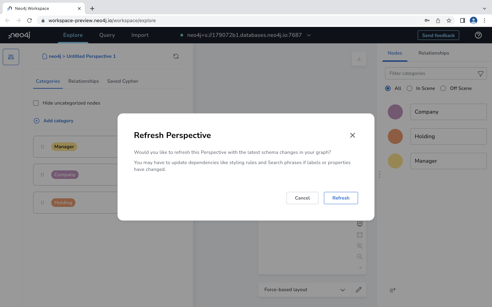
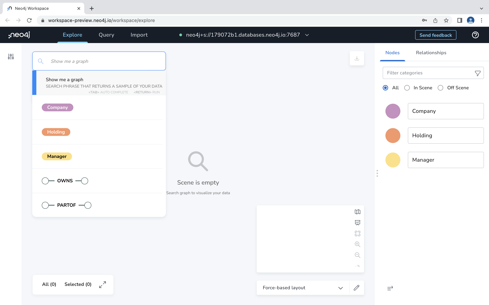
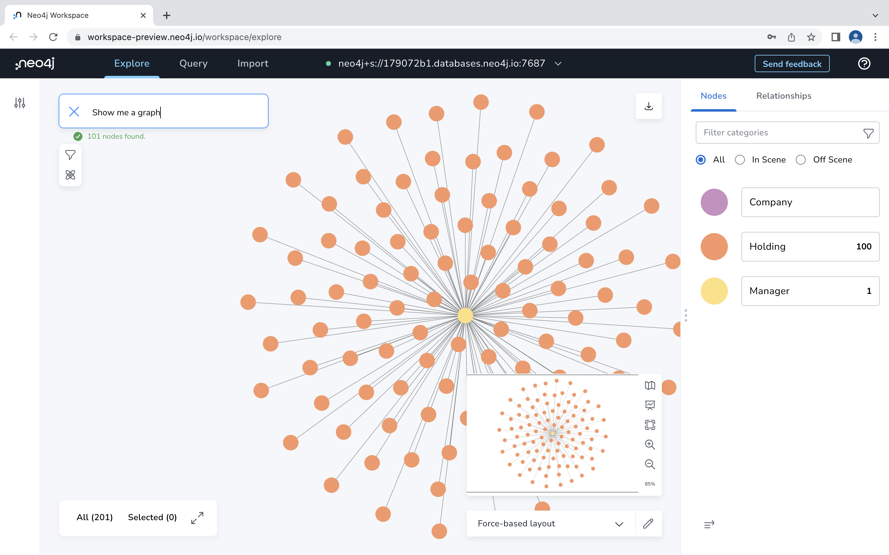
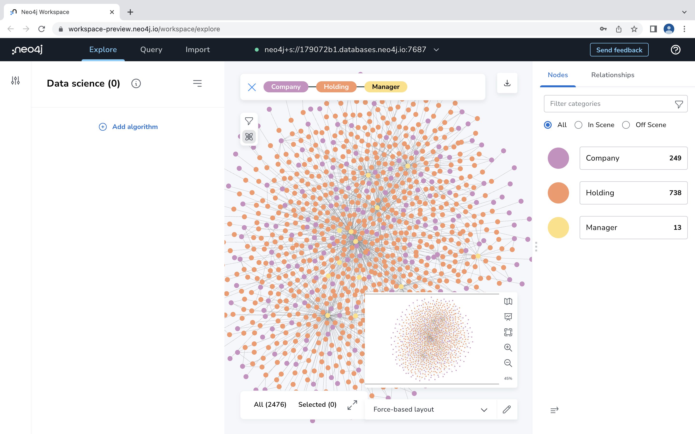
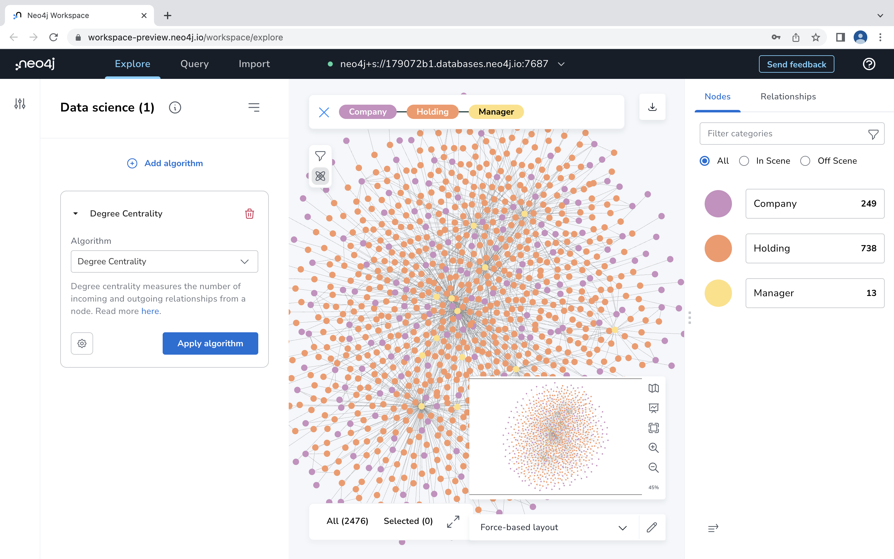
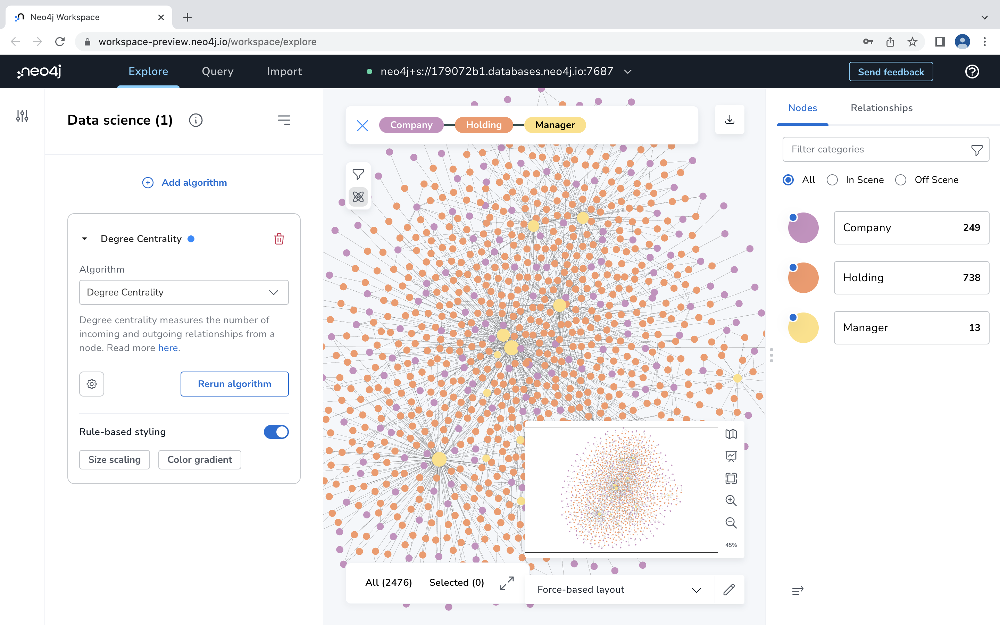

# Lab 4 - Exploration
Bloom is Neo4j's business intelligence (BI) tool.  It's integrated into Neo4j Workbench.  

## Exploration with Neo4j Bloom

To open Bloom, first go to the Neo4j Aura Console and then click "Open" as we did in Lab 2.  From there, make sure the "Explore" tab at the top is selected.

Perspectives in Bloom define a certain business view or domain that can be found in the target Neo4j graph. A single Neo4j graph can be viewed through different perspectives, each tailored for a different business purpose.

Click the slider icon in the upper left to open the perspective menu.

Now click the refresh icon to refresh the perspective.  This pulls the latest data model from our database.

Click "Refresh" to agree to refresh the perspective.

When that is complete you should see node types of Manager, Company and Holding.  Click the perspective button again to close this menu.

Now that our perspective is refreshed, we're ready to start exploring.

The easiest way we can explore data in Bloom is to have it generate a view for us.  To do so, click in the search bar and click on "Show me a graph."  Hit enter.

In this case, we got a view with a manager node at the center and 100 of its holdings.

We can click on a manager to see its name.

Now let's try finding a new graph.  Click in the search bar again and select "Company"

Now select "Holding."

Now select "Manager."

Now hit enter.

That gives us search results for all paths that go Company to Holding to Manager.  We hit a limit of 1000, so it's not vizualing every one.

Next we're going to apply some point and click data science to our graph.  Click on the atom icon to open the data science menu.

Click "Add algorithm."

Select "Degree Centrality" from the drop down.

Click "Apply algorithm."

Now that we've run the algorithm, we can chose how we want to vizualize the results in the graph.  Chose "Size scaling."

The nodes which are more central in our graph are now shown as larger.  

These are just a few examples of the things you can do with Bloom.  Feel free to explore!