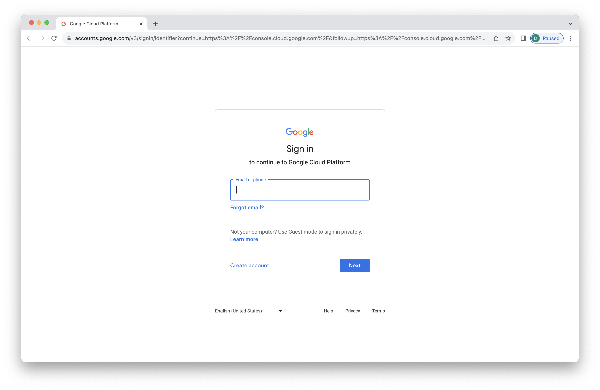
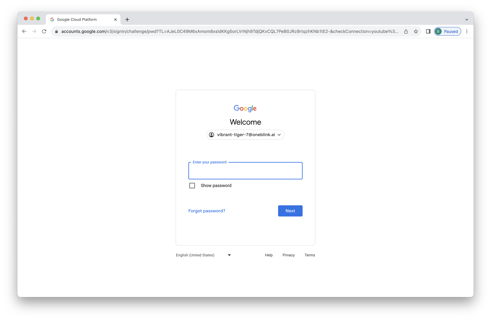
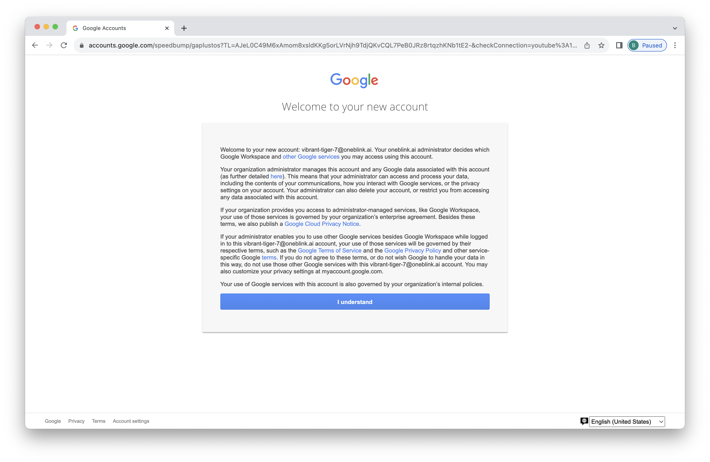
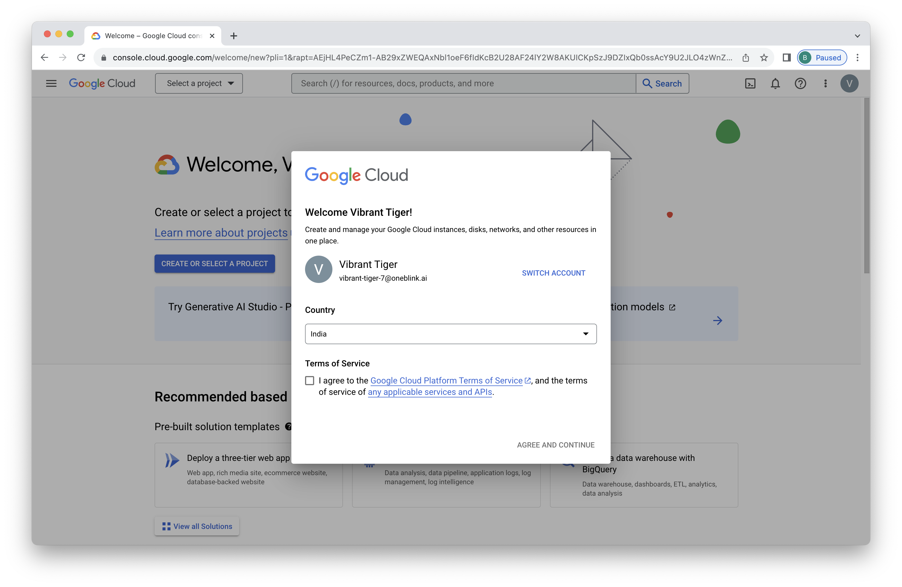
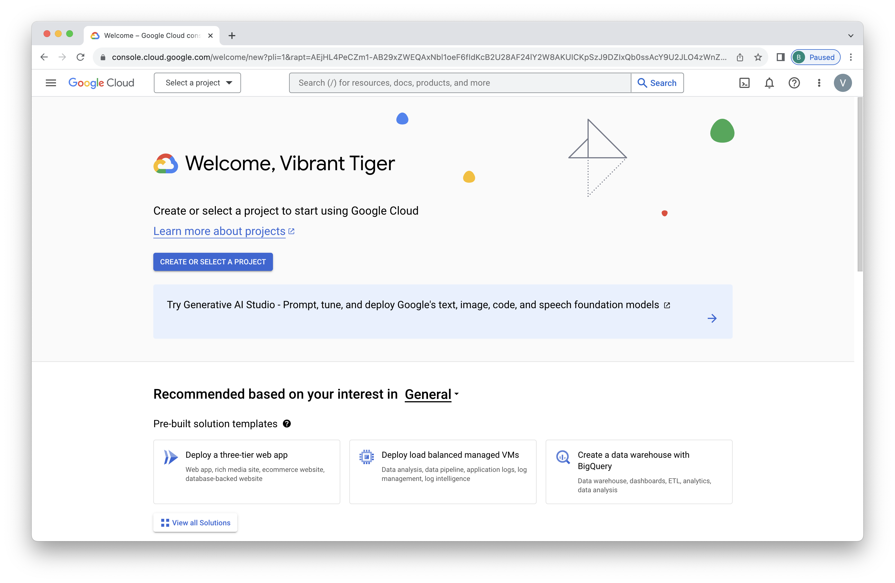
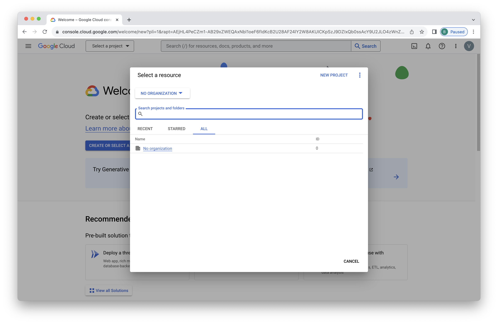
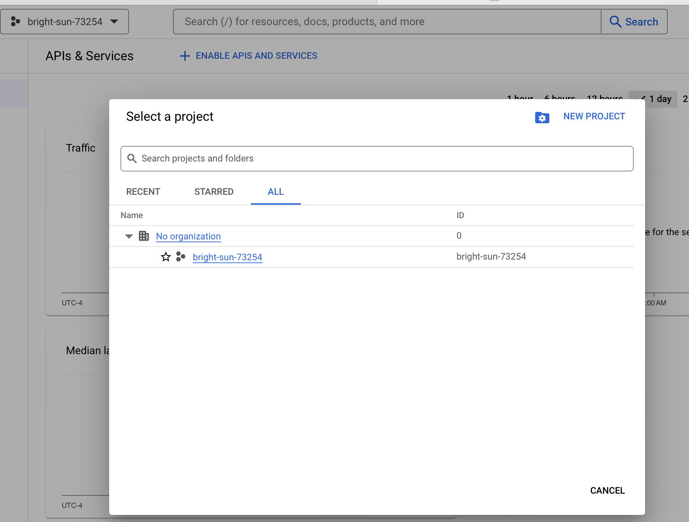
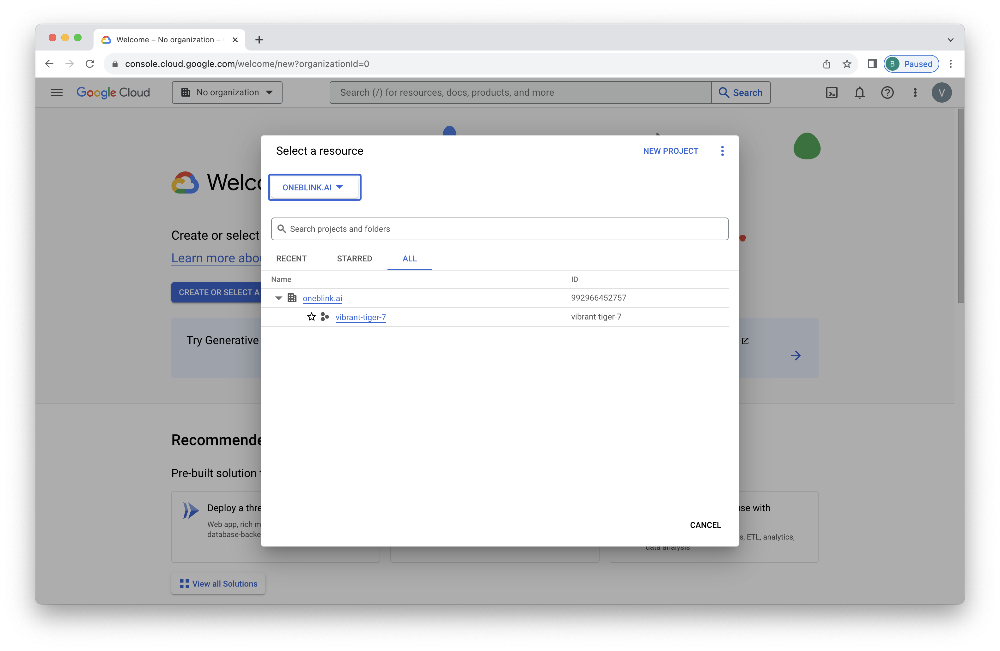
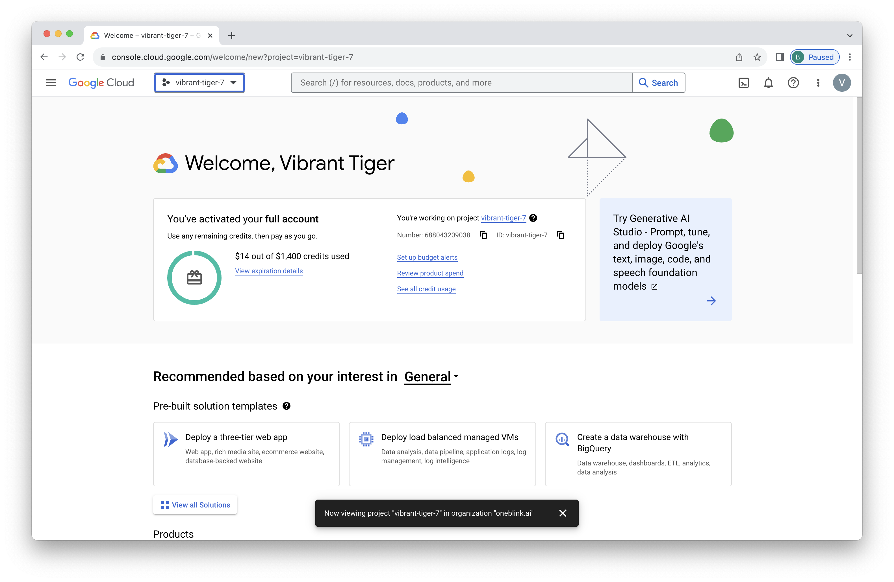

# Lab 0 - Sign In
At the start of this lab you should have been handed credentials for Google Cloud.  In this first section, we're going to use those to sign in.

## Improving the Labs
As you work through these labs, we'd really appreciate your feedback.  One way to help us improve is to open an issue by going [here](https://github.com/neo4j-partners/hands-on-lab-neo4j-and-vertex-ai/issues).  Outright bugs, usability suggestions, and general comments are all appreciated.  Pull requests are great too!

## Sign into Google Cloud
We're going to sign into a new Google Cloud account.  You may already have other Google accounts.  If you use Chrome, you might consider creating a new profile or using incognito mode for these exercises.  That's not mandatory though and other browsers work fine too.

Our next step is to open the Google Cloud console [here](https://console.cloud.google.com/). 

If you have no other Google accounts, you'll see a menu as shown below.  Enter the email you were given for this lab in and click "NEXT."  In my case, the email was vibrant-tiger-7@oneblink.ai.

Now enter the password you were given for this lab.

You'll see a prompt about the new account.  This account is being managed by [OneBlink.AI](https://oneblink.ai/), a company Neo4j works with for training.  We ask that you use this account solely to complete the lab exercises.  Assuming that is acceptable to you, click "I understand."

Check the box to agree to the terms and click "AGREE AND CONTINUE."

We're now in a new Google Cloud account.  OneBlink.AI already created a project for us.  Click "Select a project" at the top.

Click on "NO ORGANIZATION" at the top.

Select the "oneblink.ai" organization.

Click to select the project available to you.  In my case it was "vibrant-tiger-7."

Now you're all set, logged into a Google Cloud account with a project selected.

In the next lab we'll deploy Neo4j.