# Signup for Google Cloud
For this lab you'll need both a Google and a Google Cloud account.  If you don't have accounts or if they are restricted so you can't deploy things, you can follow these steps to create a free trial.

You'll need to provide your phone number and credit card information.  New Google Cloud accounts come with a $300 credit. Total costs for the lab should be significantly under $50. At the end of the lab we'll show you how to delete any resources you've deployed as well.

## Sign up for a Google Cloud account
You can sign up for a Google Cloud account [here](https://console.cloud.google.com/).

Click on "Create account" and select "For myself."

Enter you name.  If you have an existing email address you can use that.  Alternatively, select "Create a new Gmail address instead."  Click "Next."

Enter you phone number and other information.  Click "Next."

Now click "Send" to verify your phone number.

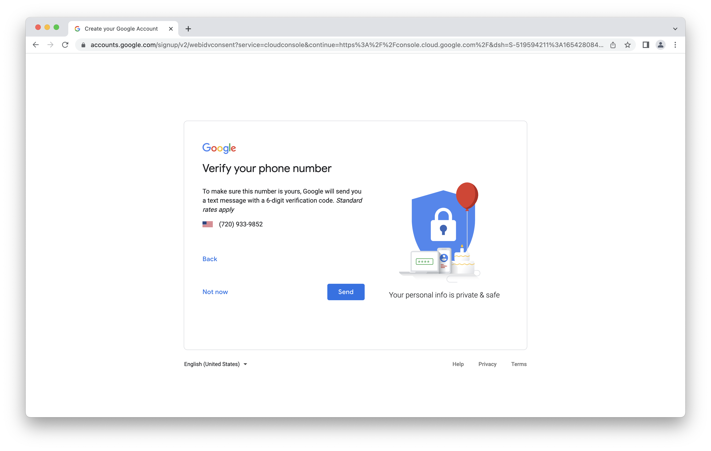

Enter the code you were texted and click "Verify."

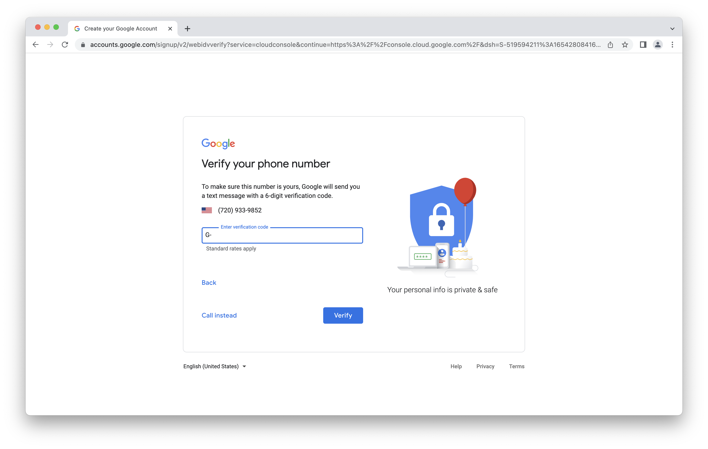

Click "Yes I'm in" to associate your number with Google services.

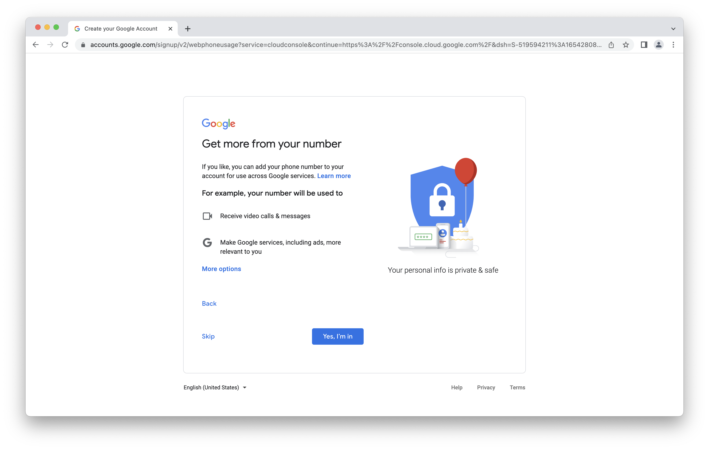

Review the terms and click "I agree" to continue.

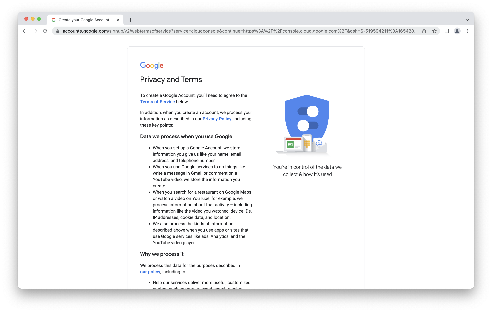

You'll now be redirected to the Google Cloud console.  Check the box to agree to terms and click "AGREE AND CONTINUE."

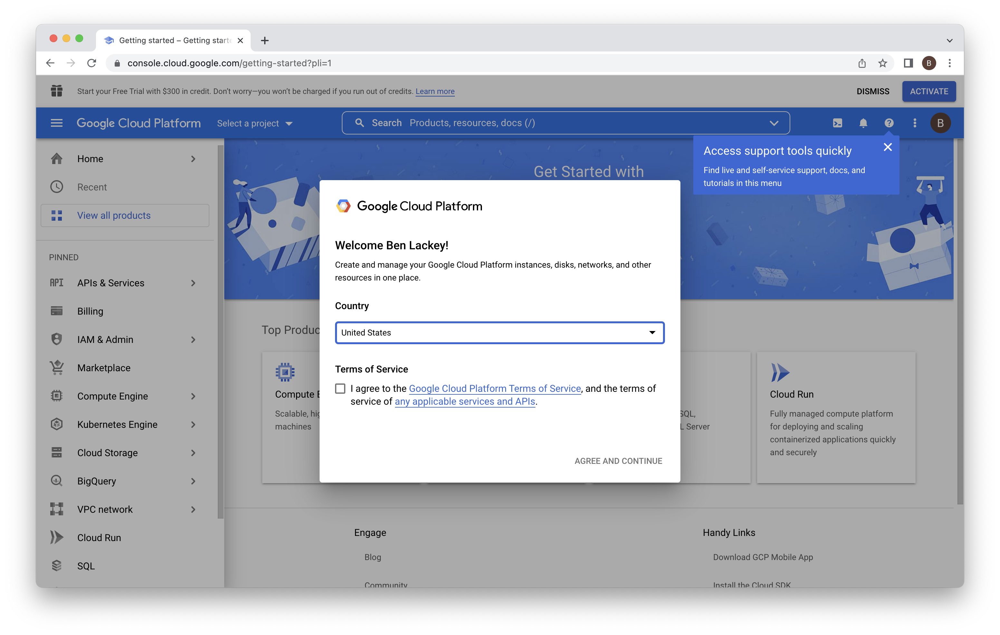

Congratulations!  You've signed up for a Google Cloud account.

## Activate your Google Cloud account
Now that you have an account, you need to activate it.  That will allow you to use the $300 free trial credits.  Click "ACTIVATE" at the top of the console.

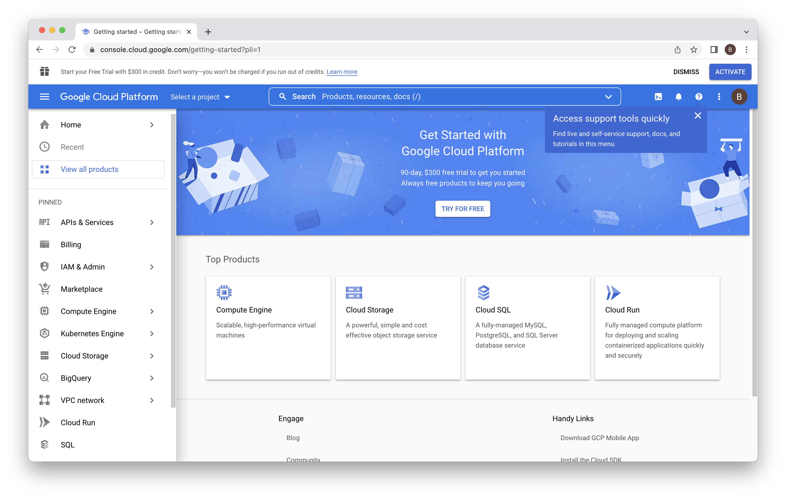

Select an answer for "What best describes your organization or needs?"  I chose "personal." Then review the terms, accept them and click "CONTINUE."

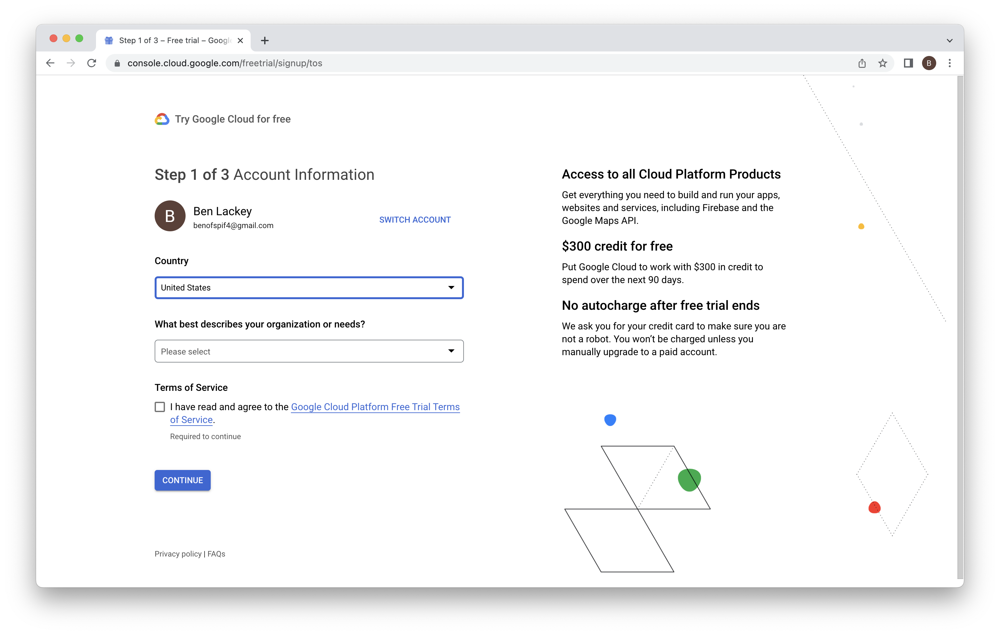

Click "CONTINUE" to verify your phone number.

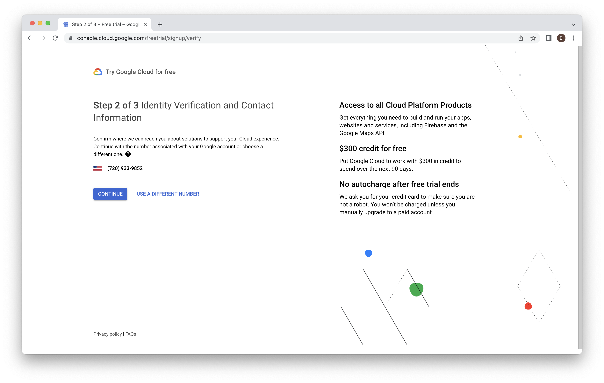

Select "Individual" for account type.  You'll need to enter a credit card number.  This number will not be charged unless you change your billing options explictly to bill it.  The card is used solely to verify your identity.

Once you've entered your information click "START MY FREE TRIAL."

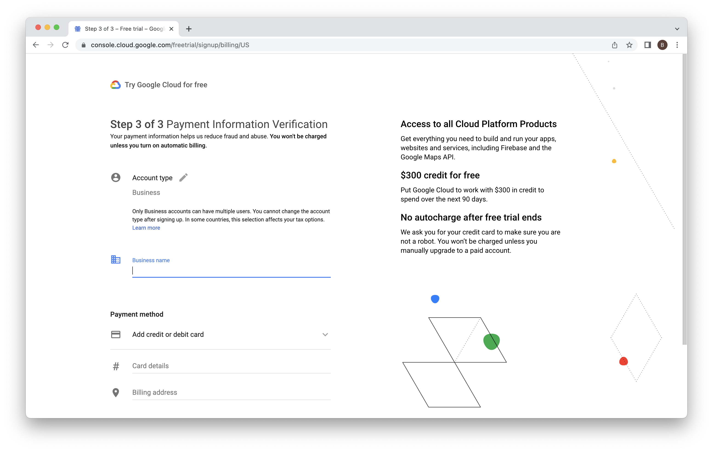

You'll see a questionaire dialog you can dismiss by clicking "CLOSE."  You can dismiss the tutorial dialog by clicking "SKIP FOR NOW."  Click the "X" to dismiss the "Now viewing project "My First Project" in organization "No organization" dialog.  Click the "X" to dismiss the "Explore products at a glance" dialog.

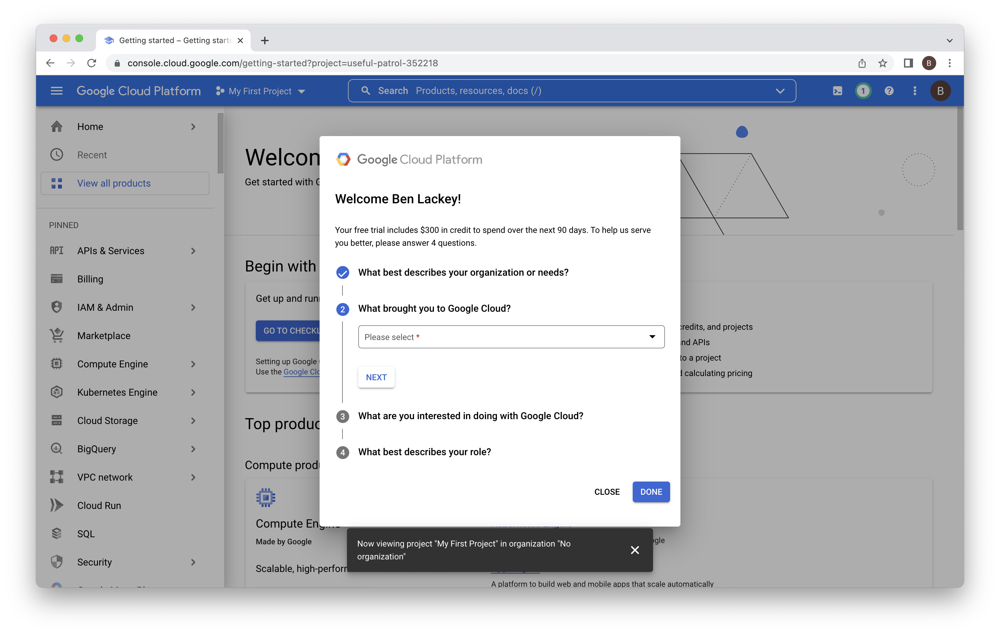

That should give you a console that's ready to use.  

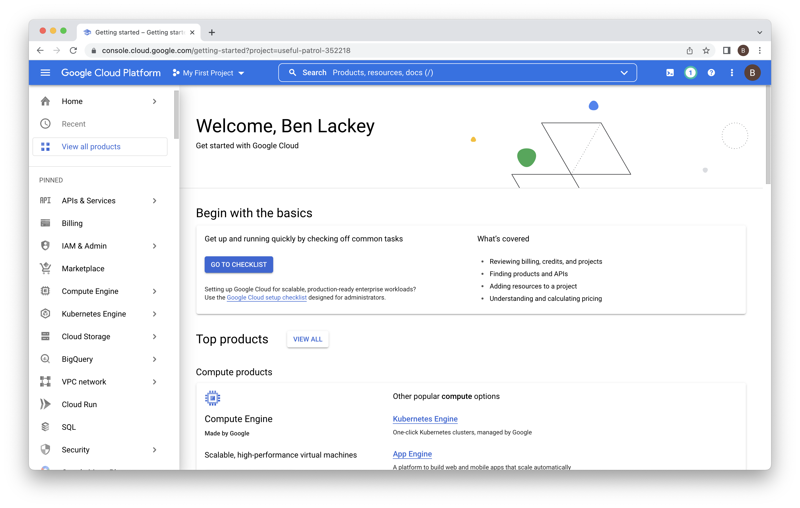

You have $300 in credits to use over 90 days.  Your credit card will not be billed unless you change your billing options.

In the next lab we'll deploy Neo4j using the account you just created.