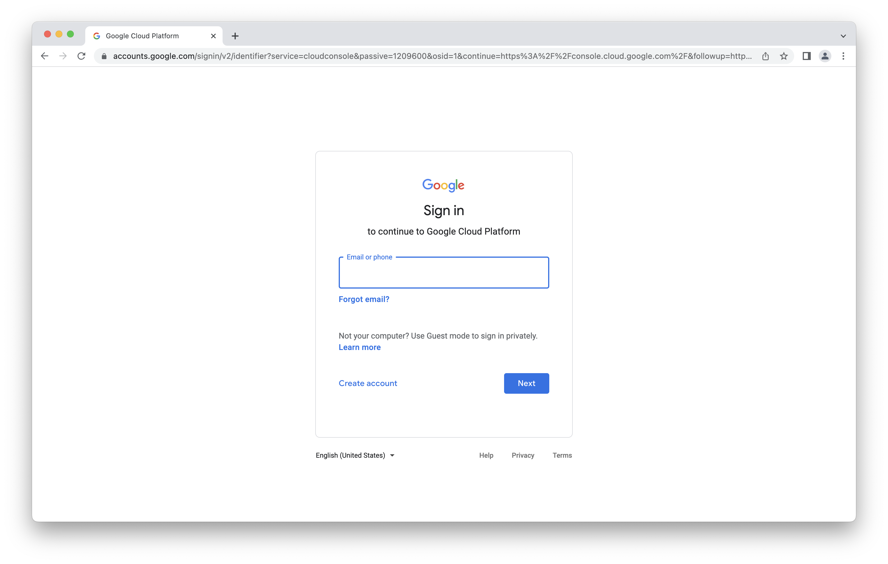
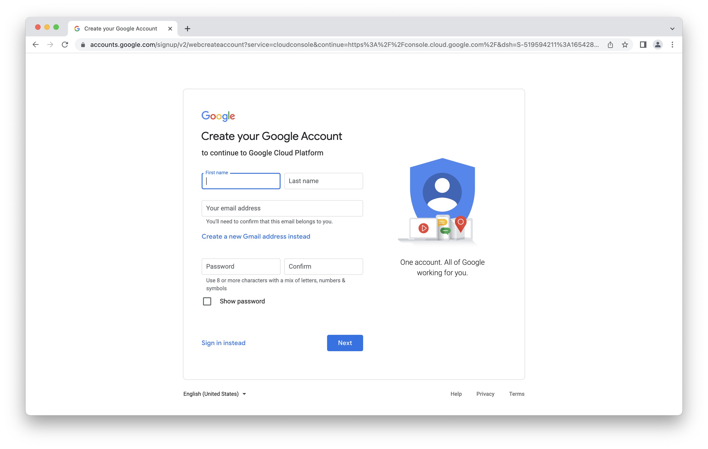
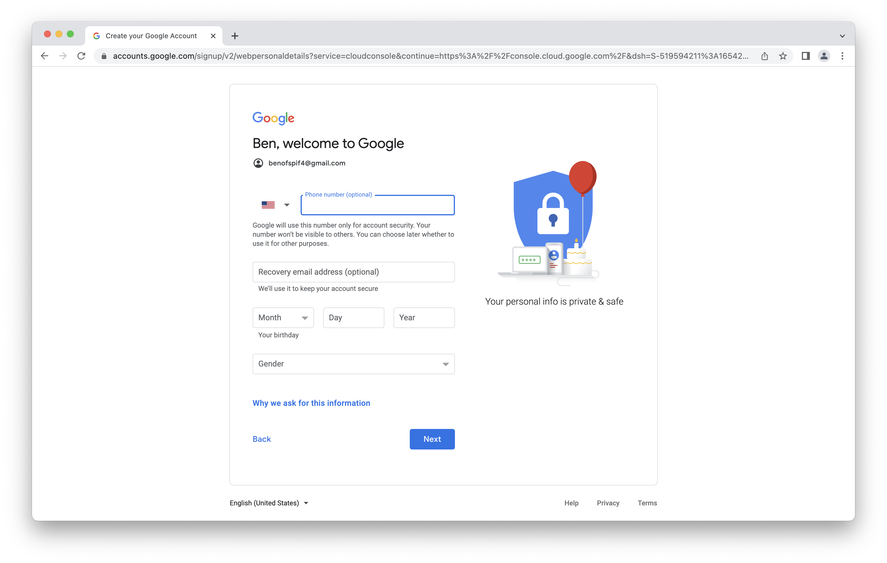
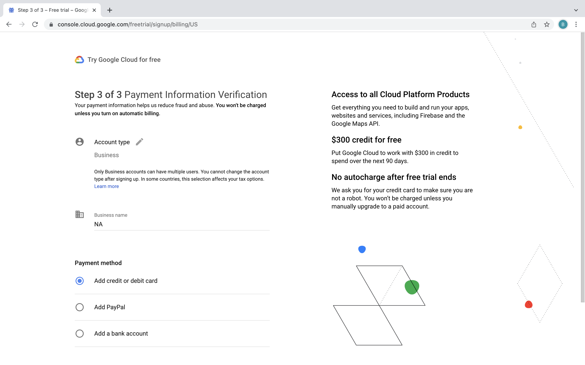
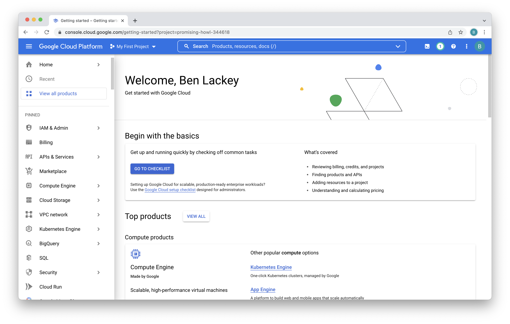

# Signup for Google Cloud
If you don't already have a Google Cloud account, these instructions will help with creating one.  If you don't have a Google account you'll need to create one as well.

## Sign up for a Google Account
First off, you'll need a Google account.  If you don't have one (either a company account or a gmail address), you can sign up for one [here](https://accounts.google.com/).

## Sign up for a Google Cloud account
You can sign up for a Google Cloud account [here](https://console.cloud.google.com/).

You'll need to provide your phone number and credit card information.  New GCP accounts come with a $300 credit. Total costs for the lab should be significantly under $50. At the end of the lab we'll show you how to delete any resources you've deployed as well.

Once you've signed up for an account, you'll see a dialog to activate your $300 in credits.  Click activate.

Accept the terms of service and click "Continue."

Verify your phone number and click "Continue."

Provide your payment information and click "Continue."  Note this is only used to verfiy your identity.  It will not be charged unless both your $300 credit is exhausted and you enable billing.

You'll now be presented with the console again.  There may be a few help dialogs you can dismiss.

Great!  You now have a GCP account and you're all ready to get started deploying stuff!