# Lab 0 - Signup for Google Cloud
For this lab you'll need both a Google and a Google Cloud account.  If you don't have accounts or if they are restricted so you can't deploy things, you can follow these steps to create a free trial.

You'll need to provide your phone number and credit card information.  This is not charged unless you explicitly enable billing, rather it is used to verify your identity.  New Google Cloud accounts come with a $300 credit. Total costs for the lab should be significantly under $50. At the end of the lab we'll show you how to delete any resources you've deployed as well.

## Improving the Labs
As you work through these labs, we'd really appreciate your feedback.  One way to help us improve is to open an issue by going [here](https://github.com/neo4j-partners/hands-on-lab-neo4j-and-vertex-ai/issues).  Outright bugs, usability suggestions, and general comments are all appreciated.  Pull requests are great too!

## Sign up for a Google Cloud Account
You can sign up for a Google Cloud account [here](https://console.cloud.google.com/). 

Click on "Create account" and select "For my personal use."

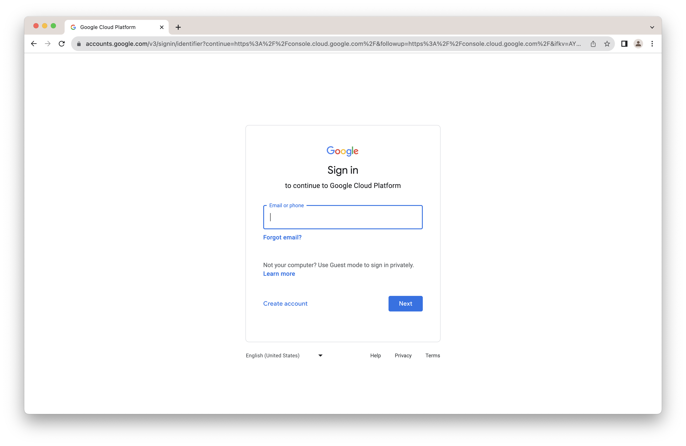

Enter your name and click "Next."

Enter your birthday and click "Next."

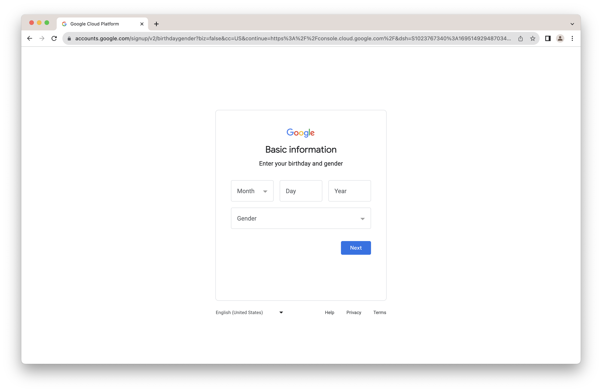

If you have an existing email address you can potentially use that.  However, you'd want to be absolutely certain that you've not already used the Google Cloud free trial for that email address.  Alternatively, select "Get a gmail address instead."  

Select "Create your own gmail address" and click "Next."

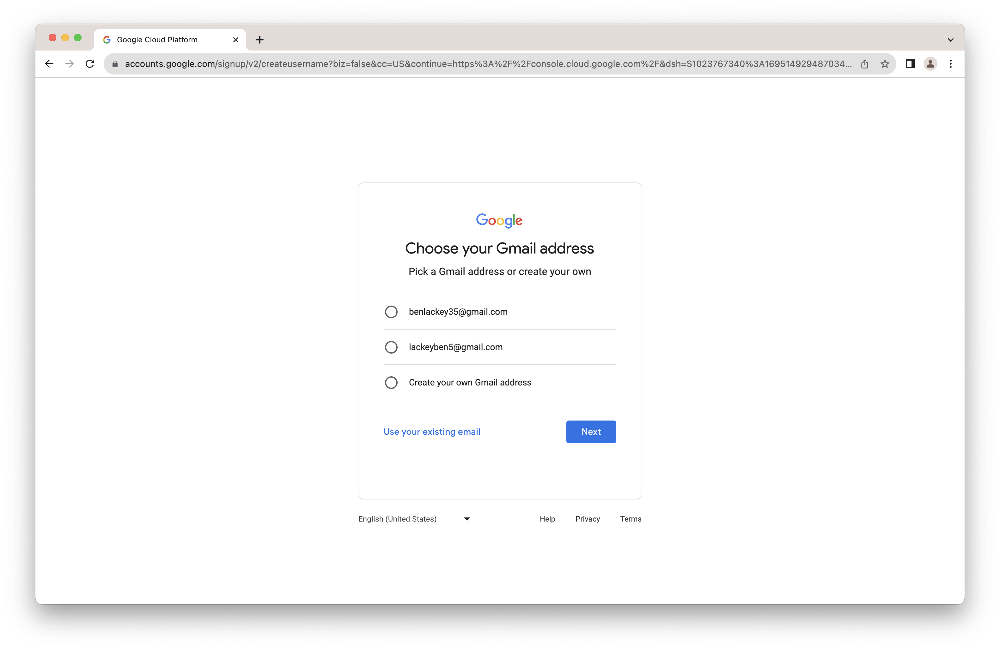

Enter an address and click "Next."

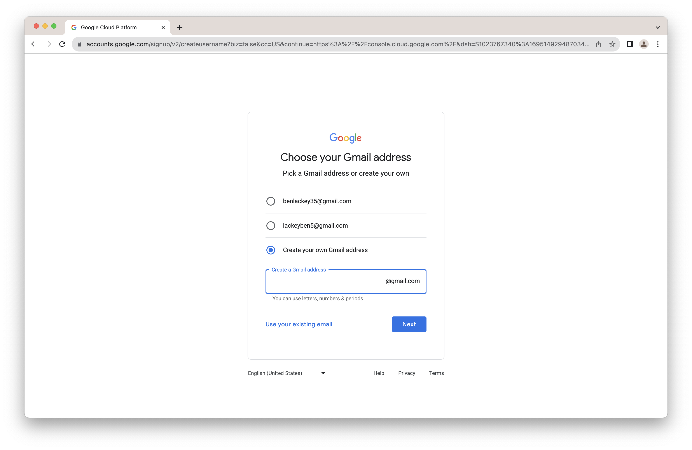

Enter a password and click "Next."

Enter a recovery email address and click "Next" or simple click "Skip."

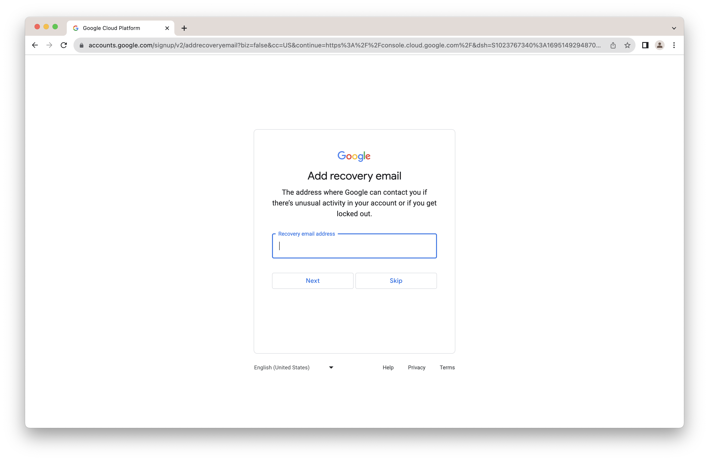

Enter you phone number and click "Next."  Do not skip this step or you will have to do it again later.

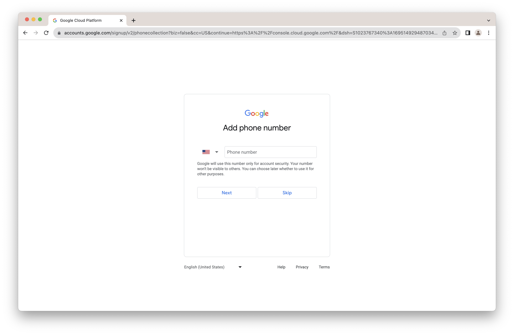

Click "Send" to verify your number.

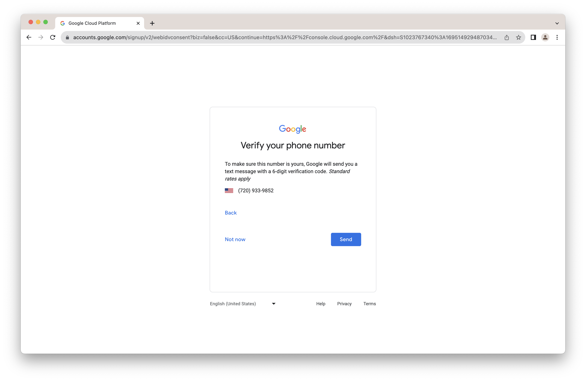

Enter the code you were texted and click "Verify."

Click "Yes, I'm in" to accept terms.

Click "Next" to confirm your information.

Review the terms and scroll to the bottom.

Click "I agree."

Click "Confirm."

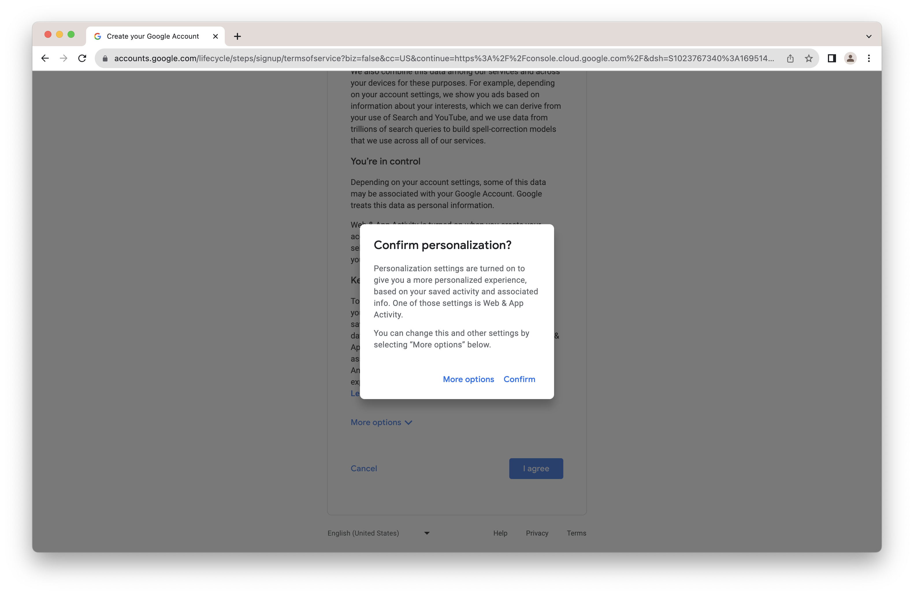

You'll now be redirected to the Google Cloud console.  Check the box to agree to terms and click "AGREE AND CONTINUE."

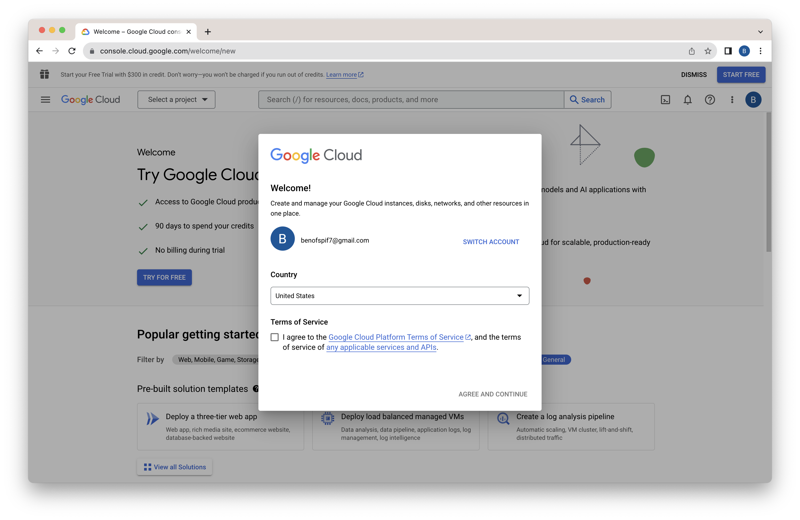

Congratulations!  You've signed up for a Google Cloud account.

## Activate your Google Cloud Account
Now that you have an account, you need to activate it.  That will allow you to use the $300 free trial credits.  Click "Start Free" at the upper right top of the console.

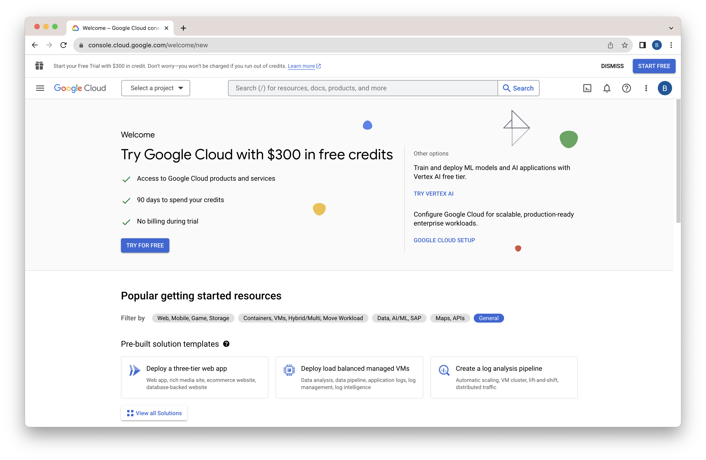

Select your country and click "AGREE & CONTINUE."

Click the pencil to change your account type to individual.

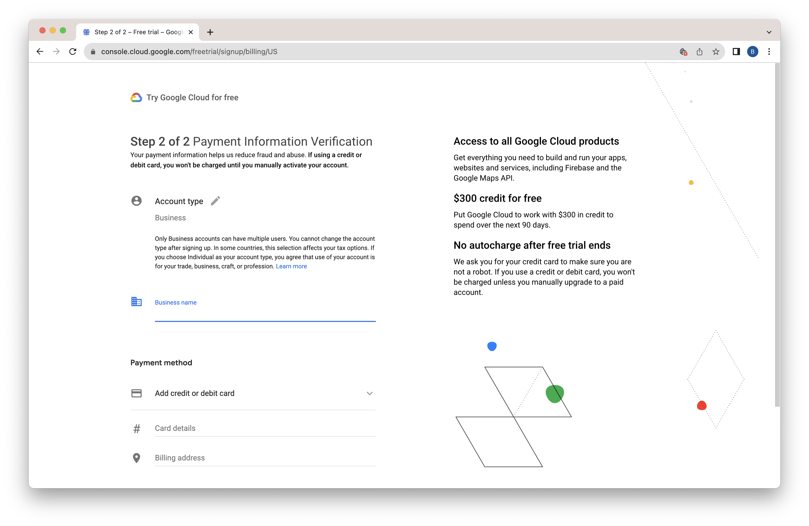

You'll need to enter a credit card number.  This number will not be charged unless you change your billing options explictly to bill it.  The card is used solely to verify your identity.

Once you've entered your information click "START MY FREE TRIAL."

You'll see a questionaire dialog you can dismiss by clicking "CLOSE."

That should give you a console that's ready to use.  

You have $300 in credits to use over 90 days.  Your credit card will not be billed unless you change your billing options.

In the next lab we'll deploy Neo4j using the account you just created.