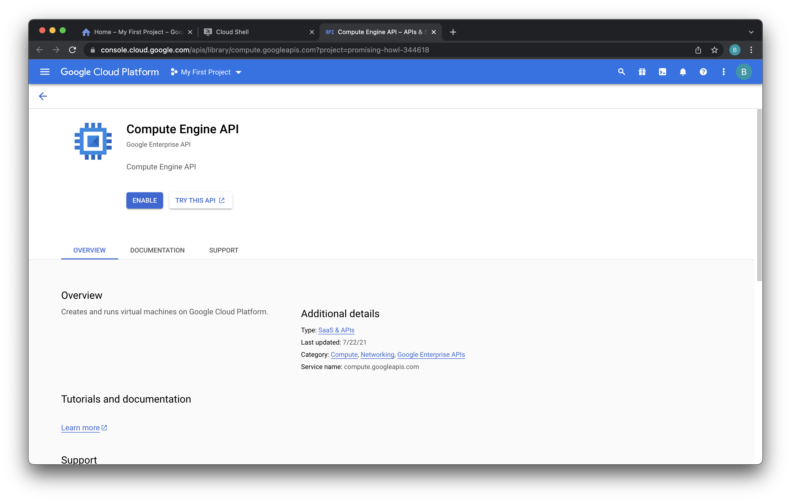

# Lab 1 - Deploy Neo4j
In this lab, we're going to deploy Neo4j.

## Improving the Labs
As you work through these labs, we'd really appreciate your feedback.  One way to help us improve is to open an issue by going [here](https://github.com/neo4j-partners/hands-on-lab-neo4j-and-vertex-ai/issues).  Outright bugs, usability suggestions, and general comments are all appreciated.  Pull requests are great too!

## Enable APIs
Throughout these labs, we're going to use a number of APIs.  If you haven't already enabled them, login to each service and click "Enable API."

* [Deployment Manager](https://console.cloud.google.com/dm)
* [Compute Engine](https://console.cloud.google.com/compute)
* [Cloud Storage](https://console.cloud.google.com/storage)
* [Vertex AI](https://console.cloud.google.com/vertex-ai)

In the case of Compute Engine, the dialog looks like this:

## Deploy Neo4j
There are a number of ways to deploy Neo4j on GCP.  We're going to deploy on IaaS using Google Deployment Manager from the CLI.  To get started with that, go [here](IaaS/README.md).