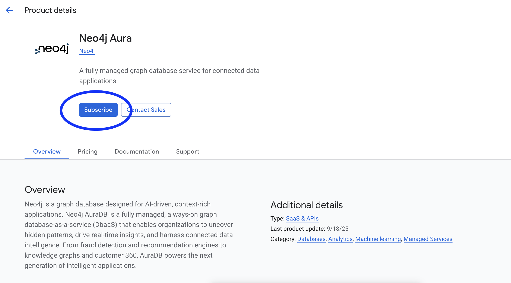
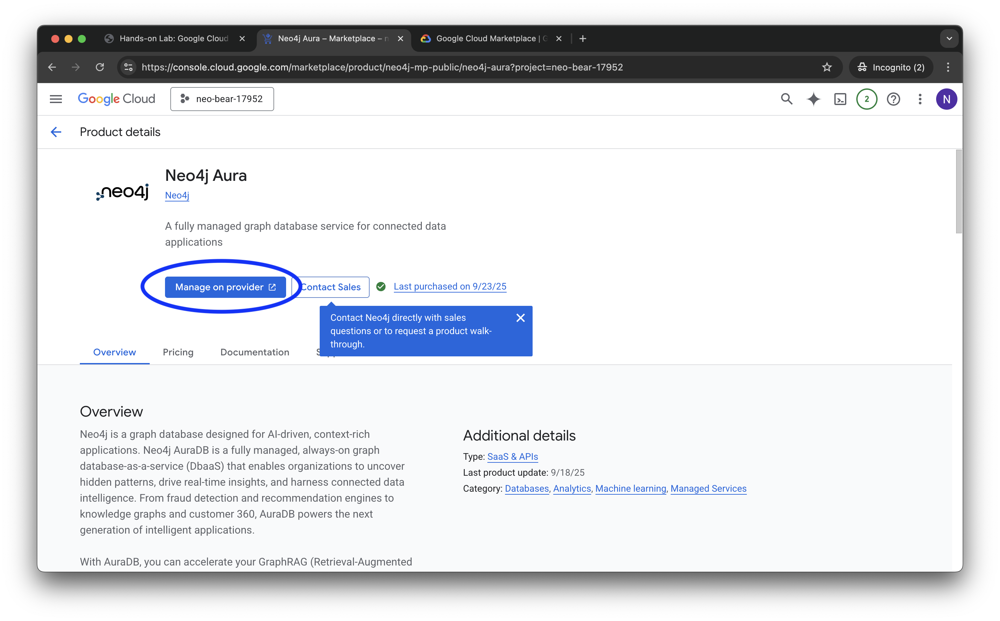

# Lab 1 - Deploy Neo4j
Neo4j has three major products:
* Graph Database - a native graph database built from the ground up to leverage not only data but also the relationships in that data
* Graph Data Science - implementations of 70+ algorithms that can be run on graphs stored in the database
* Bloom - a Business Intelligence (BI) tool designed specifically to explore graphs

There are many ways to run these products on Google Cloud.  The Marketplace in particular offers three ways to deploy Neo4j:

* Software as a Service (SaaS) - Neo4j Aura is the lowest effort way to deploy Neo4j.  Infrastructure is managed entirely for you.  Aura is available in AuraDB (Database) and AuraDS (Data Science) versions.  DB is the core database.  DS include Bloom for Business Intelligence and Neo4j Graph Data Science.
* Infrastructure as a Service (IaaS) - Neo4j Enterprise Edition is available on IaaS with a Google Deployment Manager template.  That allow you to choose whether you would like a single node or cluster.  It allows deployment of Graph Database, Bloom and Graph Data Science.
* Platform as a Service (PaaS) - This is an option to deploy Graph Database on Kubernetes.

You can inspect these options [here](https://console.cloud.google.com/marketplace/browse?filter=partner:Neo4j).

## Deploying AuraDS Professional
We're going to use the SaaS version, AuraDS, in these labs.  This is sometimes refered to as a database as a service (DBaaS).  Aura comes in a number of flavors.  There's an enterprise and a professional version.  We're going to deploy the professional version.  

So, let's get started deploying...  To do so, let's go to the Google Cloud console [here](https://console.cloud.google.com/).  If it's not already open, click the hamburger icon in the upper left to expand the menu.

On the left menu, scroll to the bottom and click "MORE PRODUCTS."

Still in the left menu, scroll all the way to the bottom.  You'll see listings for a number of partner products.  These are products from leading ISVs that Google has chosen to integrate tightly into the Cloud Consonle.  Amoung those, you'll see a listing for Neo4j.  Click on that.

That takes you to a description of Neo4j Aura Professional in the Google Cloud Marketplace.  Click on "Subscribe."

On the plan summary, review it and then scroll to the bottom.

Review the terms and accept them.  Then click "Subscribe."

You'll see a message that "Your order is now active."  Click "Go to product page."

We're now subscribed but need to enable the API.  Click on "Enable."

When complete you'll see this page.  Click on "Manage Via Neo4j, Inc." at the top of the page.

Confirm that you're ok with getting redirected to the management console.

You'll be asked which Google credentials you want to use.  Be sure to select the same credentials you've been using so far.

You'll need to agree to some terms and cookies.  Click "Got it" and "I agree."

And, now you're at the Aura console.  At this point, we've authorized the API and logged into the console for Aura Professional.  

Click "Got it!" to dismiss the cookie dialog.

We can now create our first database.  We want to create an AuraDS instance.  That way we'll have access to Graph Data Science and Bloom, the Neo4j business intelligence tool.

Click on "Instances" under AuraDS.

Important -- Be sure to select AuraDS.

Now click on "New Instance" to create a new AuraDS instance.

We're presented with various options for that database.  For number of nodes, enter "500,000" and for number of relationships, enter "1,000,000".

Then scroll down.  In later labs, We're going to be making a node embedding, so select that.  The node embedding will allow us to represent our graph as features that Google Vertex AI can consume in a tablular format.

Scroll to the bottom and click "Calculate estimate."

Review the estimate, enter "sec-edgar" for instance name, and click "Create"

You'll be presented with the credentials for your database.  Click "Download and continue."  That will download the credentials to a text file on your local machine.  Be sure to save that file as you won't be able to get those credentials later.

You'll see a dialog that your database is being created.  This takes less than five minutes.

When deployment is complete you'll see this menu.  

You can poke around the menus here a bit and see more on database status and connection information.

You now have a deployment of Neo4j running!  In the next lab, we'll connect to it.
