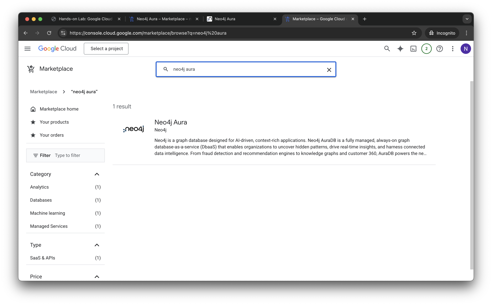

# Lab 1 - Deploy Neo4j
Neo4j has three major products:
* Graph Database - a native graph database built from the ground up to leverage not only data but also the relationships in that data
* Graph Data Science - implementations of 70+ algorithms that can be run on graphs stored in the database
* Bloom - a Business Intelligence (BI) tool designed specifically to explore graphs

There are many ways to run these products on Google Cloud.  The Marketplace in particular offers three ways to deploy Neo4j:

* Software as a Service (SaaS) - Neo4j Aura is the lowest effort way to deploy Neo4j.  Infrastructure is managed entirely for you.  Aura is available in AuraDB (Database) and AuraDS (Data Science) versions.  DB is the core database.  DS includes Bloom for Business Intelligence and Neo4j Graph Data Science.
* Infrastructure as a Service (IaaS) - Neo4j Enterprise Edition is available on IaaS with a Google Deployment Manager template.  That allow you to choose whether you would like a single node or cluster.  It allows deployment of Graph Database, Bloom and Graph Data Science.
* Platform as a Service (PaaS) - This is an option to deploy Graph Database on Kubernetes.

## Deploying AuraDS Professional
We're going to use the SaaS version, AuraDS, in these labs.  This is sometimes refered to as a database as a service (DBaaS).  Aura comes in a number of flavors.  There's an enterprise and a professional version.  We're going to deploy the professional version.  

So, let's get started deploying...  To do so, let's go to the Google Cloud Marketplace [here](https://console.cloud.google.com/marketplace).  

Once you get to the main page, type "neo4j" into the search bar. 

Once there select the "Neo4j Aura"

This will take you to the Neo4j Aura marketplace listing. Click on the "Subscribe" button. 

In the next menu, you can keep all of the default values, scroll down and tick the box to accept the Additional Terms and click "Subscribe".

You will then get a pop up window, click on "Sign up with Neo4j".

When complete you'll see this page.  Click on "Manage on Provider" at the top of the page.

Confirm that you're ok with getting redirected to the management console.

At the Neo4j Aura login screen click "Continue with Google"

Click on your temporary account name to continue, and on the next screen click "Continue" again.

The next series of menus will ask some general informational questions, feel free to enter anything you like here until you get to the Aura console. 

Now we are in the Aura console and we're ready to create our first database! 

Click on "Create Instance"

We want to create an AuraDS instance.  That way we'll have access to Graph Data Science and Bloom, the Neo4j business intelligence tool.

Select "AuraDS" om the upper right hand corner. 

You will next be taken to the configuration menu. You can leave all of the default values in place. 

Scroll down and enter "**sec-edgar**" as the instance name and tick the box that says "I accept" at the bottom and click "Create" on the lower right. 

You'll be presented with the credentials for your database.  Click "Download and continue."  That will download the credentials to a text file on your local machine.  Be sure to save that file as you won't be able to get those credentials later.

You'll see a dialog that your database is being created. This should only take a few minutes.

When deployment is complete you'll see the instance details in the management console.  

You can poke around the menus here a bit and see more on database status and connection information.

You now have a deployment of Neo4j running!  In the next lab, we'll connect to it.
