# SaaS
Aura is Neo4j's software as a service (SaaS) offering.  This is sometimes refered to as a database as a service (DBaaS) as well.  Aura comes in a number of flavors.  There's an enterprise and a professional version.  We're going to deploy the professional version.  

Aura also comes in a database (AuraDB) and a data science (AuraDS) version.  We're going to use AuraDS.

To get started, first navigate to the console [here](https://console.cloud.google.com/).  Then click the hamburger icon in the upper left to expand the menu.

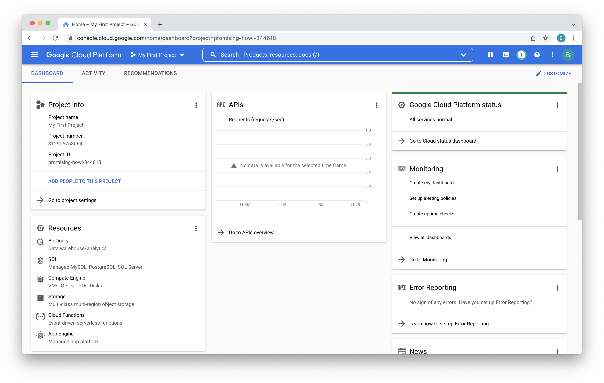

In that left menu, scroll down to the bottom.

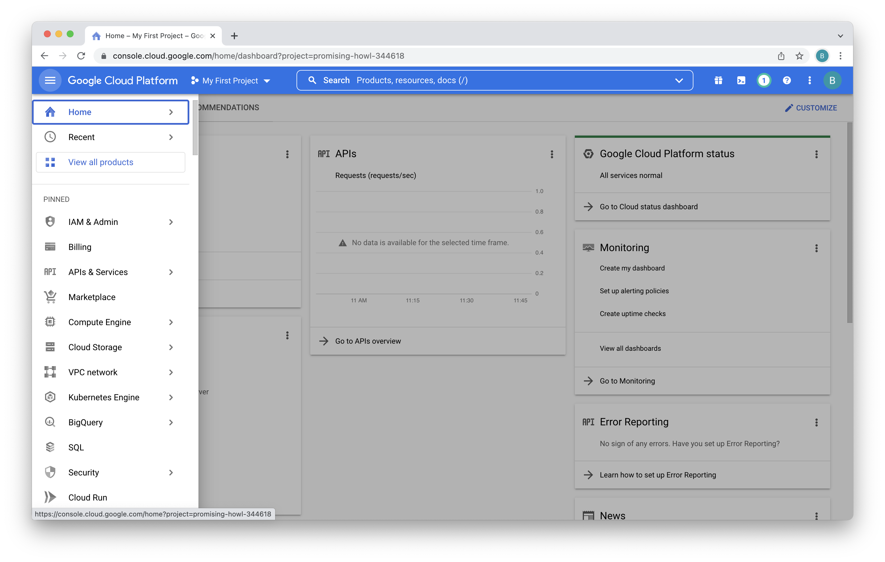

You'll see a listing for Neo4j.  Click on that.

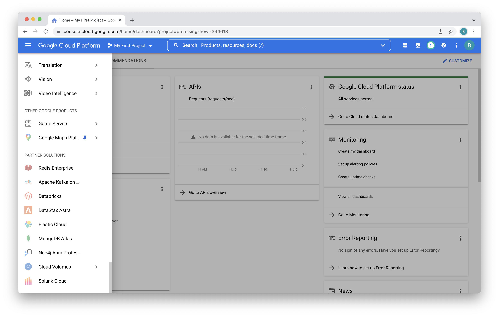

That takes you to a description of Neo4j AuraDB Professional.  Click on "Subscribe."

On the plan summary, review it and then scroll to the bottom.

Review the terms and accept them.  Then click "Subscribe."

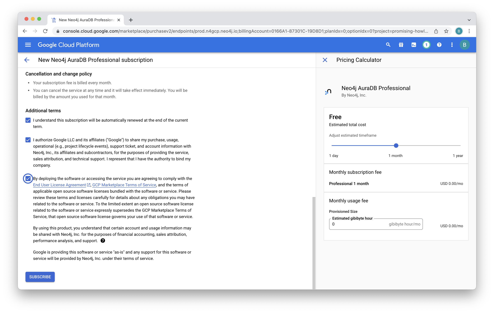

You'll see a message that "Your order is now active."  Click "Go to product page."

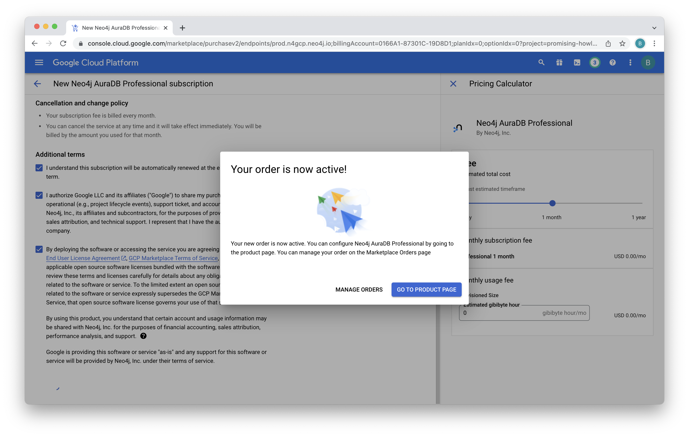

We're now subscribed but need to enable the API.  Click on "Enable."

When complete you'll see this page.  Click on "Manage Via Neo4j, Inc." at the top of the page.

Confirm that you're ok with getting redirected to the management console.

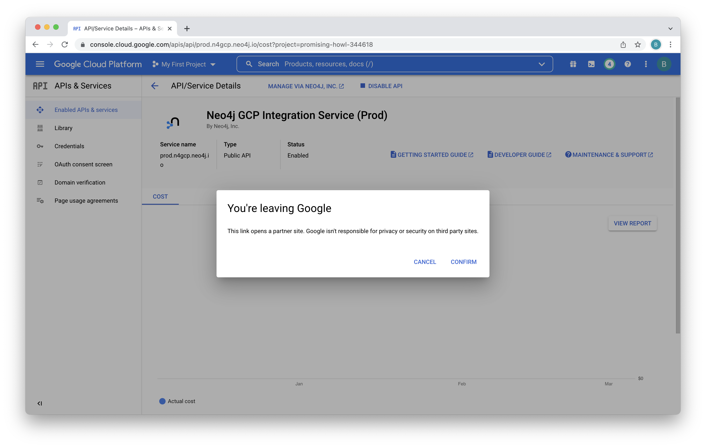

You'll be asked which Google credentials you want to use.  Be sure to select the same credentials you've been using so far.

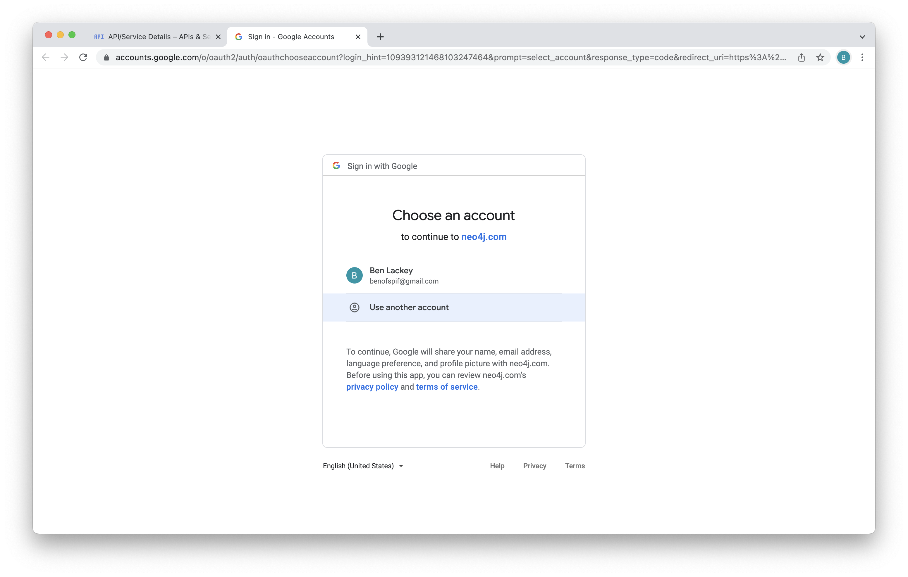

You'll need to agree to some terms and cookies.  Click "Got it" and "I agree."

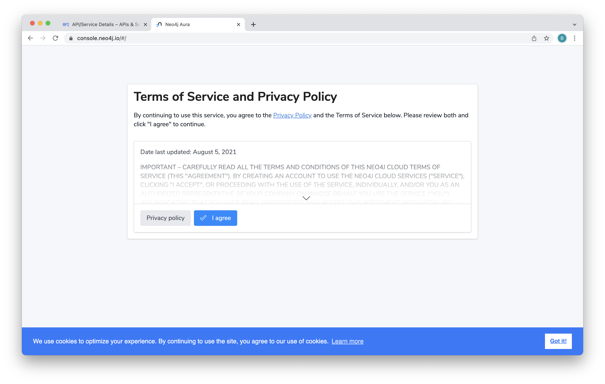

And, now you're at the AuraDB console.  At this point, we've authorized the API and logged into the console for AuraDB Professional.  We can now create our first database.  Click on "Create a database."

We're presented with various options for that database.  We can accept the defaults here.  Scroll to the bottom.

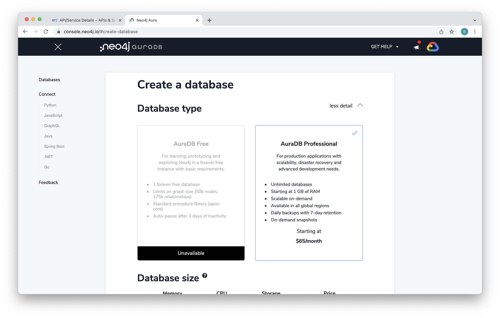

For database name, enter "form13."  Click "I understand."  Then click "Create Database."

You'll be presented with the credentials for your database.  Be absolutely certain to write those down.  We can't get them again later and you'll need them in a later lab.  Once you've done that click "I have stored these credentials safely to use later." Then click "Continue."

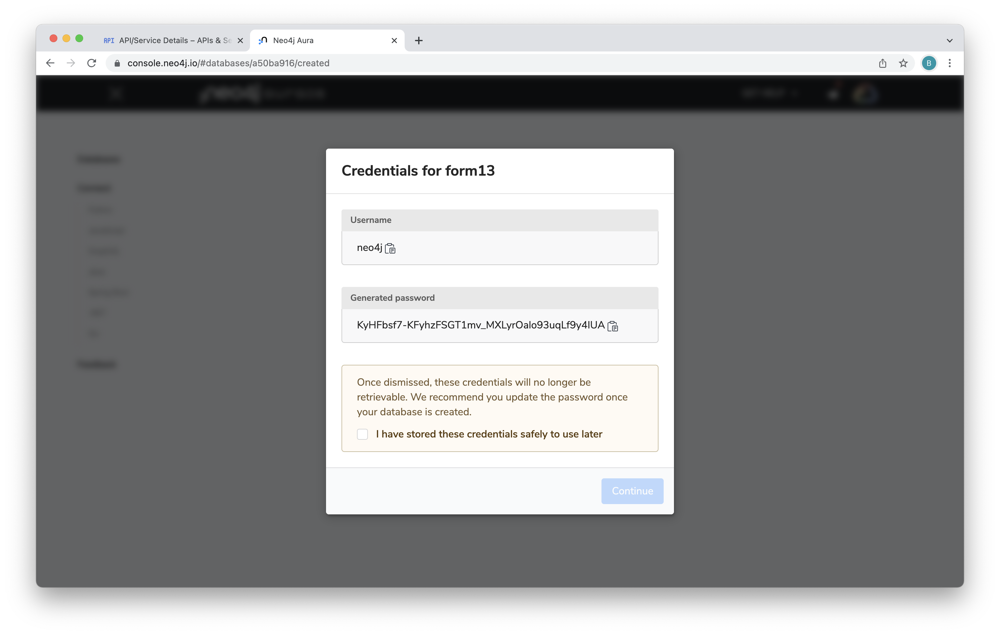

You'll see a dialog that your database is being created.  This takes less than five minutes.

When deployment is complete you'll see this menu.

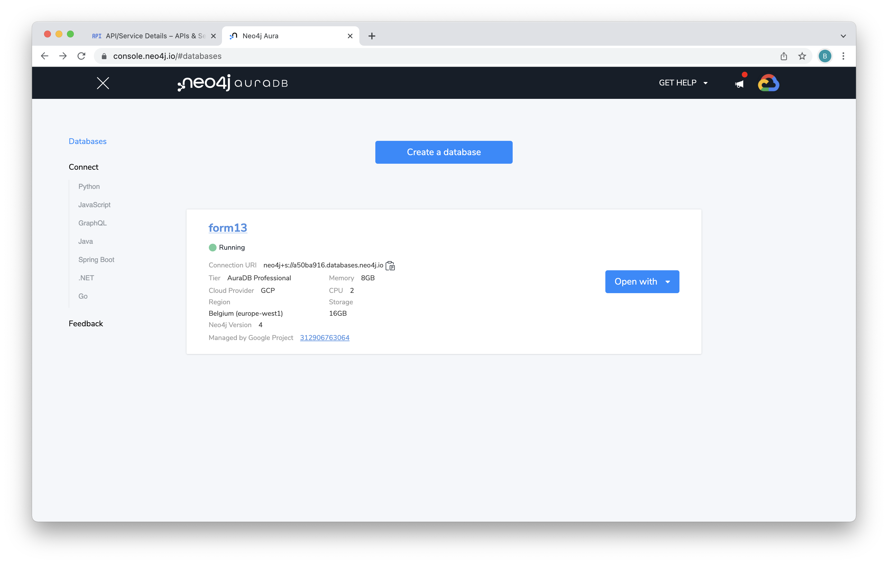

You can poke around the menus here a bit and see more on database status and connection information.
