# Lab 2 - Connect to Neo4j
In this lab, we're going to connect to the Neo4j deployment we created in the previous step.

## Neo4j Browser
A quick thing we can do to check that our deployment is running successfully is to open the Neo4j Browser.  To do so, we're going to need to get the external IP of a node.  To do that, let's go to the Google Cloud Console [here](https://console.cloud.google.com/).

In the search bar, type "vm instances" and then click on "VM Instances" under "PRODUCTS AND PAGES."

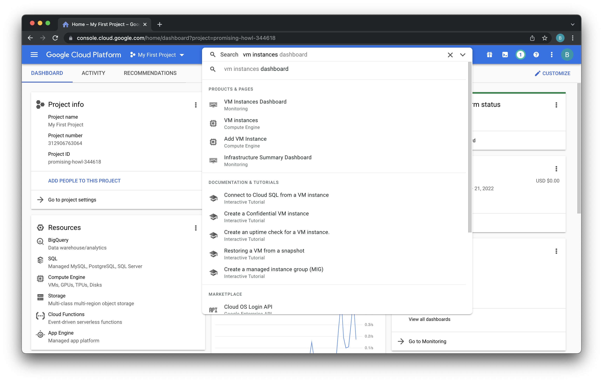

You'll see a list of instances running.  Click on one from our deployment just now.  It should have the name of the deployment, "neo4j," in the name.

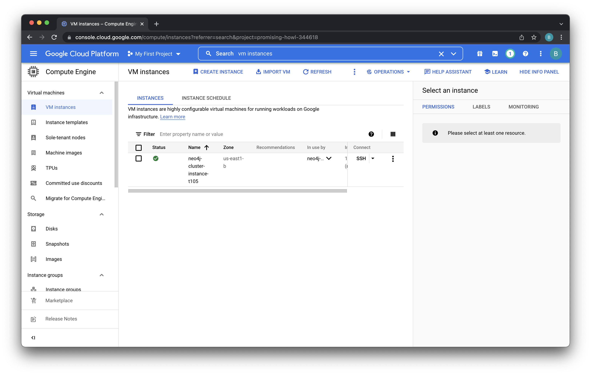

We're now presented with the instance's details.  Scroll down to find the "External IP."

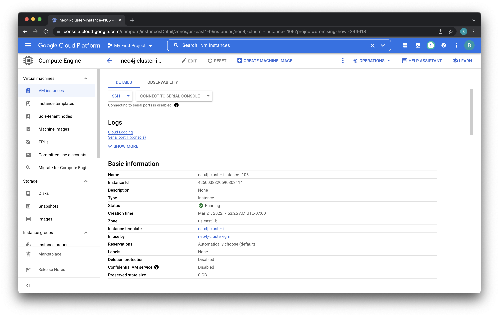

In my case, the external IP is 34.138.21.128.  Click on the "Copy to Clipboard" button for that and paste it into a new browser tab.  Add ":7474" to the end of that URL. 7474 is the port that Neo4j Browser uses for HTTP communication.  There's also an HTTPS listener running on 7473. Neo4j Browser is the GUI for Neo4j.

For instance, I navigated to http://34.138.21.128:7474

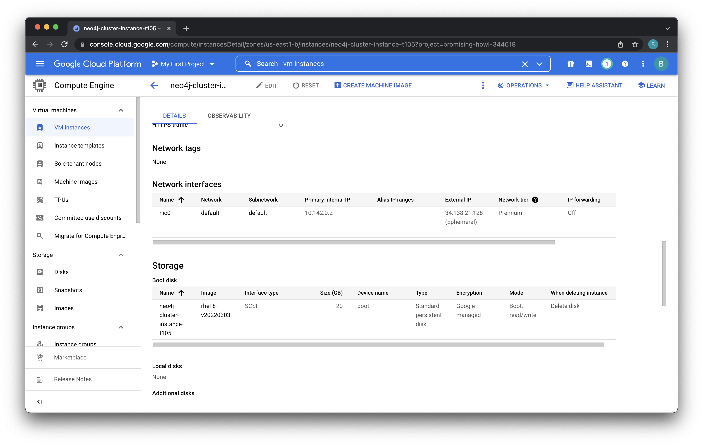

We're now presented with the Neo4j Browser. The default database is called "Neo4j."  We can leave that blank. The default login is "neo4j."  The password was given in our parameters file, parameters.single.yaml.  It's "foo123."  Type that in a click "Connect."

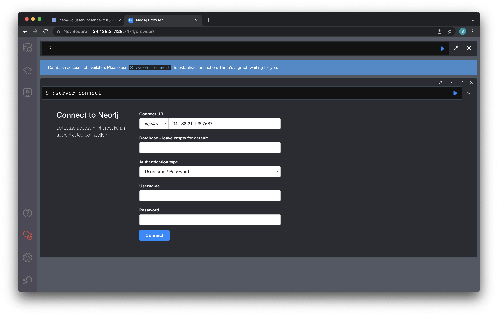

You'll be presented with the Neo4j welcome screen at this point.  If you click on the little database icon in the upper left, you can see the contents of our database.

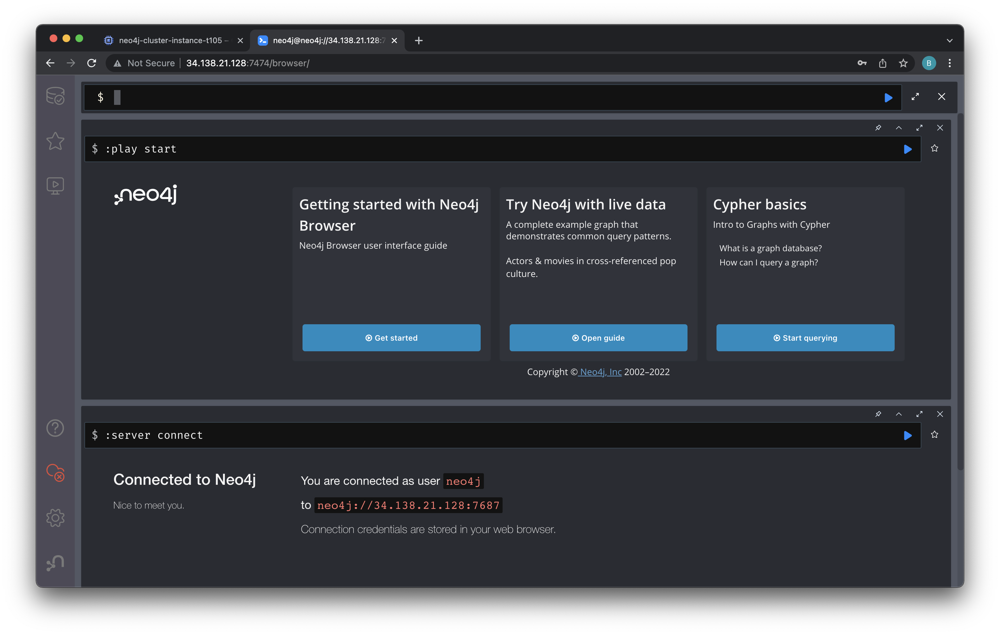

There's nothing in our database yet.  We can see the nodes, relationships and properties areas are all blank.

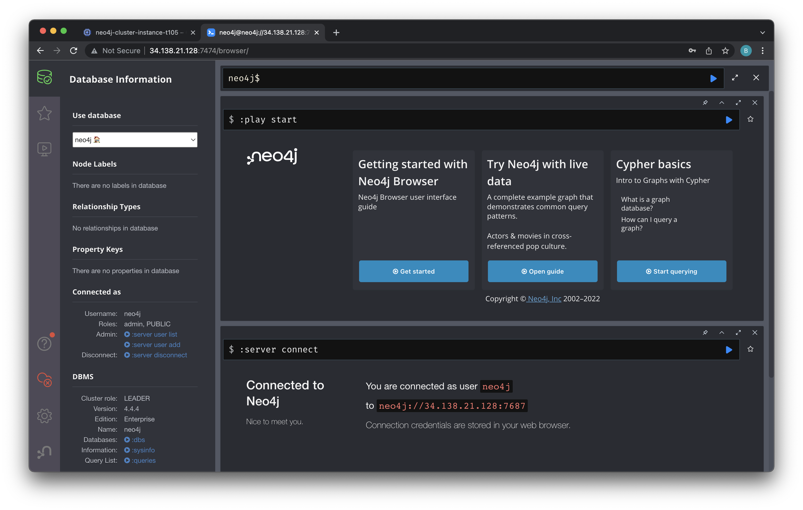

Before we move on, let's make sure Neo4j Graph Data Science (GDS) is all set up.  We can do that by entering the following command into the Neo4j Browser:

    RETURN gds.version() as version

Then hit the little blue triangle play button to run it.  You should see a GDS version number.

You might also consider running the following command.  If it returns `gdsEdition` as `licensed` then your license that you input when we deployed was processed properly.

    CALL gds.debug.sysInfo()

Assuming that all looks good, let's move on...

## Neo4j Bloom
Let's also check that Neo4j Bloom is running.  Bloom is Neo4j's Business Intelligence (BI) product.  We can connect to it on the same IP address and port as above.  The only difference is that we'll need to put "/bloom" on the end of the URL.  For instance, in my case the URL was http://34.138.21.128:7474/bloom

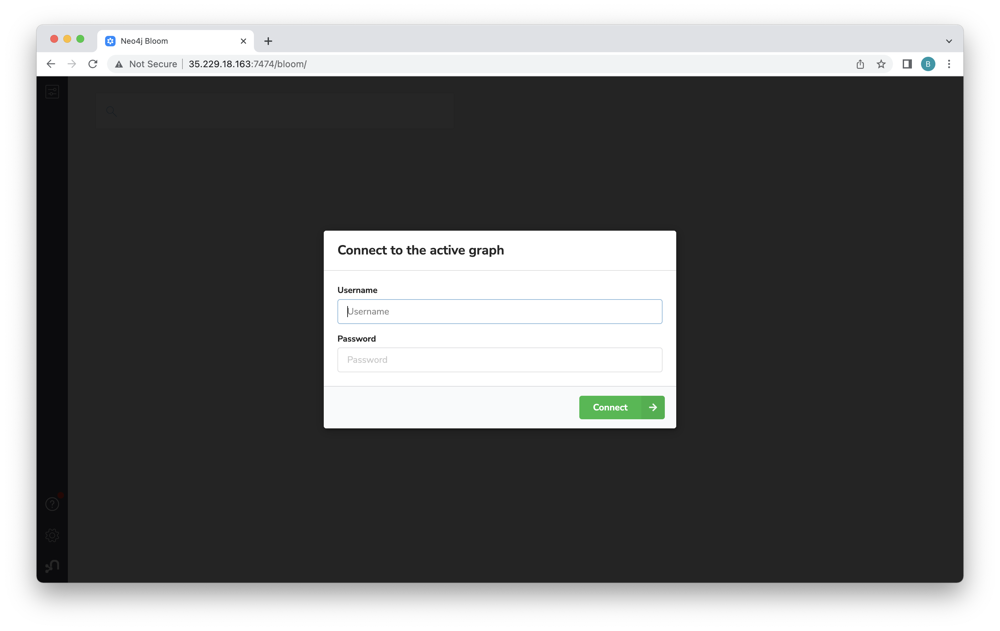

## Interacting via Shell
These steps are really useful if something goes wrong with your Neo4j deployment.  We're going to connect to an instance and check out some logs.  To get the connection information, let's go back to the tab with the instance page we were using before. If you closed it, you can follow the steps from above to find it again.

Once that's open, click on the "SSH" button.

That opens up a brand new window for SSH.  Click "Connect."

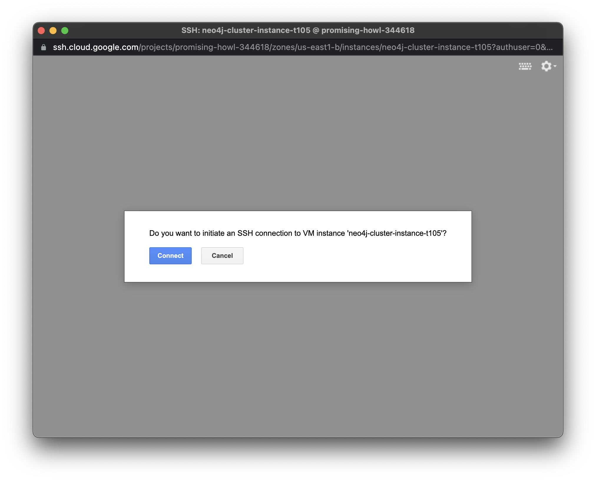

You should see a terminal like this.

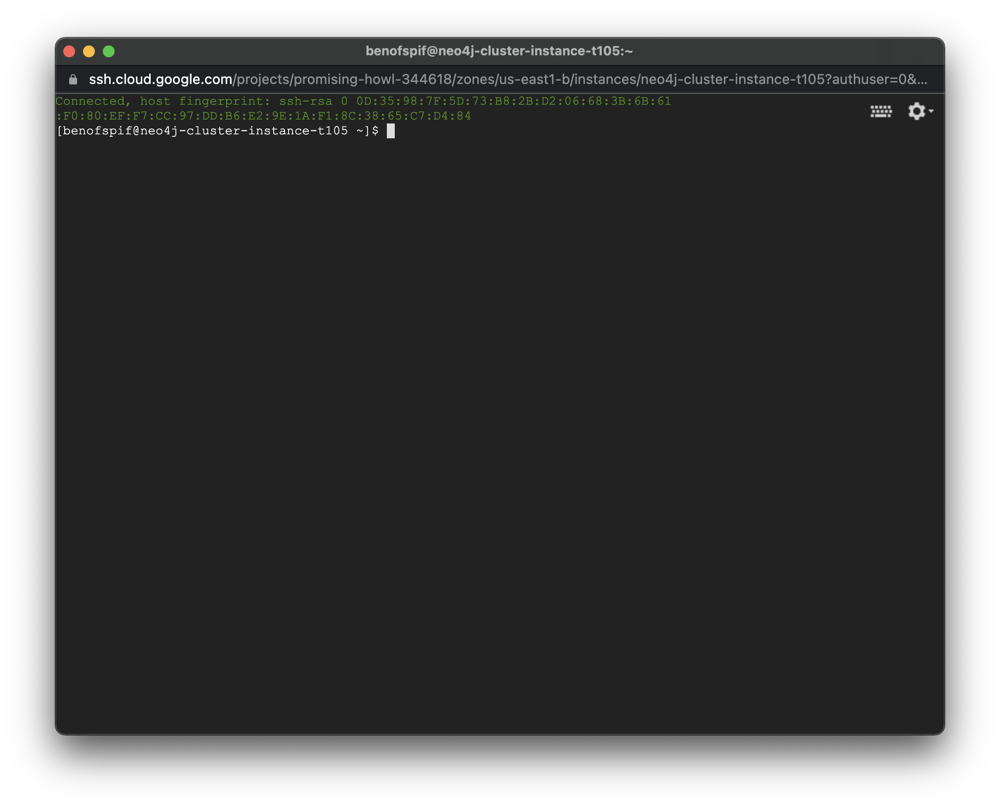

Now that we have a terminal, let's run a few commands to poke around.  This instance is running vanilla Red Hat Enterprise Linux (RHEL) 8 image, so looks very much like any other GCP instance.  After deployment, GCP ran a startup script using cloud-init.  Let's check the log for that to make sure it looks good.  We'll have to sudo as it has restricted permissions.

    sudo su
    cd /var/log/
    cat messages

Here's what it looks like.

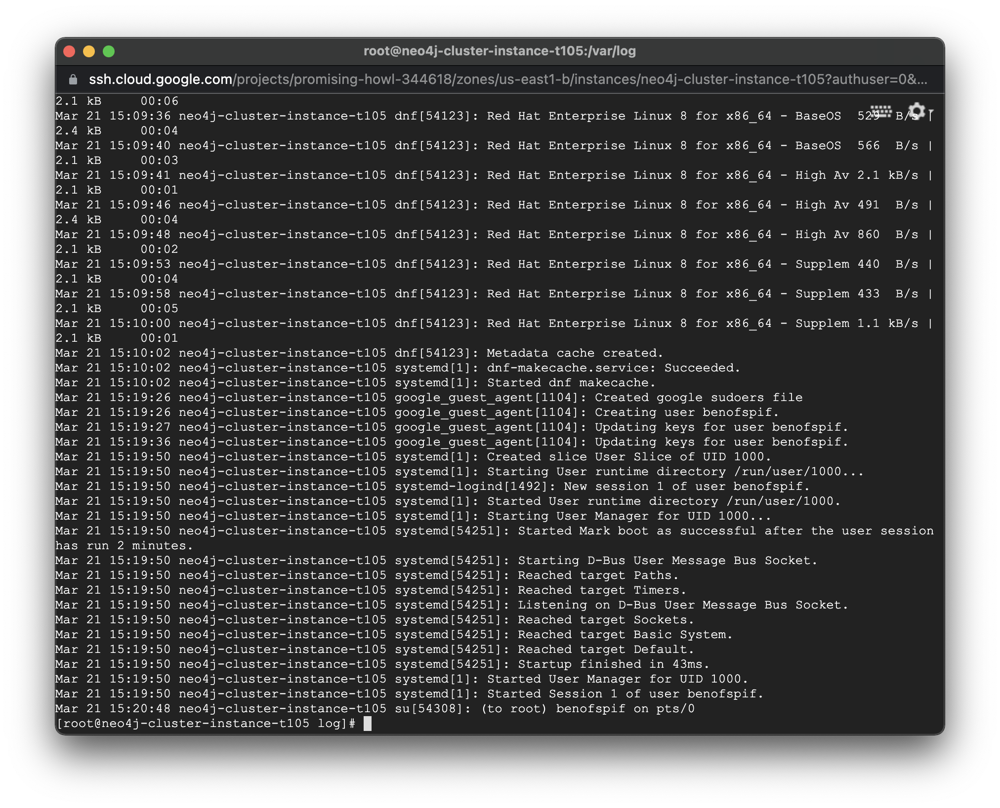

Now let's check out the Neo4j logs using these commands:

    cd /var/log/neo4j
    cat debug.log

That should give us this:

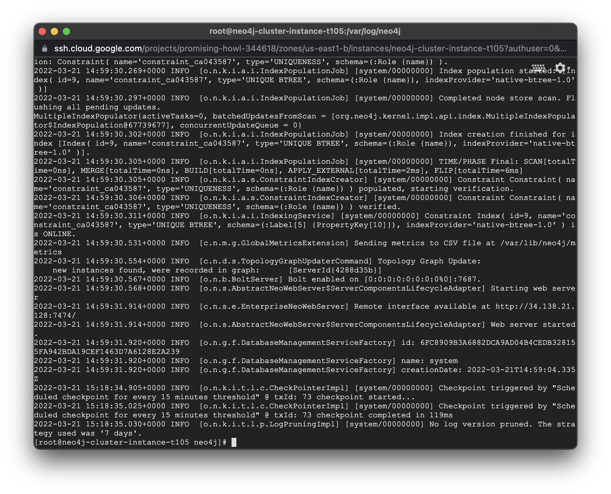

Finally, let's check to make sure the neo4j process is running with this command:

    ps -aux | grep neo4j

That should give us this:

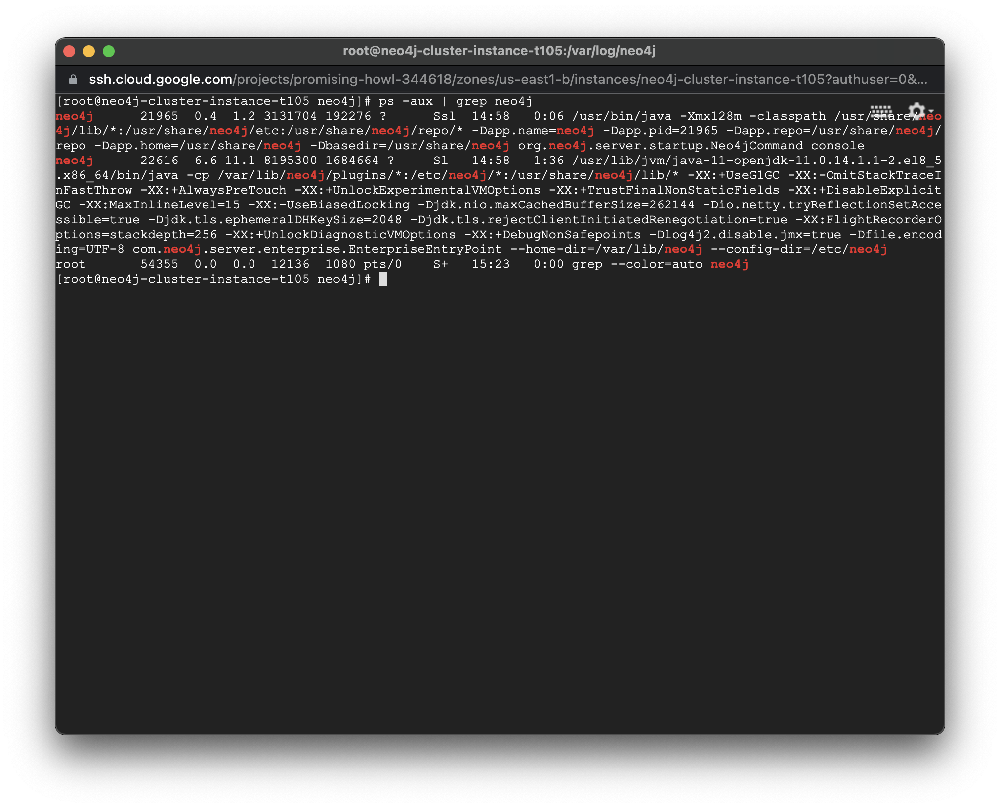

Assuming that all looks good, let's move on...
