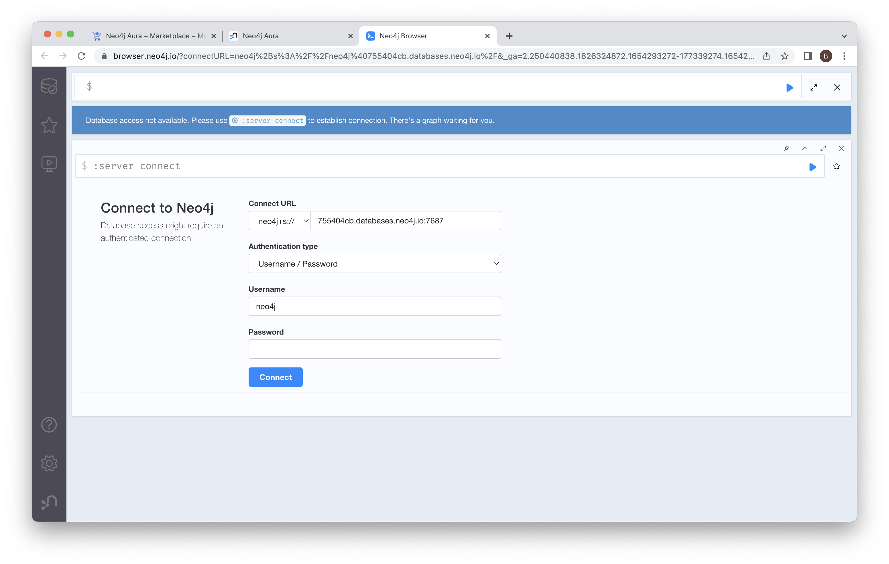
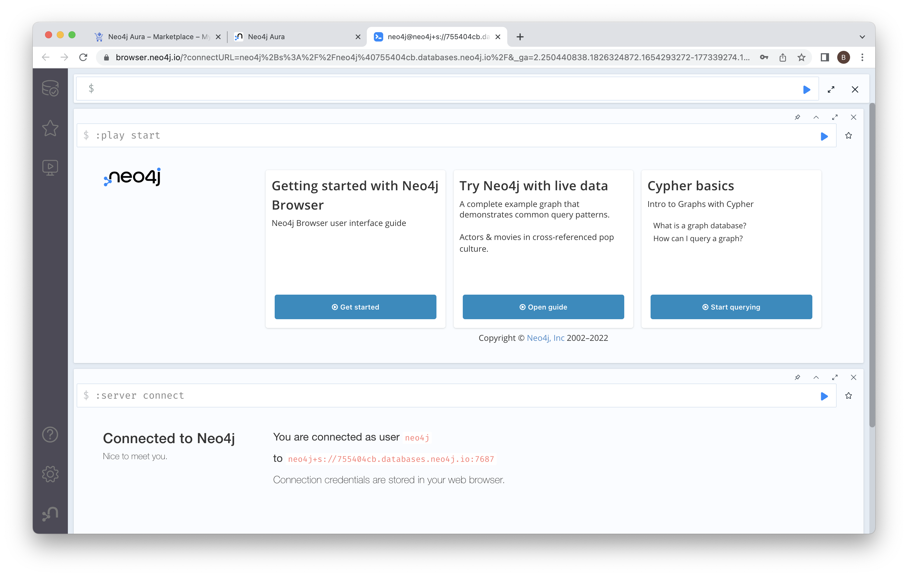
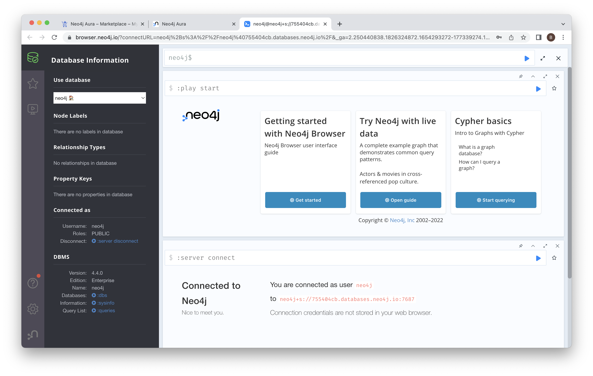
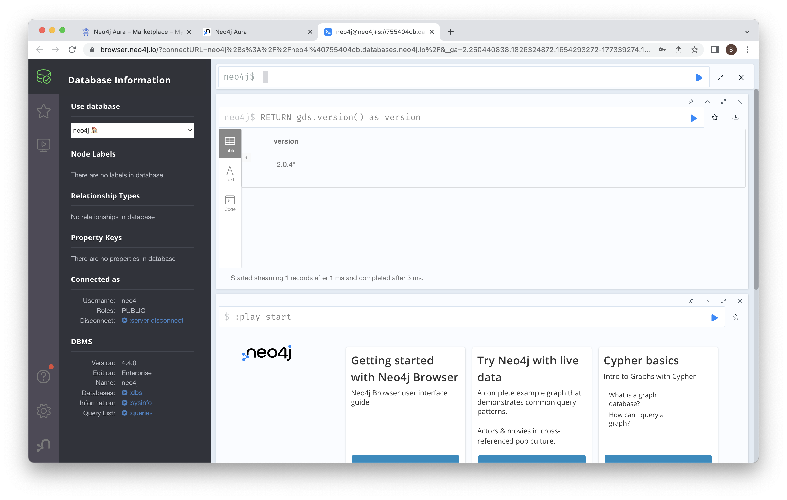

# Lab 2 - Connect to Neo4j
In this lab, we're going to connect to the Neo4j deployment we created in the previous step.  To get started, open the Neo4j endpoint in the Google Cloud console by navigating [here](https://console.cloud.google.com/marketplace/product/endpoints/prod.n4gcp.neo4j.io).

Click "MANAGE ON PROVIDER" to get to the Neo4j console.

Once again, you'll need to agreee to the redirect.

You should now see the Neo4j Aura console.

For the form13 instance we created, you can see three options:

1. Explore - This will open Neo4j Bloom, the business intelligence tool.
2. Query - This will open Neo4j Browser, a tool where we can run database queries and inspect the results.
3. Import - This opens the Neo4j Data Importer, a graphical tool for importing data into Neo4j.

## Neo4j Browser
Let's start with Neo4j Browser.  To open it, click the link that says "Query" on the form13 instance you have running.

We're now presented with the Neo4j Browser. We can accept the defaults.  Enter the password from earlier in and then click "Connect."

You'll be presented with the Neo4j welcome screen at this point.  If you click on the little database icon in the upper left, you can see the contents of our database.

There's nothing in our database yet.  We can see the nodes, relationships and properties areas are all blank.

Before we move on, let's check what version of Neo4j Graph Data Science (GDS) is set up.  We can do that by entering the following command into the Neo4j Browser:

    RETURN gds.version() as version

Then hit the little blue triangle play button to run it.  You should see a GDS version number.

Assuming that all looks good, let's move on...

Since we got a Graph Data Science version back, we know that we're on AuraDS, not AuraDB.  This means that we have the libraries we'll need to connect with the Python client and use graph algorithms later in these labs.
