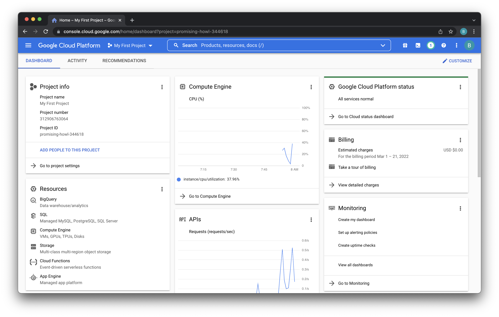
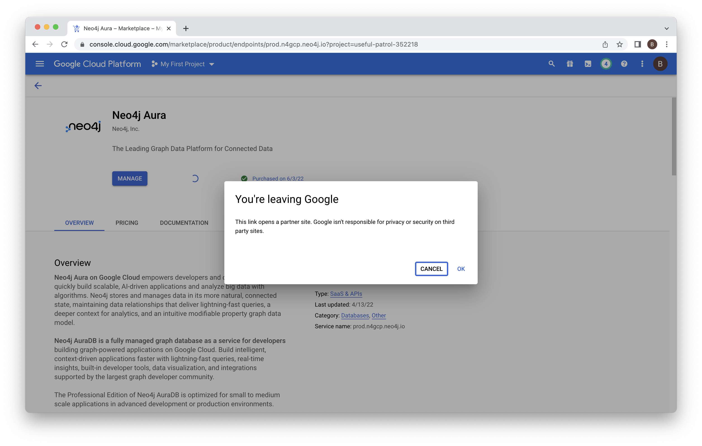
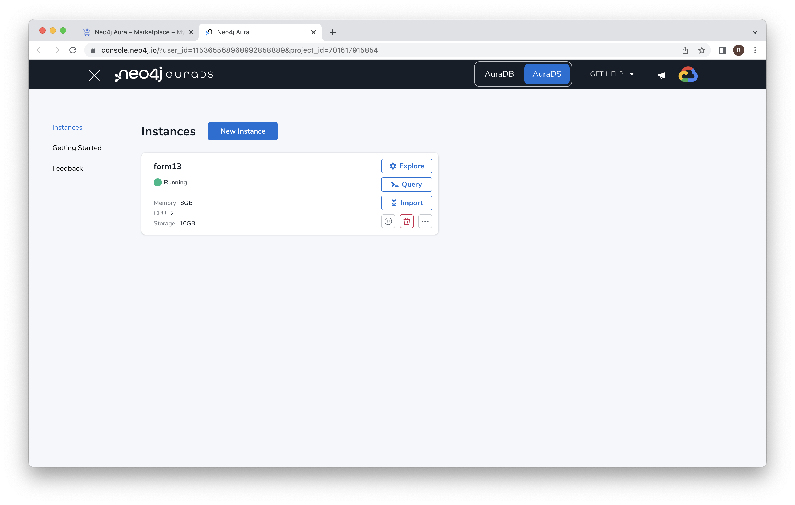
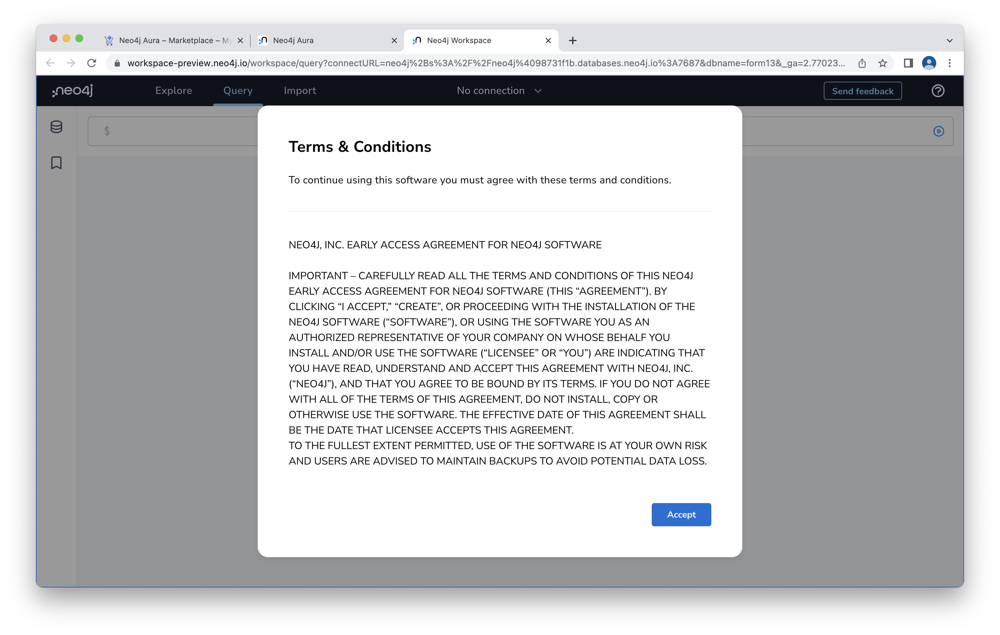
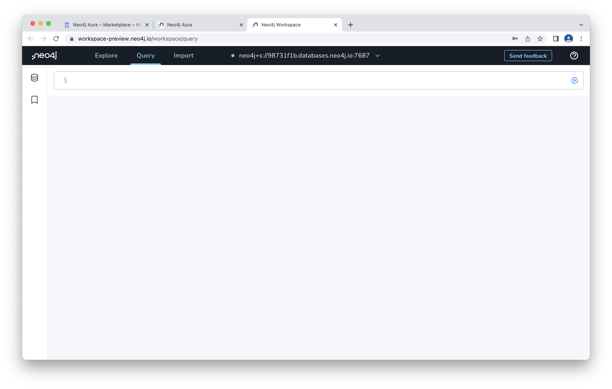
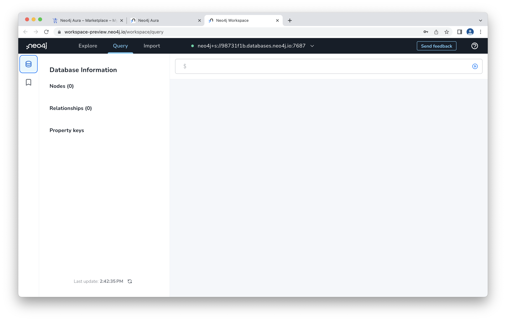
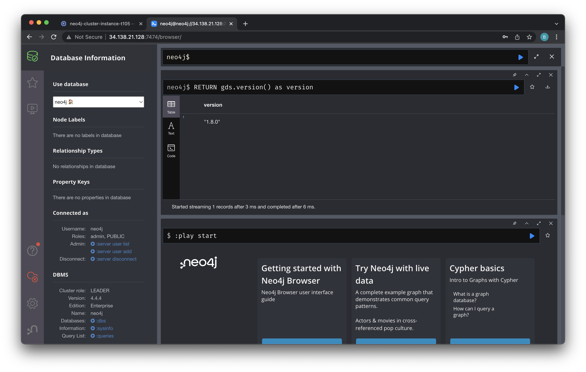

# Lab 2 - Connect to Neo4j
In this lab, we're going to connect to the Neo4j deployment we created in the previous step.  

## Neo4j Workspace
To get started, open the Neo4j endpoint in the Google Cloud console by navigating [here](https://console.cloud.google.com/marketplace/product/endpoints/prod.n4gcp.neo4j.io).

Click "MANAGE ON PROVIDER" to get to the Neo4j console.

Once again, you'll need to agreee to the redirect.

You should now see the Neo4j Aura console.  Click "Open" on the "sec-edgar" instance we created.

Review and agree to the Neo4j terms.

Enter your password from the previous lab to login.

We're now in Neo4j Workspace.  This environment offers three tools:

1. Explore - This will open Neo4j Bloom, the business intelligence tool.
2. Query - This will open Neo4j Browser, a tool where we can run database queries and inspect the results.
3. Import - This opens the Neo4j Data Importer, a graphical tool for importing data into Neo4j.

Let's start with Neo4j Browser.  To open it, click the link that says "Query." 

This is the interface from which you can write Cypher statements.  Cypher is Neo4j's graph query language.  It can be thought of as an analog to SQL, designed specifically to query graphs.  We'll try writing Cypher in later labs.

We can view the contents of our database by clicking the database icon in the upper left.

There's nothing in our database yet.  We can see the nodes, relationships and property keys are all blank.

Before we move on, let's check what version of Neo4j Graph Data Science is set up.  We can do that by entering the following command into the Neo4j Browser:

    RETURN gds.version() as version

Then hit the little blue triangle play button to run it.  You should see a Graph Data Science version number.

Since we got a Graph Data Science version back, we know that we're on AuraDS, not AuraDB.  This means that we have the libraries we'll need to connect with the Python client and use graph algorithms later in these labs.

This gave us a very brief introduction to Neo4j Workspace.  We'll look at the Query and Explore functionality in more detail in the coming labs.
