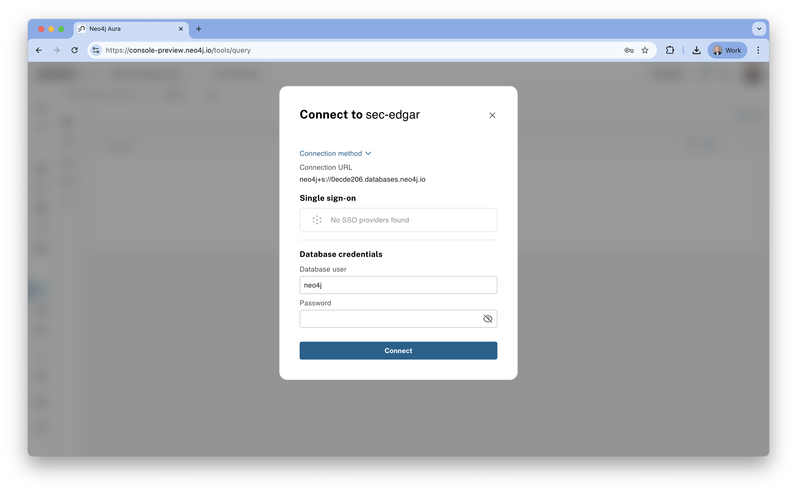
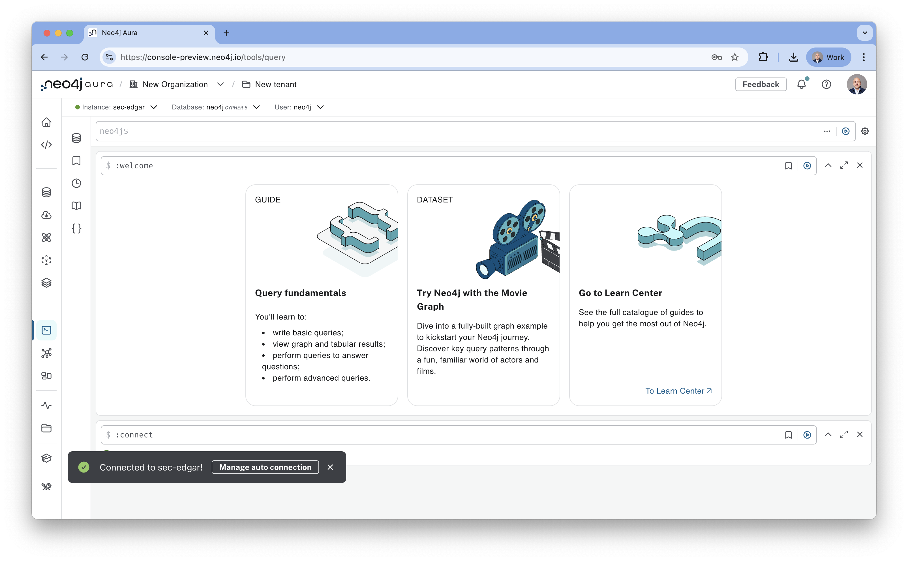

# Lab 2 - Connect to Neo4j
In this lab, we're going to connect to the Neo4j deployment we created in the previous step.  To get started, open the Neo4j endpoint in the Google Cloud console by navigating [here](https://console.cloud.google.com/marketplace/product/endpoints/prod.n4gcp.neo4j.io).

Click "MANAGE ON PROVIDER" to get to the Neo4j console.

Once again, you'll need to agreee to the redirect.

You should now see the Neo4j Aura console.

Click "Open."

Click "Accept" to agree to the terms.

You'll now need to provide your password.  You can find that in the file we downloaded earlier.  In my case, the file was named Neo4j-6688b25b-Created-2023-09-20.txt.  It contained this content:

    # Wait 60 seconds before connecting using these details, or login to https://console.neo4j.io to validate the Aura Instance is available
    NEO4J_URI=neo4j+s://6688b25b.databases.neo4j.io
    NEO4J_USERNAME=neo4j
    NEO4J_PASSWORD=_kogrNk53u8oTk5be55kmit1kHGdhZj98yJlG-VYSR
    AURA_INSTANCEID=6688b25b
    AURA_INSTANCENAME=sec-edgar

The password was then _kogrNk53u8oTk5be55kmit1kHGdhZj98yJlG-VYSR

Enter your password and click "Connect."

Click "X" to dismiss the beginner guides.

We're now in Neo4j Workspace, a unified experience for working with graph data.  There are a number of tabs:

1. Explore - This will open Neo4j Bloom, the business intelligence tool.
2. Query - This will open Neo4j Browser, a tool where we can run database queries and inspect the results.
3. Import - This opens the Neo4j Data Importer, a graphical tool for importing data into Neo4j.

Let's start with Query or Neo4j Browser.  It should already be open.

There's nothing in our database yet.  We can see the nodes, relationships and property key areas are all blank.

We can check what version of Neo4j Graph Data Science (GDS) is set up.  We can do that by entering the following command into the Neo4j the query field:

    RETURN gds.version() as version

Now click the run button, a triangle surrounded by a circle to run that command.

You should see a GDS version number.

Since we got a Graph Data Science version back, we know that we're on AuraDS, not AuraDB.  This means that we have the libraries we'll need to connect with the Python client and use graph algorithms later in these labs.

Assuming that all looks good, let's move on...
