# Lab 3 - Moving Data
In this lab, we're going to take data from an Google Cloud Storage bucket and import it into Neo4j.  There are a few different ways to do this.  We'll start with the LOAD CSV function and later try the Data Importer.

The dataset is pulled from the SEC's EDGAR database.  These are public filings of something called form 13.  Asset managers with over $100m AUM are required to submit Form 13 quarterly.  That's then made available to the public over http.  The csvs linked above were pull from EDGAR using some python scripts.  We don't have time to run those in the lab today as they take a few hours.  But, if you're curious, they're all available [here](https://github.com/neo4j-partners/neo4j-sec-edgar-form13).

## A Day of Data
For this portion of the lab, we're going to work with a subset of the data.  Our full dataset is a year of data.  However, we'll just be playing around with a day's worth.  The data is [here](https://storage.googleapis.com/neo4j-datasets/form13/2022-02-17.csv).

You may want to download the data and load it into your favorite tool for exploring CSV files.  Pandas, Excel or anything else should be able to make short work of it.  Once you understand what's in the data, the next step would be to load it into Neo4j.

To load it, let's open the tab that has our Neo4j Browser in it.  If you don't have that tab open, you can review the previous lab to grab the address of it again.

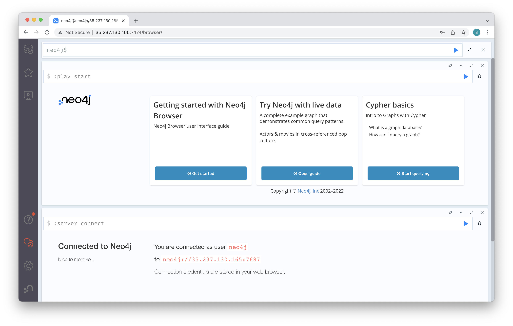

We're going to run a Cypher statement to load the data.  Cypher is Neo4j's query language.  LOAD CSV is part of that and allows us to easily load CSV data.  Try copying this command into the Neo4j Browser.

    LOAD CSV WITH HEADERS FROM 'https://storage.googleapis.com/neo4j-datasets/form13/2022-02-17.csv' AS row
    MERGE (m:Manager {filingManager:row.filingManager})
    MERGE (c:Company {nameOfIssuer:row.nameOfIssuer, cusip:row.cusip})
    MERGE (m)-[r1:Owns {value:toInteger(row.value), shares:toInteger(row.shares), reportCalendarOrQuarter:row.reportCalendarOrQuarter}]->(c)

It should look like the following.  You can then press the blue triangle to run the job.

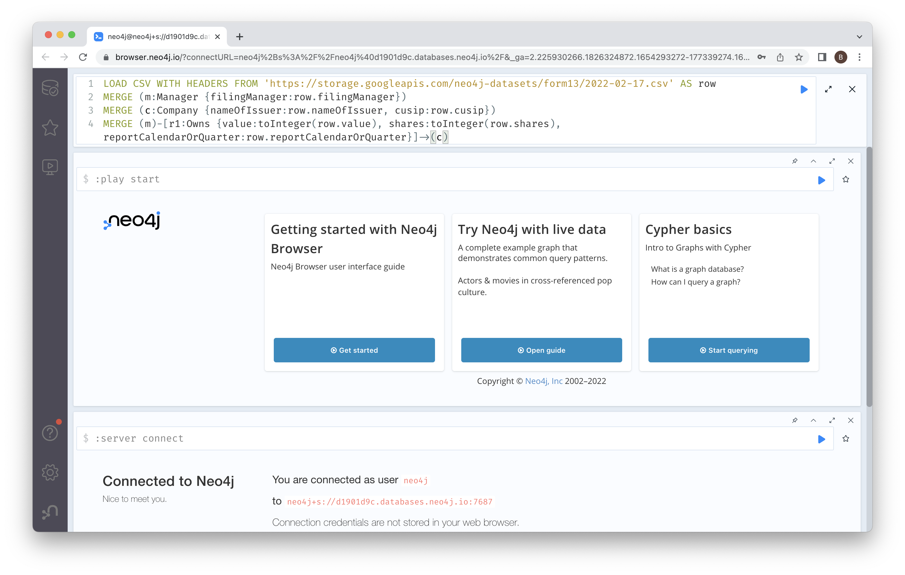

That will load the nodes and relationships from the file.  You should see the number of nodes loaded and so forth.  When that completes, click the database icon in the upper left to inspect what we've loaded.

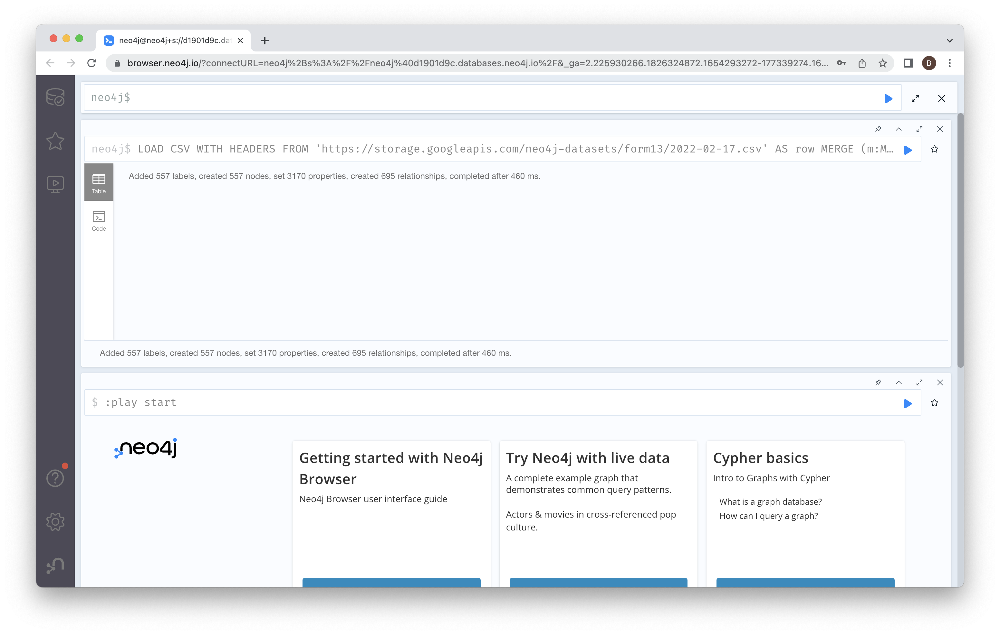

Sometimes it takes a minute to populate this menu, but once it's populated you'll see the nodes, relationships and properties we loaded.  We have two kinds of nodes, Manager and Company.  Manager nodes are asset managers.  Company nodes are the companies that those asset manages buy shares of.  Managers are related to companies by the "owns" relationship.  Manager, company and owns all have properties that we can inspect as well.

Click on "Manager" under "Node Labels to automatically generate a new cypher query.

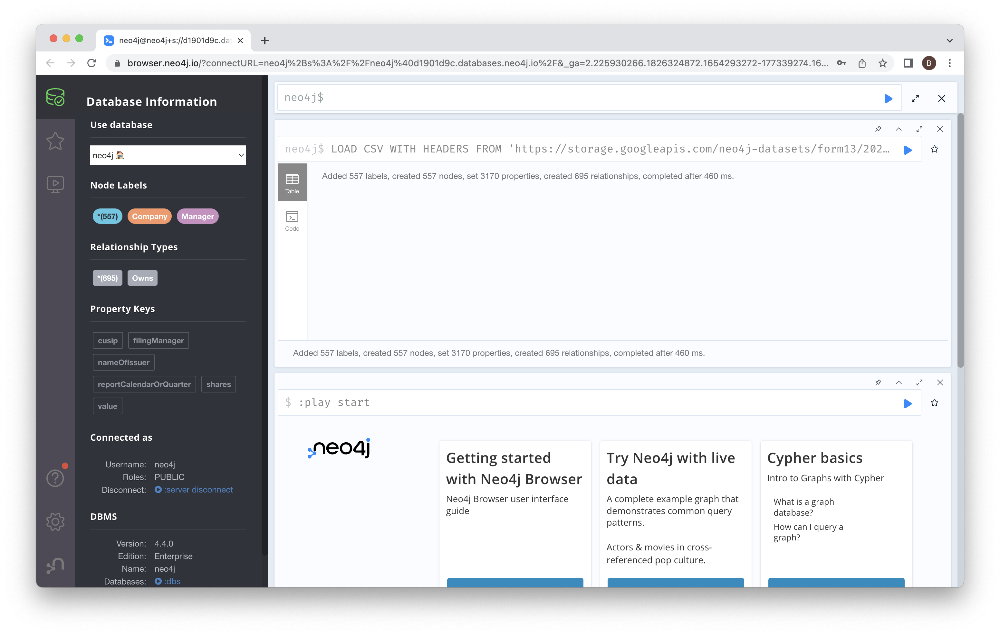

You'll now see a subset of the managers we have in the database.  The query returns 25 of them.  It's limited because returning to many nodes in this visualization mode can make it hard to navigate.

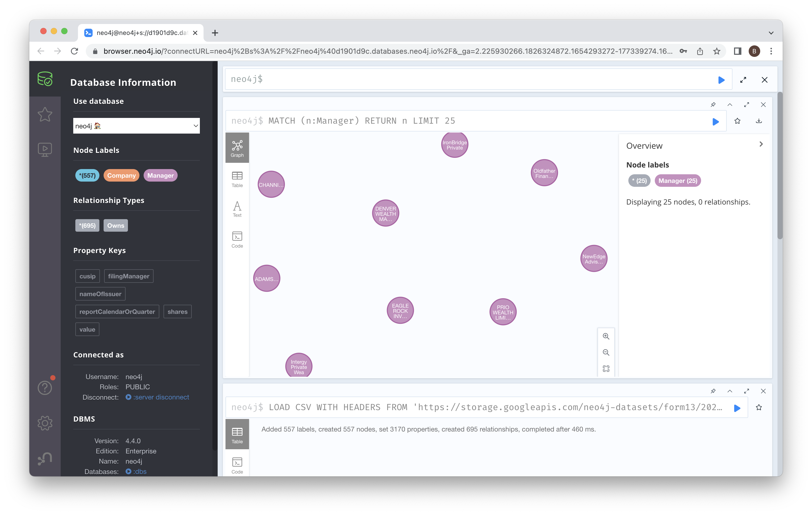

Now, let's click on one of the managers.  Don't worry, it doesn't particularly matter which one.  Once we've clicked on it, click the graph icon at the bottom to expand it.

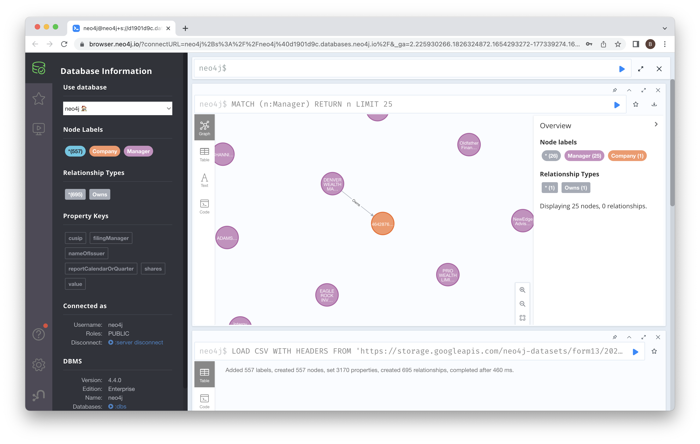

When it expands, we can see what companies this manager owns shares in.  In this case, CHANNING GLOBAL ADVISORS, LLC seems to only have one holding, CANADIAN PACIFIC RAILWAY LTD.  Note that this data set only has holdings over $10m.  Smaller holdings were filtered out in pre-processing.

We can also click on the relationship, that is the line between the nodes to see detail on the transaction.

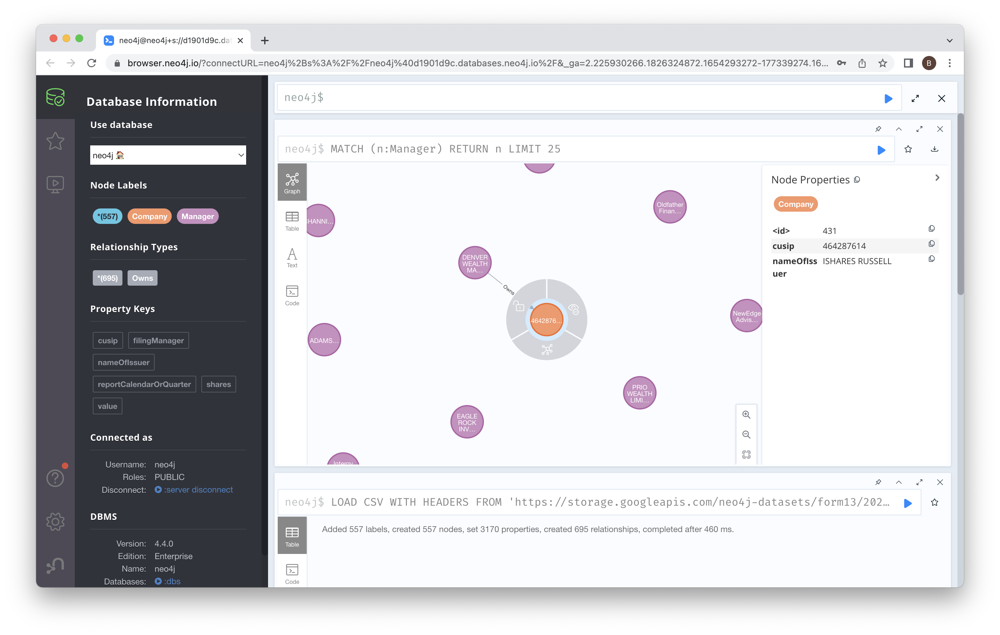

In this case, it appears we have a report from 12-31-2021 that 139,781 shares were purchased with a value of $10,063,000.

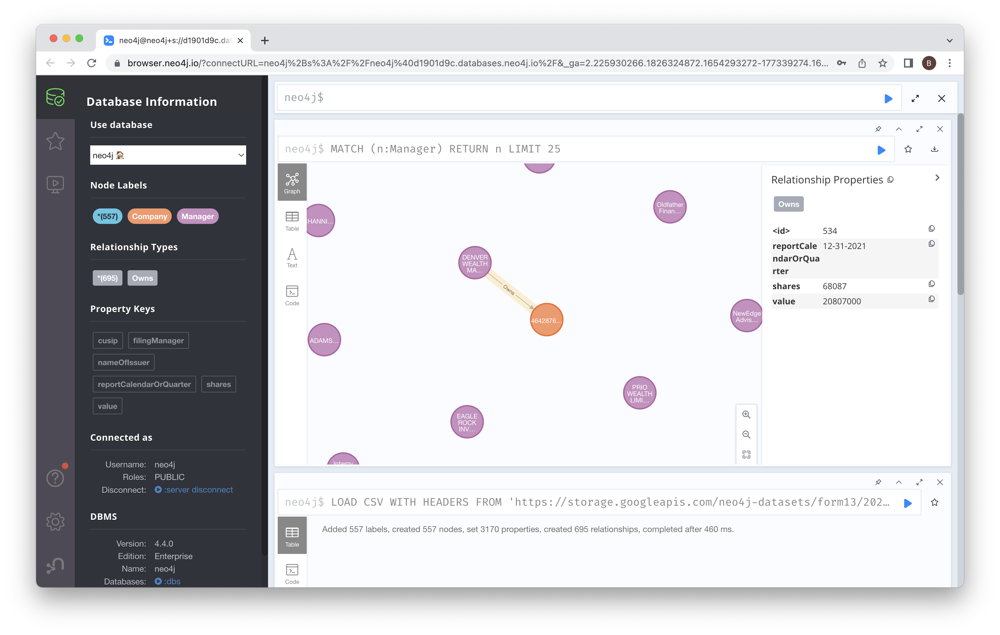

At this point, take some time to poke around the graph.  You can expand it by clicking the icon with two arrows pointing away from each other in the upper right.  You may also want to click on the "Company" node label to query those.

As you play around, you may start to see some of the structure in the graph with recurrent connections and interesting communities of managers who have similar holdings.

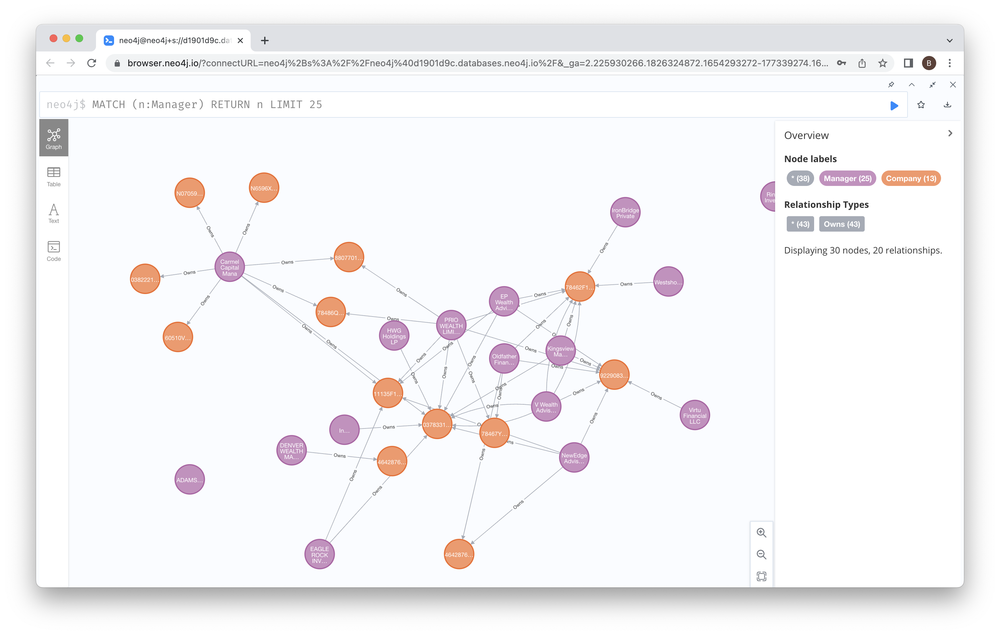

Now that we have some understanding of this portion of the dataset, we're going to delete it.  Then we'll load the full data set.  We don't want to delete the database we're currently using.  So, we're going to switch databases first.  Run this in the Neo4j Browser.

    :use system

That should give you this:

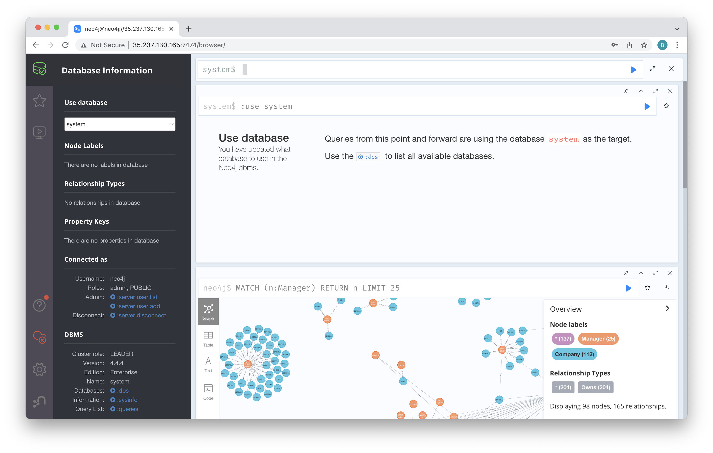

Then drop the database:

    drop database neo4j

That will give you this:

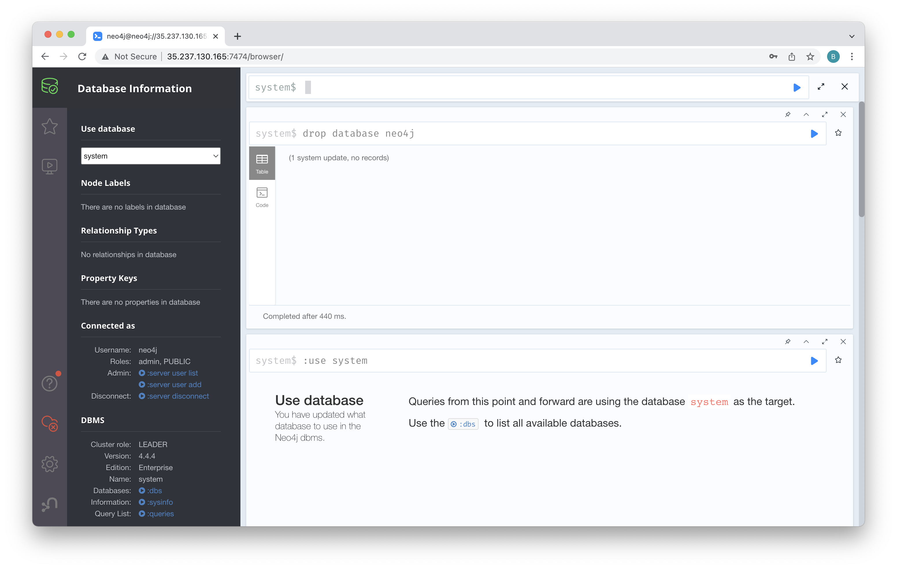

Now, create a new data:

    create database neo4j

You'll see this:

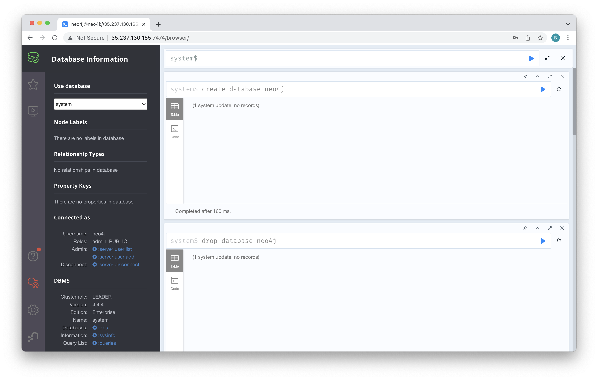

Finally, switch back to the neo4j database:

    :use neo4j

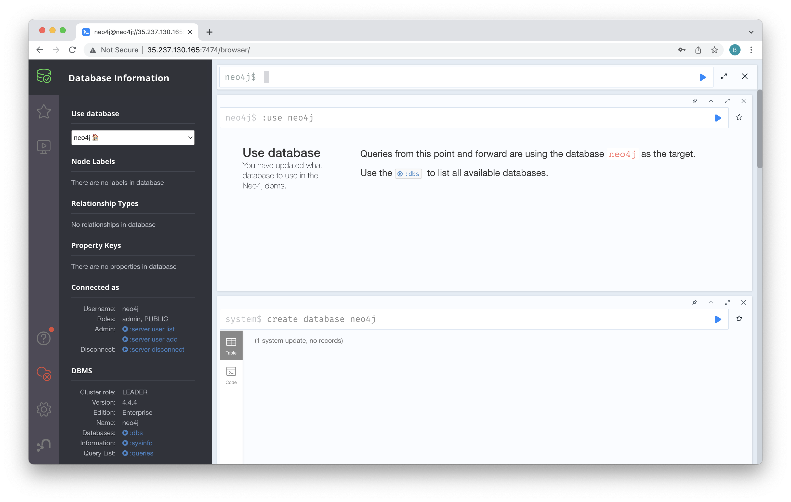

Now, all your data should be deleted and you're back on the neo4j database.

## A Year of Data
There are many ways to load data into Neo4j.  The LOAD CSV statement we used before was pretty naive.  It didn't create any indices.  It also loaded the nodes and relationships simultaneously.  Both of those are inefficient approaches.  It wasn't a big deal as that single day of data was about 57kb.  However, we'd now like to load a full year of data.  That's 49.5mb of data, so we have to be a bit more efficient.  That new dataset is [here](https://storage.googleapis.com/neo4j-datasets/form13/form13.csv.)

If you're curious, you can read a bit about the intracties of optimizing those loads here:

* https://neo4j.com/developer/guide-import-csv/#_optimizing_load_csv_for_performance
* https://graphacademy.neo4j.com/courses/importing-data/

We're also going to change our data model a bit.  This is to make it work better in the Graph Data Science component of our lab where we create graph embedding.  We're going to move some properties out of the owns relationship we had previously, into a new node type call "Holding."

First, let's create constraints, essentially a primary key, for the Company and Manager node types.  Company keys should be cusips.  We know a cusip is unique because that is the whole point of one.  They are identifiers for securities designed to be unique.  You can read more about them [here](https://www.cusip.com).  This is a much better field to use than nameOfIssuer because it avoids the problem where some companies (like Apple or Apple, Inc.) are referred to by slightly different names.

The manager is a little more difficult.  But, we're going to assume that the filingManager field is both unique and correct.

    CREATE CONSTRAINT IF NOT EXISTS ON (p:Company) ASSERT (p.cusip) IS NODE KEY;
    CREATE CONSTRAINT IF NOT EXISTS ON (p:Manager) ASSERT (p.filingManager) IS NODE KEY;

That should give this:

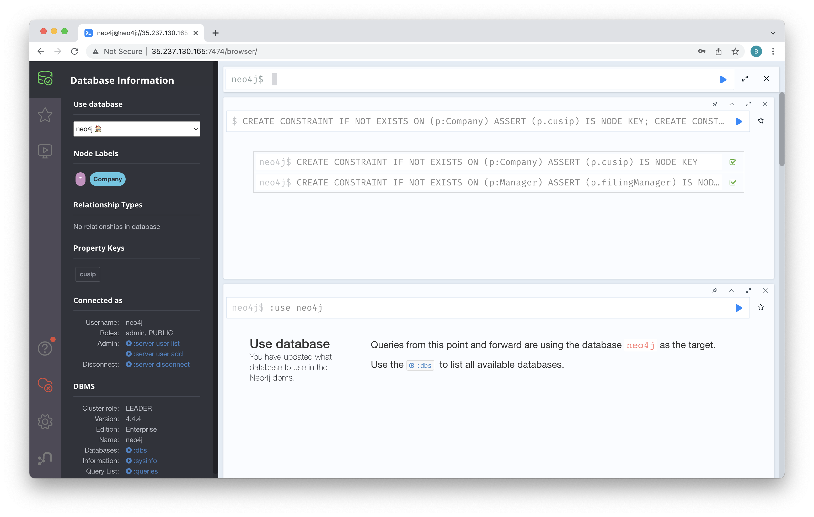

Now, the holding is a bit more interesting.  It needs a compound key.  Because a holding is unique in the context of:

(1) Being held by a particular filingManager
(2) Being a particular cusip
(3) Being for a particular reportOrCalendarQuarter

So, we're going to need something with a compount key like this:

    CREATE CONSTRAINT IF NOT EXISTS ON (p:Holding) ASSERT (p.filingManager, p.cusip, p.reportCalendarOrQuarter) IS NODE KEY;

That should give this:

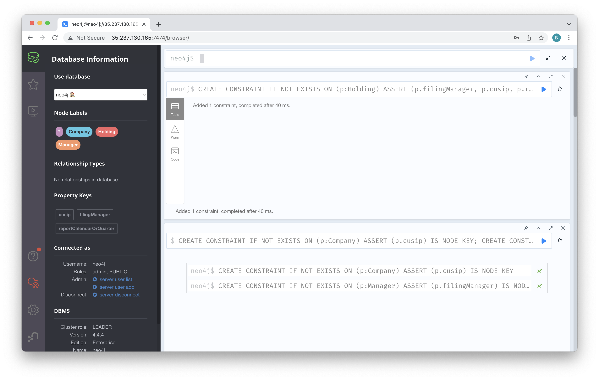

Now that we have all the constraints, let's load our nodes.  We're going to do that first and grab the relationships in a second pass.  While we could do it in a single cypher statement, as we did above, it's more efficient to run them in series.

Let's load the companies first.  We're going to have a lot of duplication, since our key is cusip and many different rows in our csv, each representing a filing, have the same cusip.  So, we need to enhance our LOAD CSV statement a little bit to deal with those duplicates.

    LOAD CSV WITH HEADERS FROM 'https://storage.googleapis.com/neo4j-datasets/form13/form13.csv' AS row
    MERGE (c:Company {cusip:row.cusip})
    ON CREATE SET
        c.nameOfIssuer=row.nameOfIssuer

That should give this:

Now let's load the Managers:

    LOAD CSV WITH HEADERS FROM 'https://storage.googleapis.com/neo4j-datasets/form13/form13.csv' AS row
    MERGE (m:Manager {filingManager:row.filingManager})

That should give this:

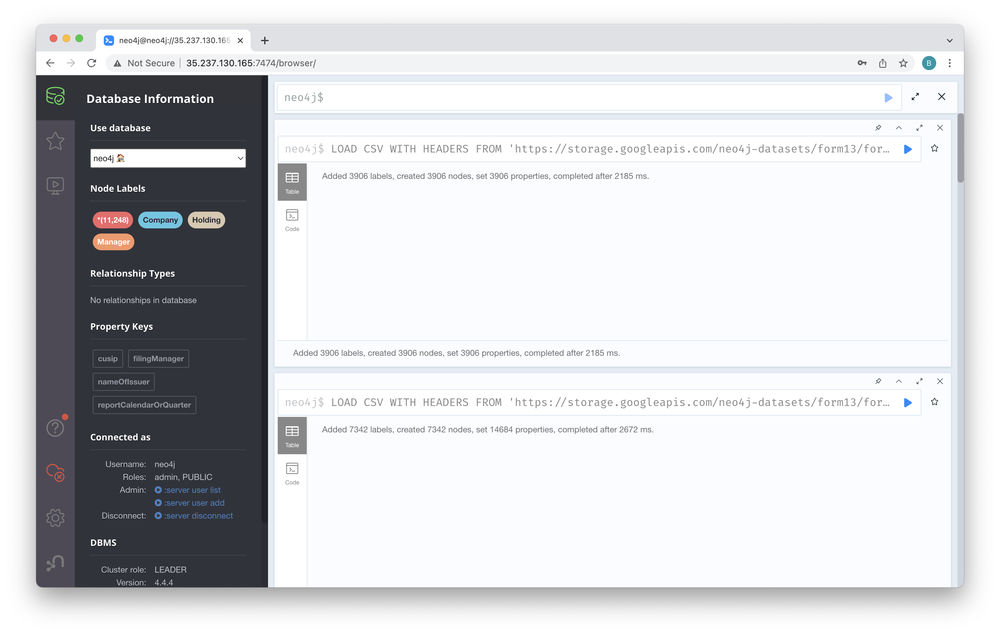

And now we can load our Holdings:

    LOAD CSV WITH HEADERS FROM 'https://storage.googleapis.com/neo4j-datasets/form13/form13.csv' AS row
    MERGE (h:Holding {filingManager:row.filingManager, cusip:row.cusip, reportCalendarOrQuarter:row.reportCalendarOrQuarter})
    ON CREATE SET
        h.value=row.value, 
        h.shares=row.shares,
        h.target=row.target

That should give this:

Well, this is cool.  We've got all our nodes loaded in.  Now we need to tie them together with relationships.  We're going to want two kinds of relationships:

(1) A Manager "OWNS" Holdings
(2) Holdings are "PARTOF" Companies

So, let's put together the OWNS relationship first.

    :auto LOAD CSV WITH HEADERS FROM 'https://storage.googleapis.com/neo4j-datasets/form13/form13.csv' AS row
    CALL { WITH row 
    MATCH (m:Manager {filingManager:row.filingManager})
    MATCH (h:Holding {filingManager:row.filingManager, cusip:row.cusip, reportCalendarOrQuarter:row.reportCalendarOrQuarter})
    MERGE (m)-[r:OWNS]->(h) } IN TRANSACTIONS OF 50000 ROWS;

That should give this:

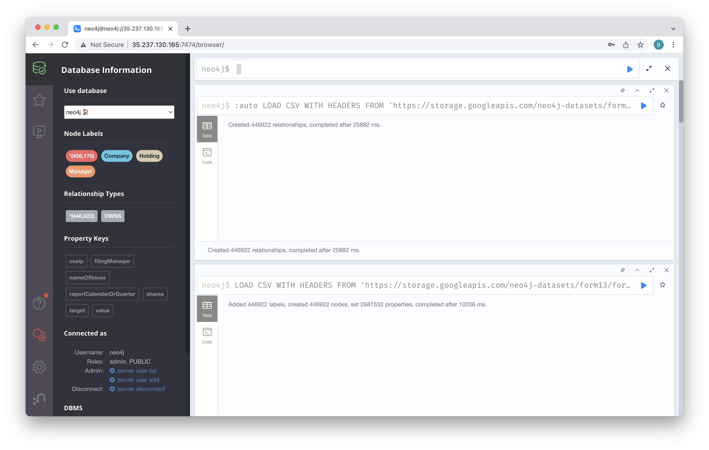

And, now we can create the PARTOF relationships:

    :auto LOAD CSV WITH HEADERS FROM 'https://storage.googleapis.com/neo4j-datasets/form13/form13.csv' AS row
    CALL { WITH row 
    MATCH (h:Holding {filingManager:row.filingManager, cusip:row.cusip, reportCalendarOrQuarter:row.reportCalendarOrQuarter})
    MATCH (c:Company {cusip:row.cusip})
    MERGE (h)-[r:PARTOF]->(c) } IN TRANSACTIONS OF 50000 ROWS;

That should give this:

You've done it!  We've loaded our data set up.  We'll explore it in the next lab.  But, feel free to poke around in the Neo4j Browser a bit as well.