# Lab 3 - Moving Data
In this lab, we're going to take data from a Google Cloud Storage bucket and import it into Neo4j.  There are a few different ways to do this.  We'll start with a very naive LOAD CSV statement using a small dataset. Then we will try it again with a larger dataset using the Neo4j Data Importer, a great graphical way to import data.

The dataset is from the SEC's EDGAR database.  These are public filings of something called Form 13.  Asset managers with over \$100m AUM are required to submit Form 13 quarterly.  That's then made available to the public over http.  We don't have time to download those in the lab today as they take a few hours.  But, if you're curious, they're all available [here](https://github.com/neo4j-partners/neo4j-sec-edgar-form13).  We've filtered the data to only include filings over $10m in value.

## Simple Load Statement
For this portion of the lab, we're going to work with a subset of the data.  Our full dataset is a year of data.  However, we'll just be playing around with a a subset of a day's worth.  The data is [here](https://storage.googleapis.com/neo4j-datasets/hands-on-lab/form13-2023-05-11.csv).

You may want to download the data and load it into your favorite tool for exploring CSV files.  Pandas, Excel or anything else should be able to make short work of it.  Once you understand what's in the data, the next step would be to load it into Neo4j.

To load it in Neo4j, let's open the tab that has our Neo4j Workspace in it.  If you don't have that tab open, you can review the previous lab to get into it.

Make sure we are in the "Query" tab of the browser. If not you can select it from the side bar on the left.

We're going to run a Cypher statement to load the data.  Cypher is Neo4j's query language.  `LOAD CSV` is part of that and allows us to easily load CSV data.  Try copying this command into Neo4j Workspace.

    LOAD CSV WITH HEADERS FROM "https://storage.googleapis.com/neo4j-datasets/hands-on-lab/form13-2023-05-11.csv" AS row
    MERGE (m:Manager {managerName:row.managerName})
    MERGE (c:Company {companyName:row.companyName, cusip:row.cusip})
    MERGE (m)-[r:OWNS {value:toFloat(row.value), shares:toInteger(row.shares), reportCalendarOrQuarter:date(row.reportCalendarOrQuarter)}]->(c);

It should look like the following.  You can then press the blue triangle with a circle around it to run the job.

That will load the nodes and relationships from the file.

You'll now see the nodes, relationships and properties we loaded.  We have two kinds of nodes, manager and company.  Manager nodes are asset managers.  Company nodes are the companies that those asset manages buy shares of.  Managers are related to companies by the owns relationship.  Manager, company and owns all have properties that we can inspect as well.

Click on "Manager" under "Nodes" to automatically generate a new cypher query and run it.

You'll now see a subset of the managers we have in the database.  The query returns 25 of them.  It's limited because returning to many nodes in this visualization mode can make it hard to navigate.

Now, let's click on one of the managers.  Don't worry, it doesn't particularly matter which one.  Once we've clicked on it, right click and select "Expand."

When it expands, we can see what companies this manager owns shares in.  In this case, "Smithfield Trust Co" seems to only have five holdings.  Note that this data set only has holdings over $10m.  Smaller holdings were filtered out in pre-processing.

Try selecting a company now.

In this case, we see the company "APPLE INC" has CUSIP 037833100.

We can also click on the relationship, that is the line between the nodes to see detail on the transaction.

In this case, it appears we have a report from 2023-03-31 that 164,531 shares were purchased with a value of $27,128,000.

At this point, take some time to poke around the graph.  You can expand it by clicking the icon with two arrows pointing away from each other in the upper right.  You may also want to click on the "Company" node label to query those.

As you play around, you may start to see some of the structure in the graph with recurrent connections and interesting communities of managers who have similar holdings.

Now that we have some understanding of this portion of the dataset, we're going to delete it.  Then we'll load the full data set.  To delete all the nodes and relationships in the database, run this command:

    MATCH (n) DETACH DELETE n;

Now, all your data should be deleted.  Note that Workspace is still caching some property keys.

In the next section, we'll load more data.

## Using Neo4j Data Importer

Now we're going to take data from a Cloud Storage bucket and import it into Neo4j. There are a few different ways to do this. Let's import data from SEC EDGAR Form 13 filings into a Neo4j database using the data importer tool within the Neo4j Aura console.

## Introduction

The Neo4j Aura console offers a convenient data importer tool that allows you to import data from various sources, including CSV files, into your Neo4j database. This guide will walk you through the process of importing Form 13 data, which represents holdings of large asset managers.

### Graph Data Modeling Overview

Before diving into the import process, let's briefly touch on graph data modeling. Graph databases, like Neo4j, store data as nodes and relationships. In this example, we'll model:

* **Managers:** Entities that manage assets.
* **Companies:** Entities that are held as investments.
* **OWNS:** Relationships connecting Managers to Companies, representing ownership.

This structure allows us to easily query and analyze relationships between asset managers and their investments.

## About the Data

The dataset used in this guide comes from the U.S. Securities and Exchange Commission's (SEC) EDGAR database. Form 13 filings are quarterly reports that asset managers with over $100 million in assets under management (AUM) are required to submit, detailing their equity holdings. These filings are publicly available.

For this guide, we'll use pre-filtered Form 13 data that includes filings with over $10 million in value.

## Data Files

You will need the following files:

1.  **Neo4j Graph Data Model:** This JSON file defines the structure of your graph, specifying the nodes, relationships, and their properties.
    * Download from: [https://storage.googleapis.com/neo4j-datasets/hands-on-lab/neo4j_importer_model_sec-edgar-forms13.json](https://storage.googleapis.com/neo4j-datasets/hands-on-lab/neo4j_importer_model_sec-edgar-forms13.json)

2.  **Form 13 Data:** This CSV file contains the actual data to be imported.
    * Download from: [https://storage.googleapis.com/neo4j-datasets/hands-on-lab/form13-2023.csv](https://storage.googleapis.com/neo4j-datasets/hands-on-lab/form13-2023.csv)

## Import Instructions

1.  **Open Neo4j Aura Console:**
Follow these steps to import the data into your Neo4j Aura database. Lets' use the Import tool. 
    * In the data services section, click on "Import"
    * in the Import section, select the "Graph models" tab.
    * Click on the "New graph model" button.
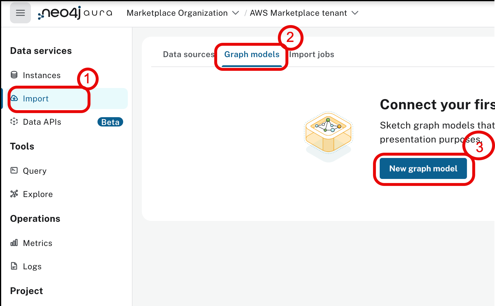
2. **Open Graph Model:**
    * Locate the "Run import" button in the top right corner and click the three dots next to it.
    * Select "Open model" from the menu.
    * Browse and select the `neo4j_importer_model_sec-edgar-forms13.json` file that you downloaded.
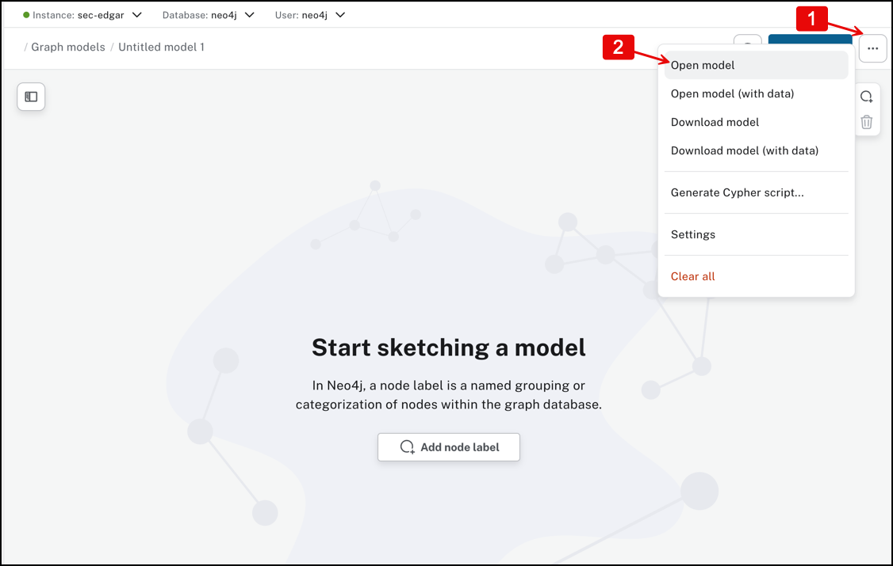
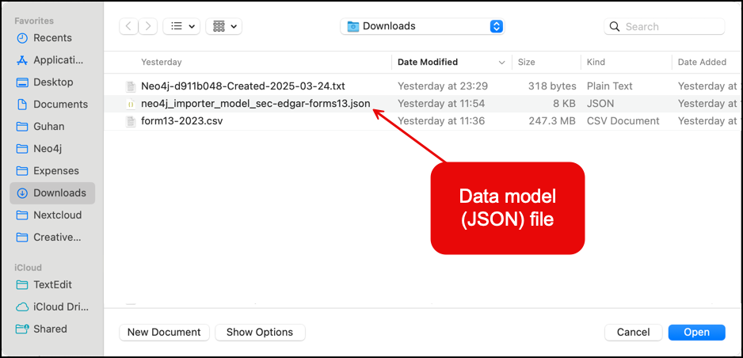
7.  **Review Graph Model:**
    * The graph model should now be displayed on the canvas in the middle of the screen.
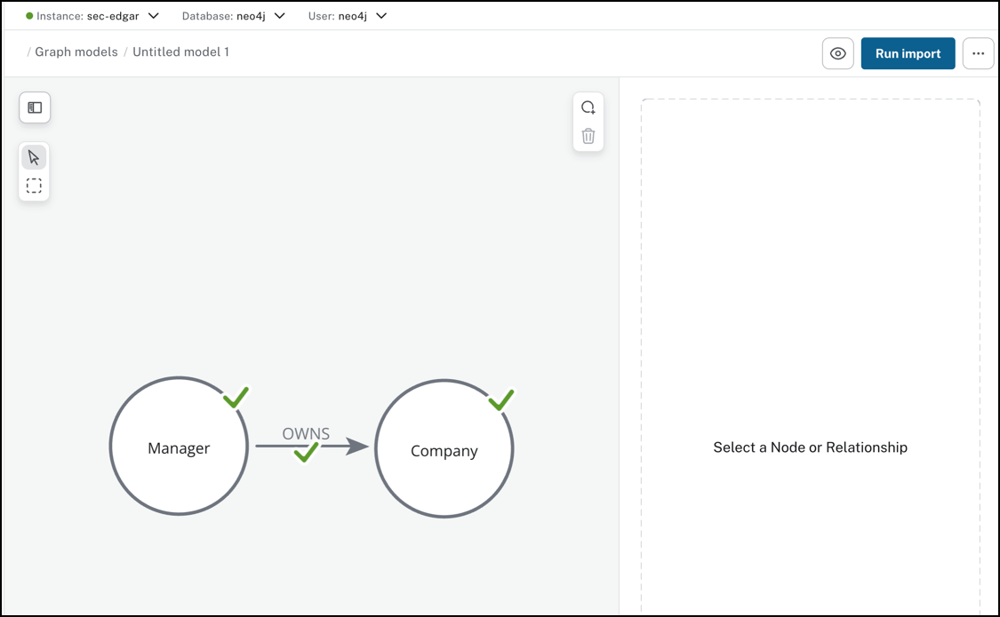
8.  **Inspect Nodes and Relationships:**
    * Click on the "Manager" node to view its properties and keys.
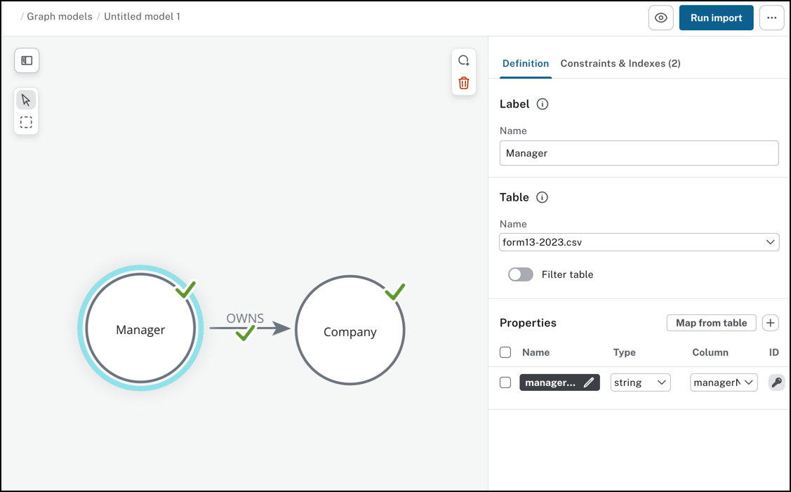
    * Click on the "OWNS" relationship type to view its Node ID Mapping and properties.
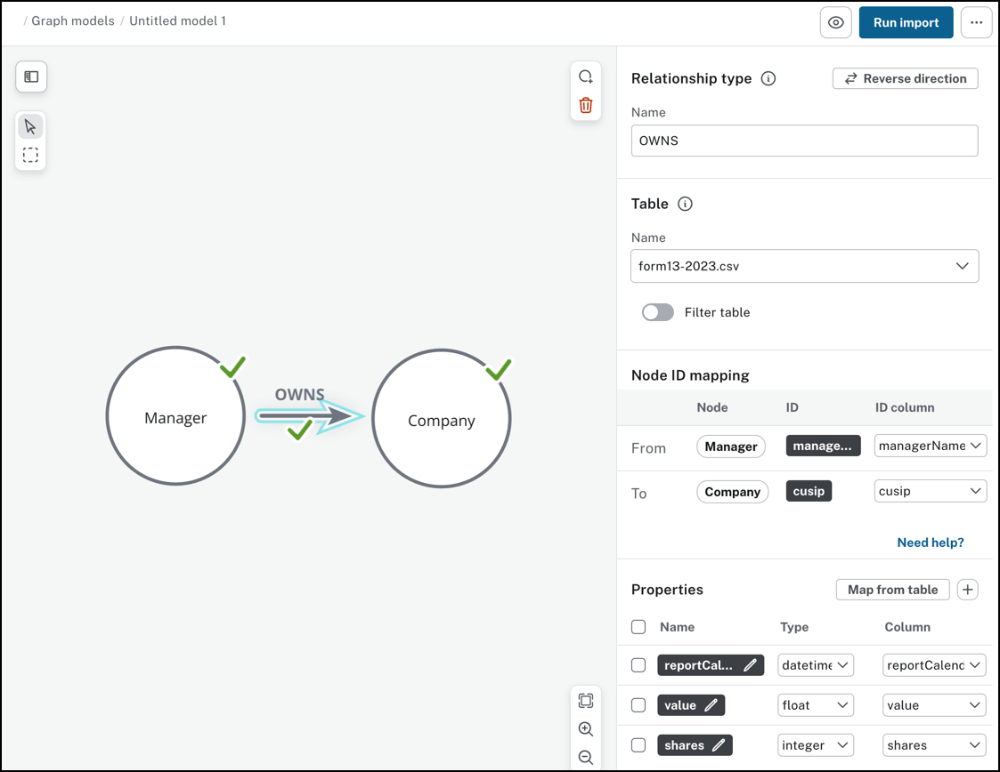
6.  **Select Data Source:**
    * On the left-hand side, next to "Data source," click the "Browse" button.
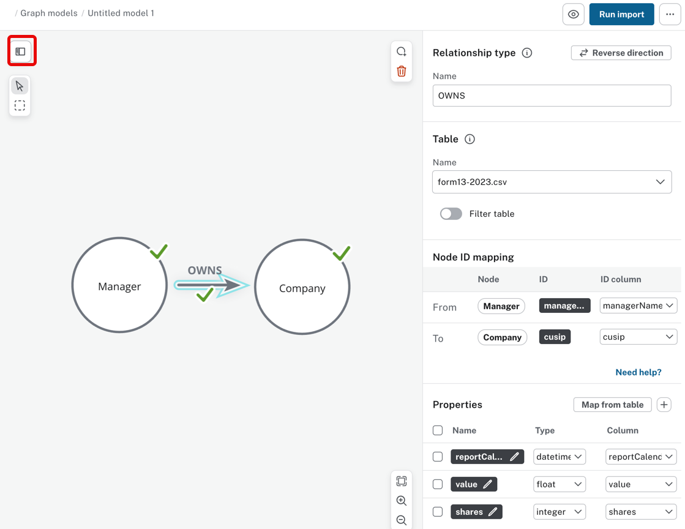
    * Select the `form13-2023.csv` file that you downloaded.
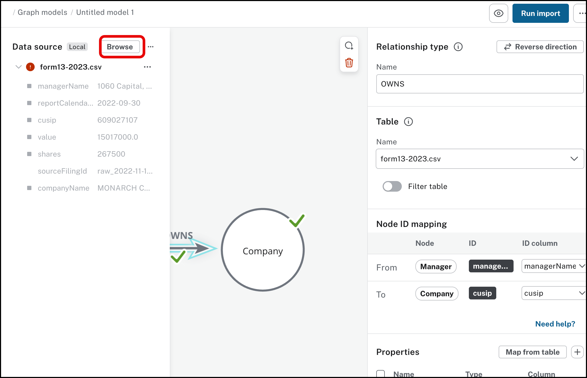
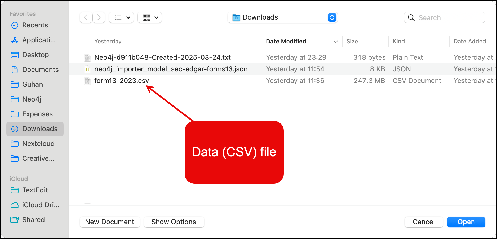
9.  **Run Import:**
    * Click on "Run import."
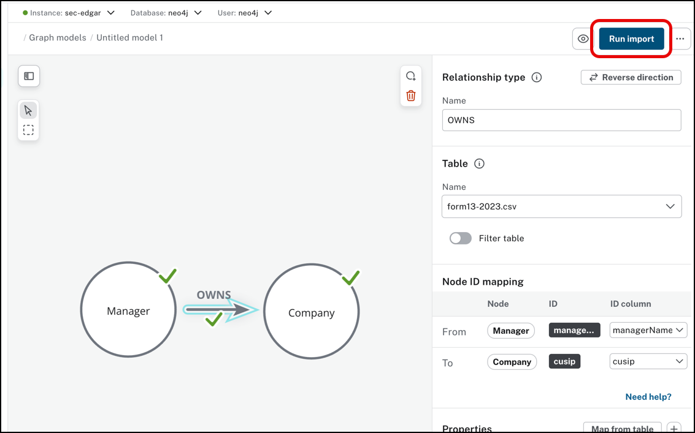
    * Wait for the import process to complete (approximately 5 minutes or less).
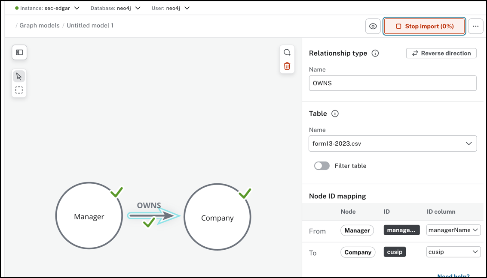
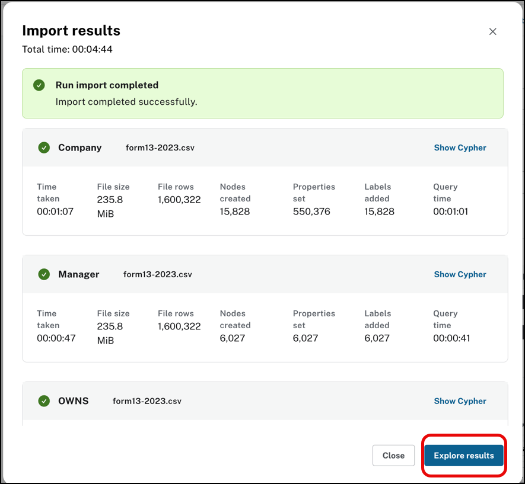

You've done it!  We've loaded our data set up.  We'll explore it in the next lab.  But, feel free to poke around a bit as well.
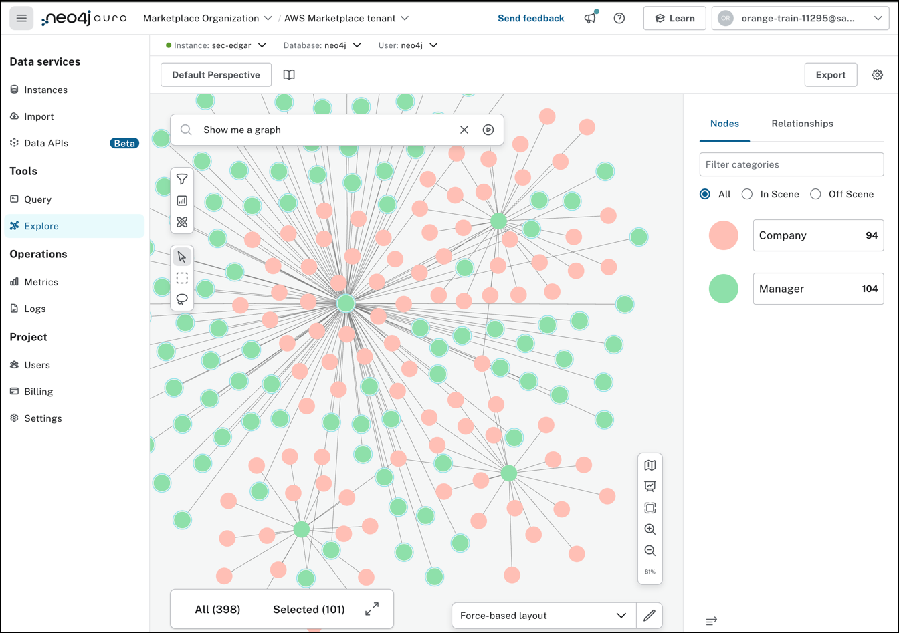

#### Progress:  ███░░░░ 3/7 Labs Completed!
