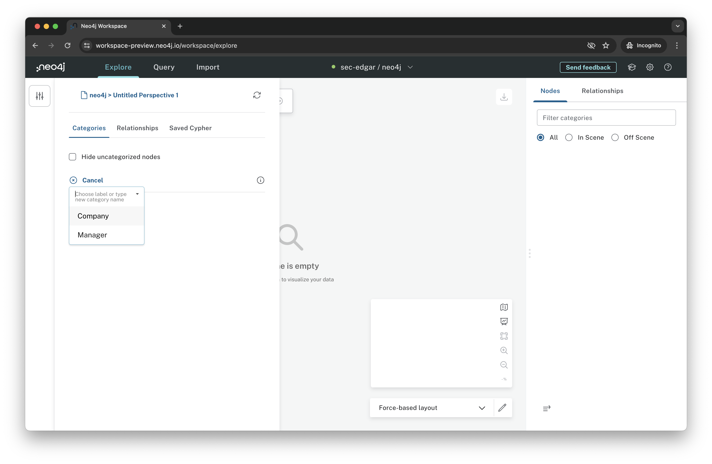
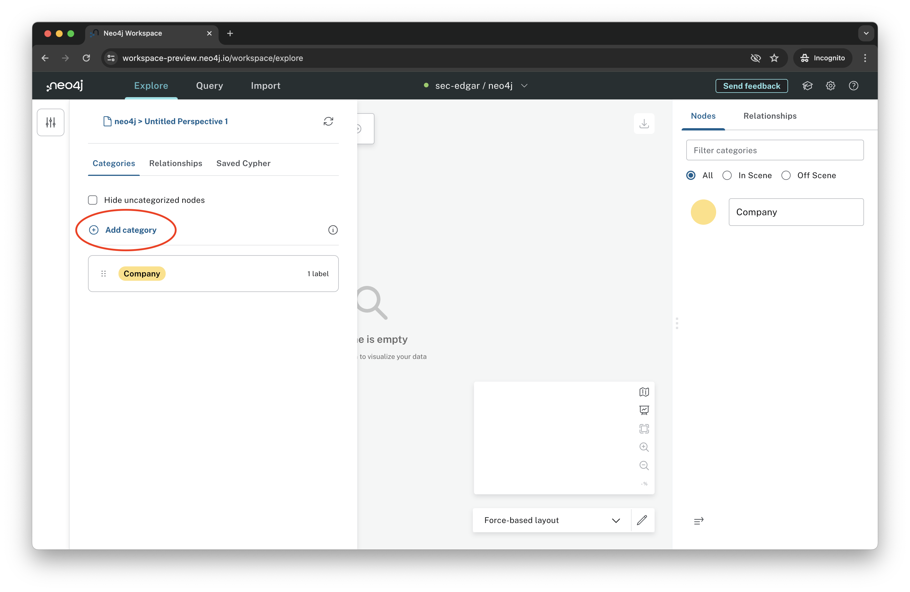

# Lab 4 - Exploration
In this lab, we'll use Bloom, Neo4j's business intelligence (BI) tool, to explore our data.

## Exploration with Neo4j Bloom
To open Bloom, go to the Neo4j Aura Console and click "Open" as in Lab 2.  From there, make sure the "Explore" tab at the top is selected.

Perspectives in Bloom define a specific business view or domain from the target Neo4j graph. A single Neo4j graph can be viewed through different perspectives, each tailored for a different business purpose.

Click the slider icon in the upper left to open the perspective menu.

Now click the refresh icon to refresh the perspective.  This pulls the latest data model from our database.  Click "Refresh" to agree to refresh the perspective.

When that is complete, select "Add category" in the perspective menu. 

You should see a pop-up with the node labels in the database. Select "Company."  Then repeat the process to select "Manager."

When that is complete, you should see labels for Manager and Company. Click the perspective button again to close this menu.

Now that our perspective is refreshed with updated labels, we're ready to start exploring.

The easiest way we can explore data in Bloom is to have it generate a view for us.  To do so, click in the search bar and click on "Show me a graph."  Hit enter.

In this case, we got a view with a company node at the center and 80 managers that own the company through their holdings.

We can click on the company to see its name.

Now let's try finding a new graph.  Click in the search bar again.  Clear the contents of it.  Then select "Manager."

Now select "Company."

Now hit enter.

That gives us search results for paths that go from Manager to Company.  We hit a limit of 1000, so it's not visualizing everyone.

Next, we will apply some point-and-click data science to our graph.  Click on the atom icon to open the data science menu.

Click "Add algorithm."

Select "Degree Centrality" from the drop-down.

Click "Apply algorithm."

Now that we've run the algorithm, we can choose how we want to visualize the results in the graph.  Choose "Size scaling". The more central nodes in our graph are now shown as larger. 

That gives us this.

These are just a few examples of what you can do with Bloom.  Feel free to explore!
