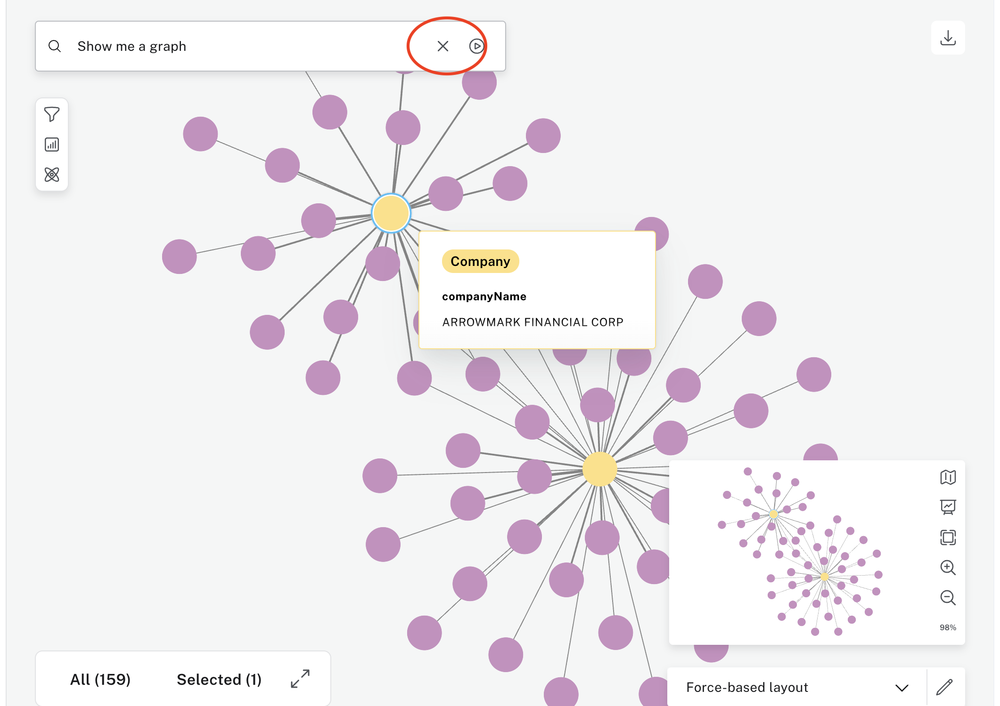

# Lab 4 - Exploration
In this lab, we'll use Explore, Neo4j's business intelligence (BI) tool, to explore our data.

## Exploration with Neo4j Bloom
The Explore tool, powered by Neo4j Bloom, is a graph exploration tool for visually interacting with graph data.

A graph puts information into context. People, places, and things. Products, services, and accounts. Transactions, identities, and events. Explore shows the patterns you intuitively know are there in your data, and reveals new patterns you may not have expected.

Click on the 'Explore' option under Tools.

Now click on "Show me a graph."  Hit enter.

In this case, we got a view with a two company nodes at the center and 100+ managers that own shares of that company.

We can click on the company to see its name.

Now let's try finding a new graph.  Click on the X in the search bar to clear the contents of it.  

Then click in the search bar

Select "Manager."

Now select "OWNS."

Now select "Company" 
 

Now hit either hit enter or press the play button.

That gives us search results for paths that go from Manager to Company.  We hit a limit of 1000, so it's not visualizing everything.

Next, we will apply some point-and-click data science to our graph.  Click on the atom icon to open the data science menu.

Click "Add algorithm."

Open the drop down menu.

Select "Degree Centrality."

Click "Apply."

That gives us this.

Now that we've run the algorithm, we can choose how we want to visualize the results in the graph.  

Choose "Size scaling."

The more central nodes in our graph are now shown as larger. 

These are just a few examples of what you can do with Bloom.  Feel free to explore!

#### Progress:  ████░░░ 4/7 Labs Completed!