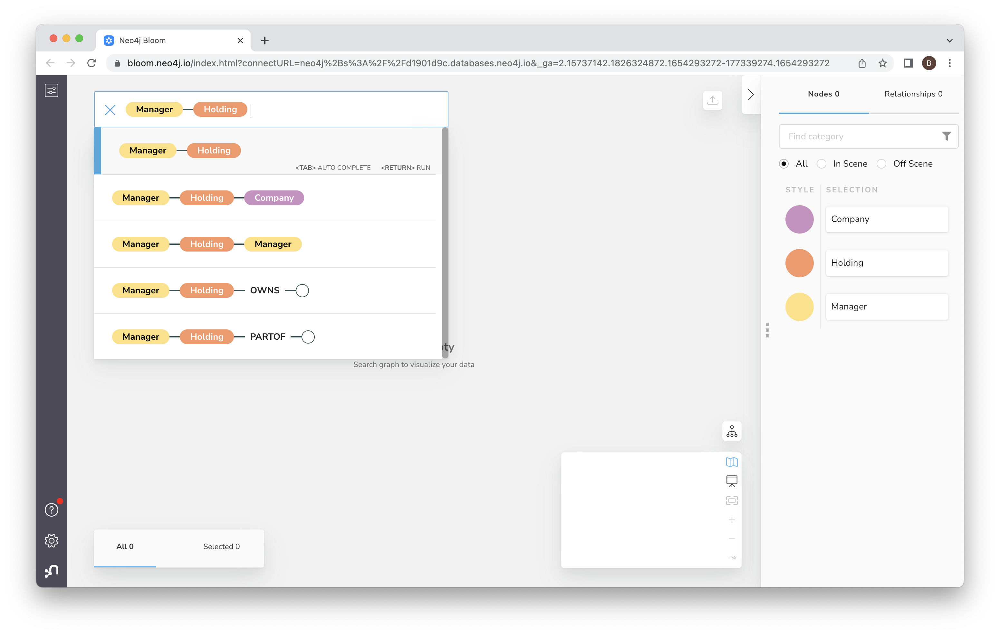
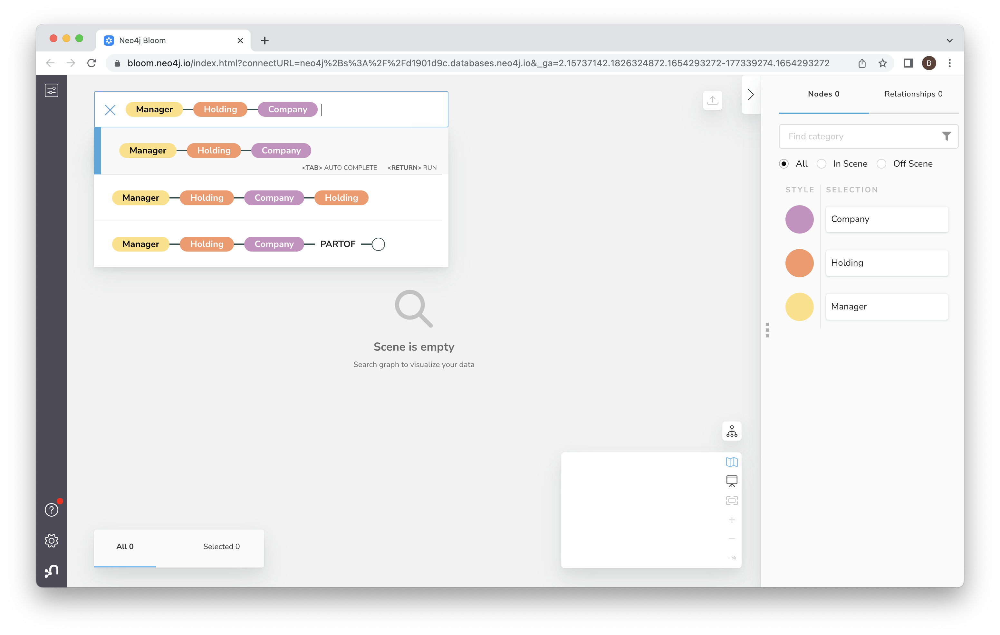
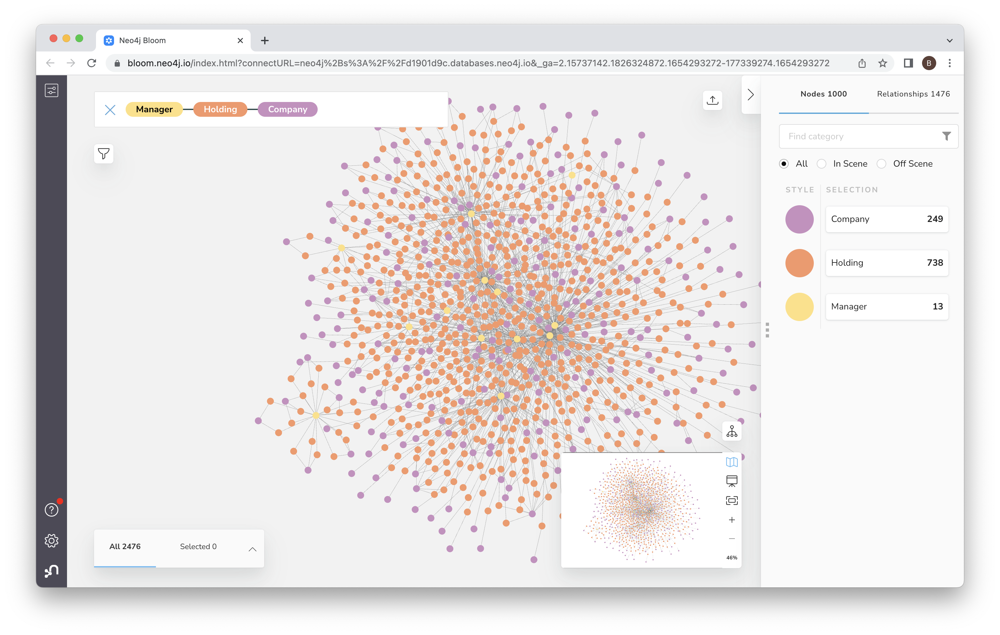

# Lab 4 - Exploring Data
In this lab, we're going to query the data in a few different ways.

## Pandas
First off, let's fiddle with the data in pandas.  Click [here](exploring_pandas.ipynb) to get started.

## Cypher Queries
Now we'll run a few queries using the python API.  Earlier we used the graphical interface in the Neo4j Browser.  We're going to do the same thing but in a programmatic way.  Let's start by firing up a notebook.  Click [here](exploring_cypher.ipynb) and then follow the "Run in Colab" link to open it in Google Colab.

## Vizualization with Neo4j Bloom
Bloom is Neo4j's business intelligence (BI) tool.  You can open it from the Neo4j Aura Console as we did in Lab 2.

When you open Bloom, you should see the login screen.  Use the same credentials we used before.

That should take you to the home screen.  Click in the search bar and then click on "Manager."

If the search bar doesn't populate, you may have to click in the upper left and add the three entities: "Manager", "Holding", and "Company".

Then click on the link for manager-holding.

Then click on the link to add manager-holding-company.

And now hit enter to run the query.

That will give you a view with many nodes.

Now, spend a bit of time exploring the graph.  You can zoom in by holding on the "+" icon.  You can also drag the canvas around to choose what you zoom in on.

