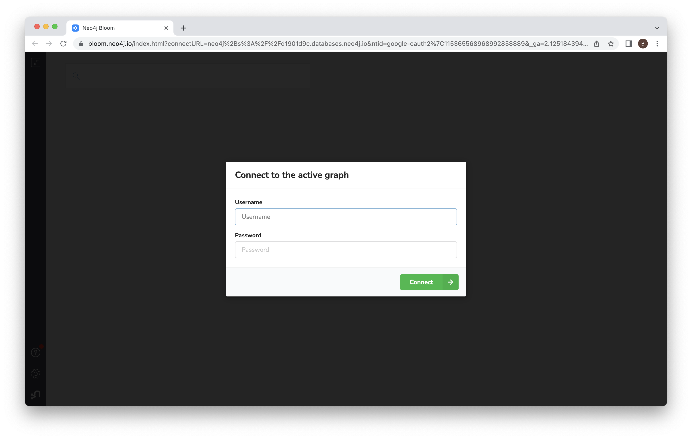
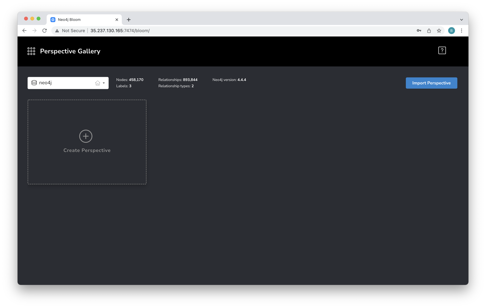
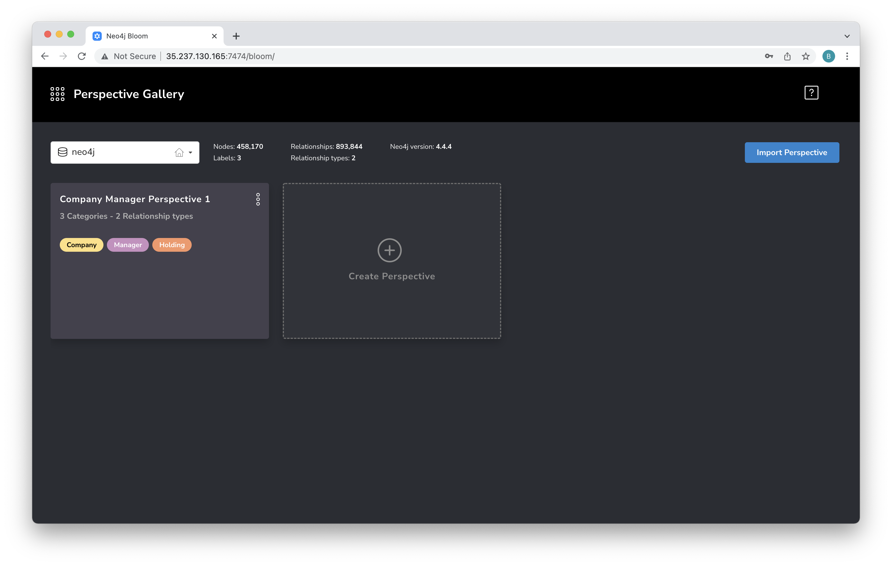
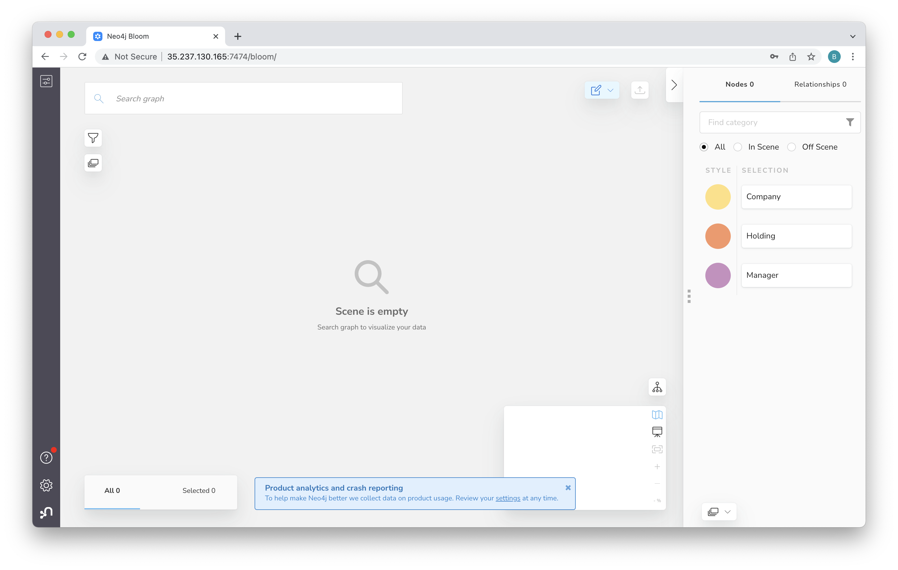
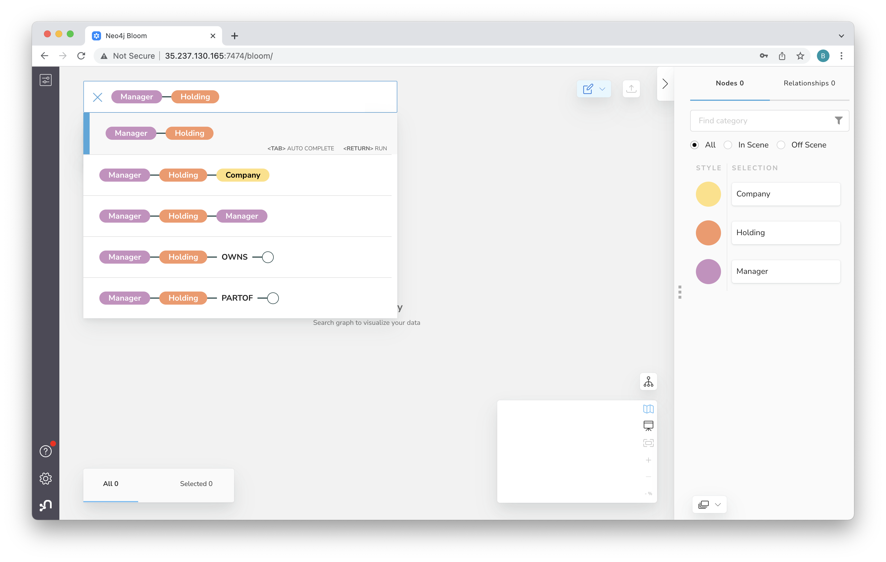
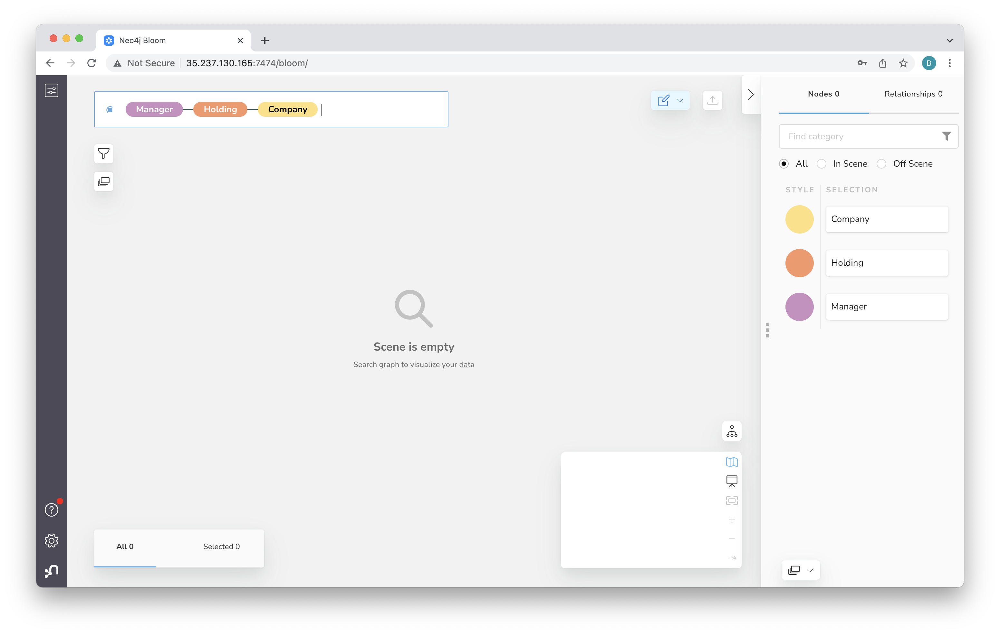
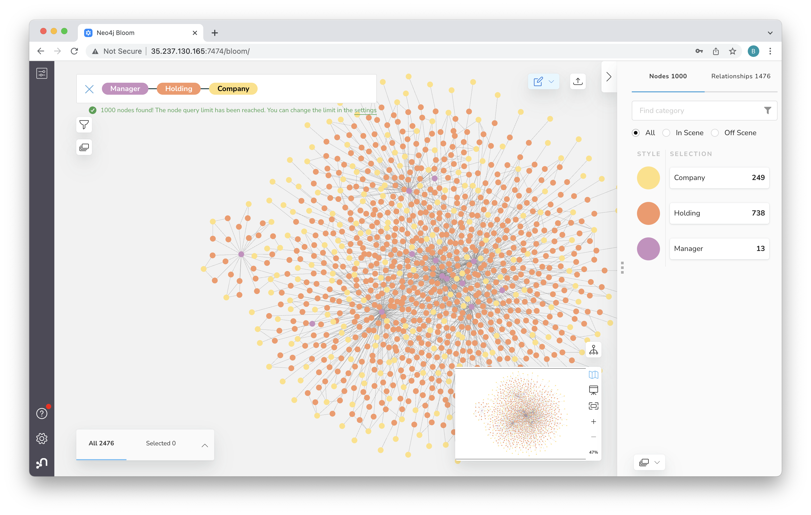
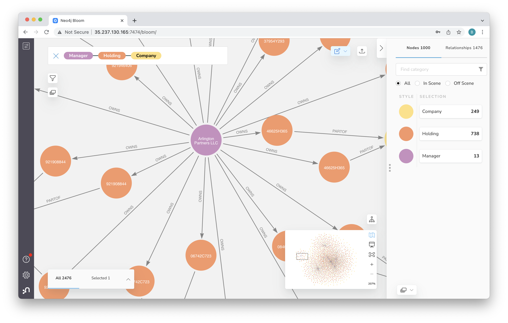

# Lab 4 - Exploring Data
In this lab, we're going to query the data in a few different ways.

## Pandas
First off, let's fiddle with the data in pandas.  Click [here](exploring_pandas.ipynb) to get started.

## Cypher Queries
Now we'll run a few queries using the python API.  Earlier we used the graphical interface in the Neo4j Browser.  We're going to do the same thing but in a programmatic way.  Let's start by firing up a notebook.  Click [here](exploring_cypher.ipynb) and then follow the "Run in Colab" link to open it in Google Colab.

## Vizualization with Neo4j Bloom
Bloom is Neo4j's business intelligence (BI) tool.  We can open it on port 7474 under the path /bloom of the instance we were using previously.  For instance, for my deployment, the URL is http://35.237.130.165:7474/bloom

When you open Bloom, you should see the login screen.  Use the same credentials we used before.  If you kept the defaults the username will be neo4j and the password foo123.

That should take you to the home screen.  Click on "Create Perspective" and then "Generate Perspective."

When complete, you'll see a new perspective.  Mouse over that and click "Use Perspective."

That takes you to a blank scene.  Click in the search bar and then click on "Manager."

Then click on the link for manager-holding.

Then click on the link to add manager-holding-company.

And now hit enter to run the query.

That will give you a view with many nodes.

Now, spend a bit of time exploring the graph.  You can zoom in by holding on the "+" icon.  You can also drag the canvas around to chose what you zoom in on.

