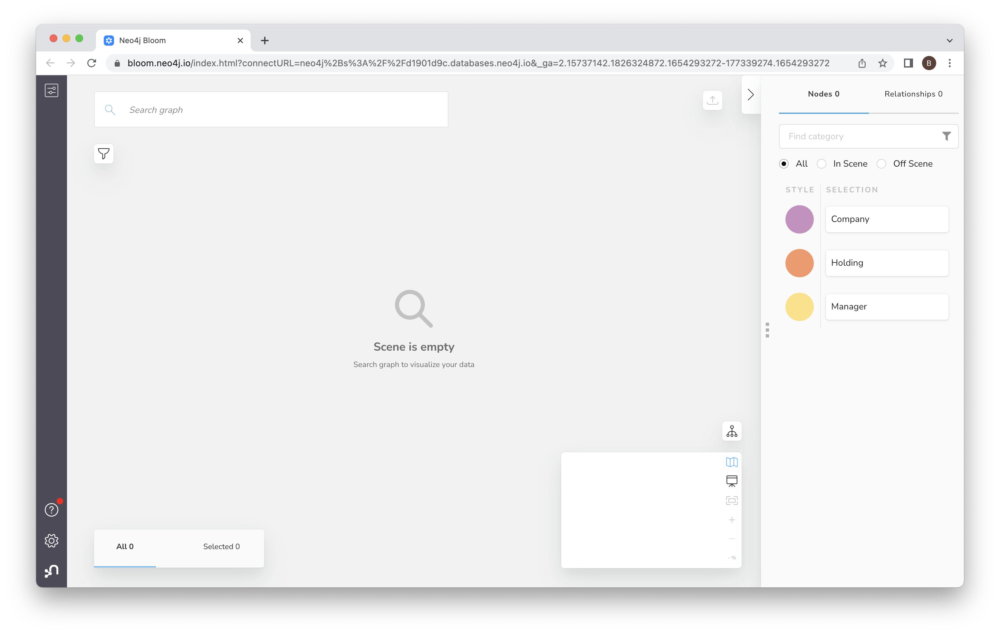
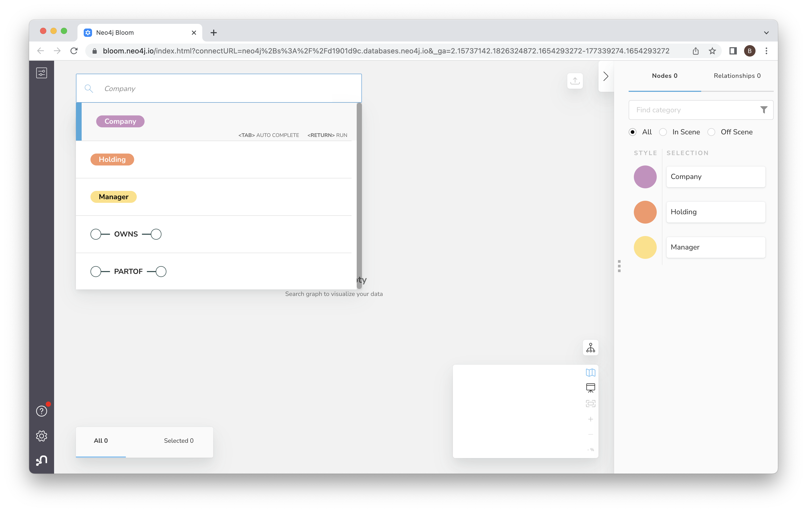

# Lab 4 - Vizualization
Bloom is Neo4j's business intelligence (BI) tool.  You can open it from the Neo4j Aura Console as we did in Lab 2.

When you open Bloom, click Explore tab and create a perespective.  Perspective defines a certain business view or domain that can be found in the target Neo4j graph. A single Neo4j graph can be viewed through different Perspectives, each tailored for a different business purpose.

That should take you to the home screen.  Click in the search bar and then click on "Manager."

If the search bar doesn't populate, you may have to click in the upper left and add the three entities: "Manager", "Holding", and "Company".

Then click on the link for manager-holding.

Then click on the link to add manager-holding-company.

And now hit enter to run the query.

That will give you a view with many nodes.

Now, spend a bit of time exploring the graph.  You can zoom in by holding on the "+" icon.  You can also drag the canvas around to choose what you zoom in on.

