# Lab 5 - Parsing Data
In this lab we're going to parse data with generative AI to create a knowledge graph.  We'll use the generative AI functionality in Google Cloud Vertex AI.

We'll be using some of the same data we loaded from a CSV earlier.  However, this time, we'll parse the raw files from the SEC.  This is really neat as we're using generative AI to parse something that required complex python scripts.  Essentially we're trading generative AI compute time for developer time.  Making this sort of trade possible is exactly why computers were invented!  In this case, we're sidestepping scripts that took months of effort to harden, so it's an excellent trade.

## Setup Vertex AI Workbench
Open up the [Google Cloud Console](https://console.cloud.google.com/).

Type Vertex AI in the search bar.

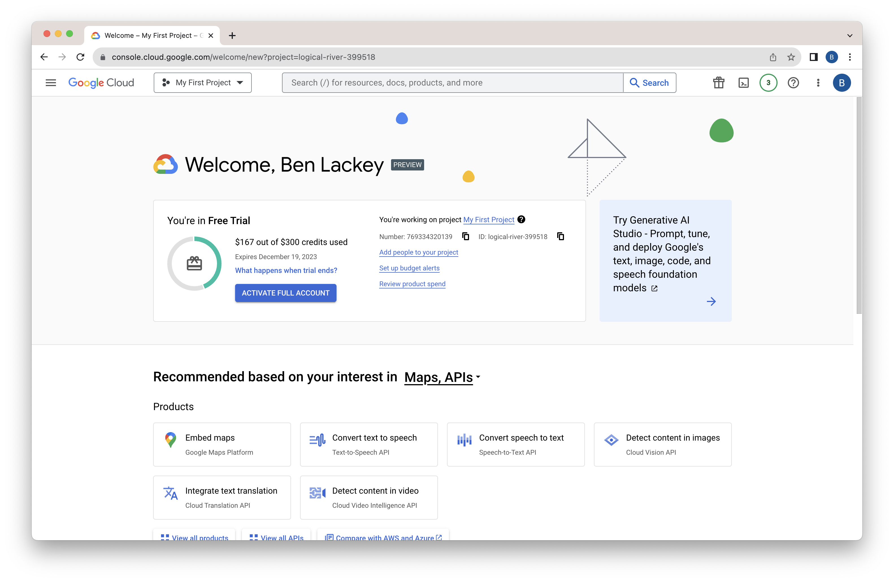

Click on the first result.

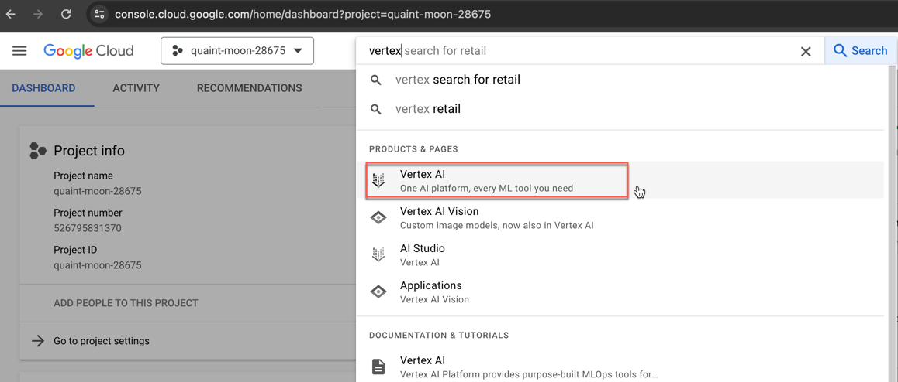

Dismiss the tutorials dialog.  Click "ENABLE ALL RECOMENDED APIS."

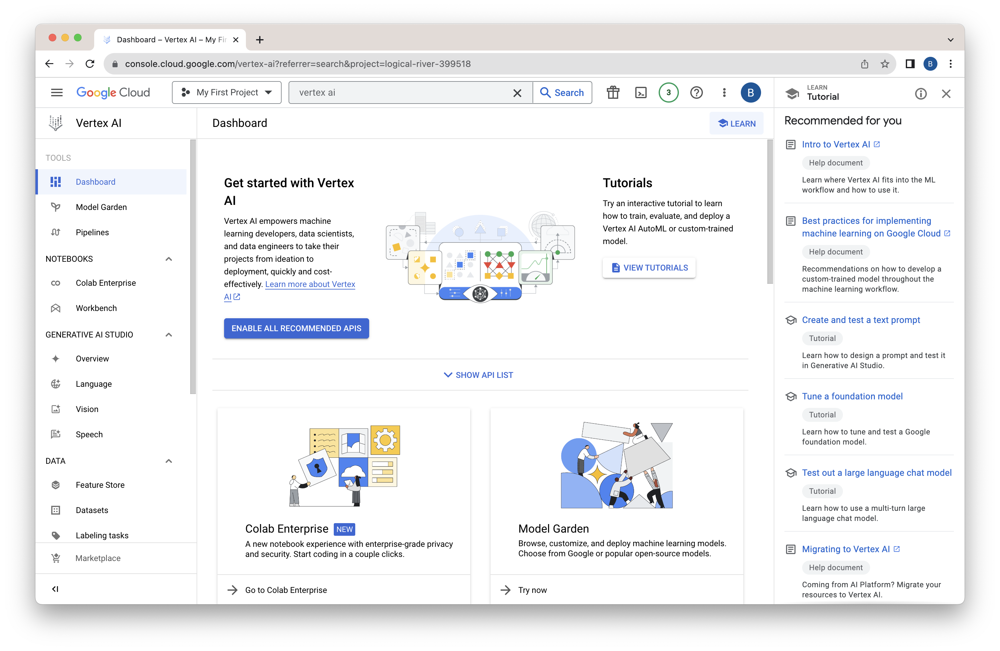

That will take a few minutes to run.  You can click on the alert icon in the upper right to view progress.

You can also close the tutorial dialog on the right by clicking "X."

When complete, click on the Workbench link on the left hand side.

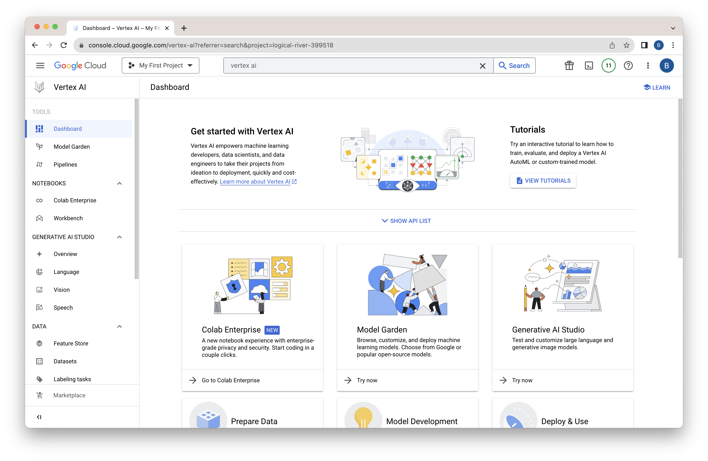

Workbench is a hosted notebook environment.

Since we're testing out all the most advanced Google features, we want to use instances, not the user managed or managed notebooks.  Make sure "INSTANCES" is selected.  Then click "CREATE NEW."

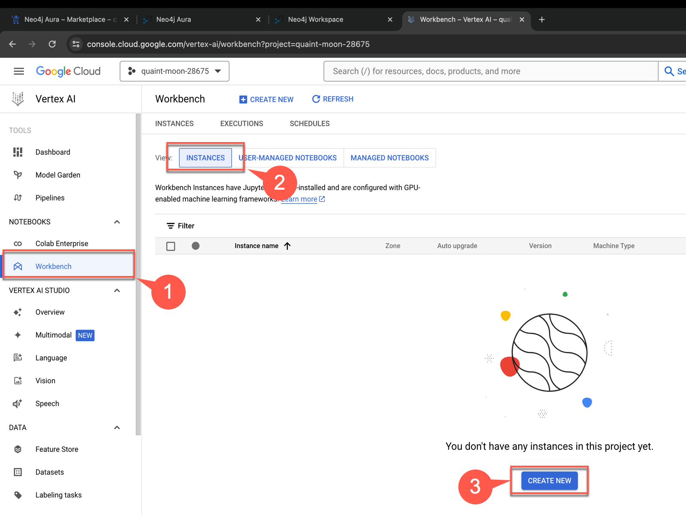

Feel free to explore the configuration options.  Keep the defaults and select "CREATE."

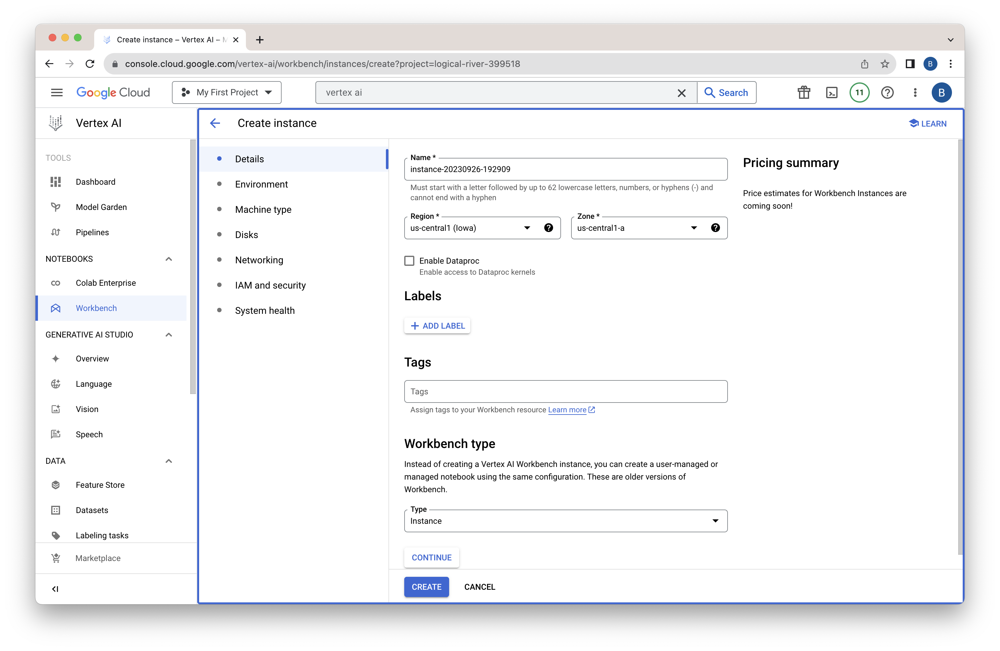

The notebook creation will take a few minutes to run.  When complete, click "OPEN JUPYTERLAB" to open the Workbench environment.

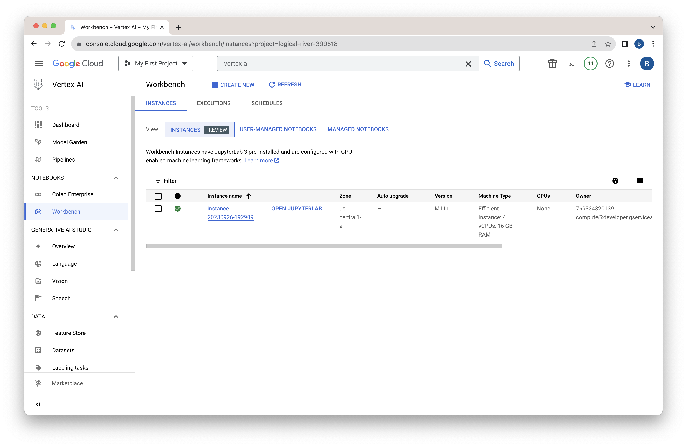

You're now presented with a menu of runtimes available.  We're going to clone the notebooks we need for the remainder of this workshop.  We could do this graphically, but let's use the terminal.  Click on the terminal icon.

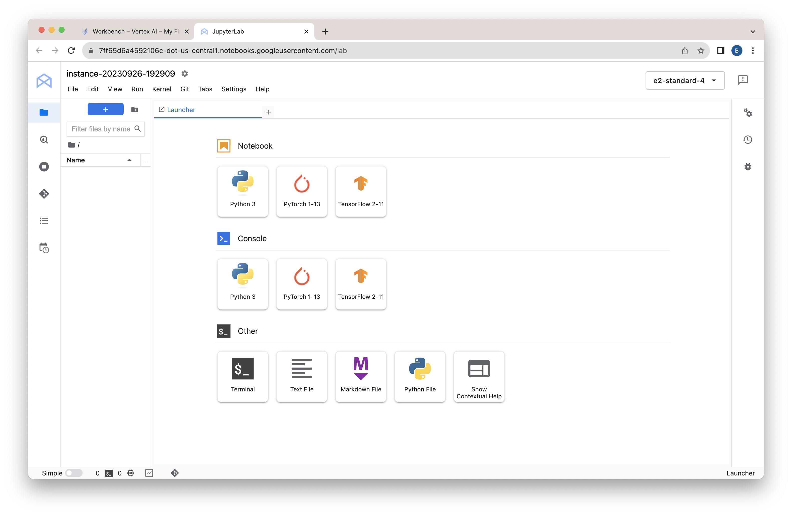

In the terminal type the command:

    git clone https://github.com/neo4j-partners/hands-on-lab-neo4j-and-vertex-ai.git

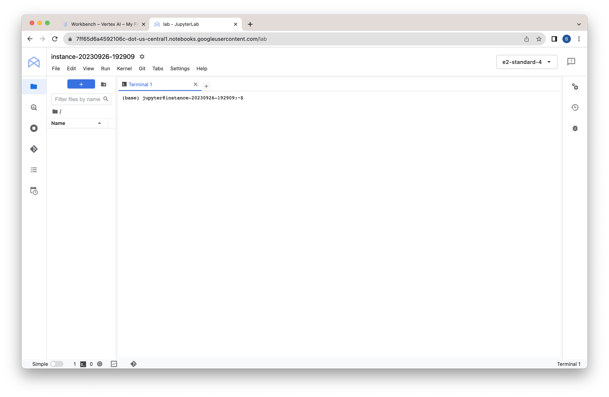

When complete, you should see a message in the terminal as well as a new directory in the file explorer on the left.  In the file explorer on the left, double click on "hands-on-lab-neo4j-and-vertex-ai" to open it.

Then drill down to "Lab 5 - Parsing Data"

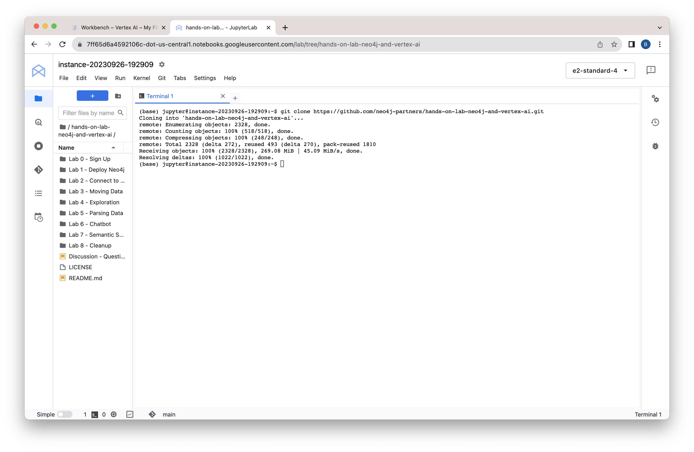

Open the notebook "parsing-data.ipynb."

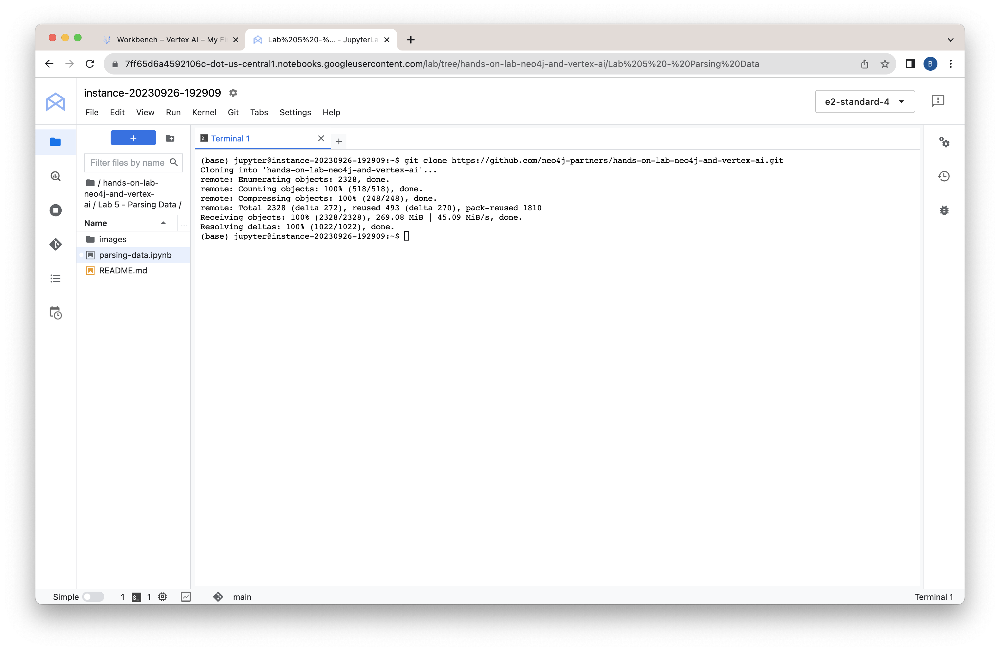

Select the standard Python 3 kernel.

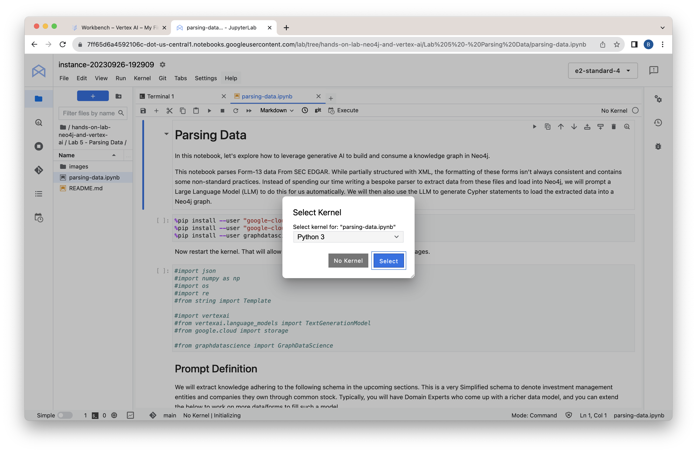

Great, now you're all ready to run through this notebook!

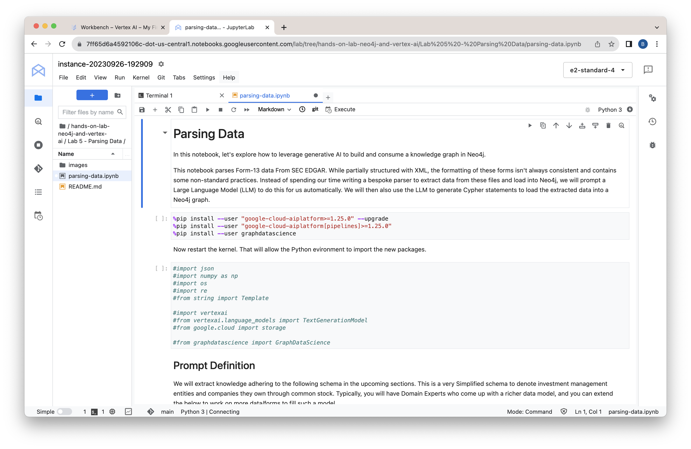

In the next labs, we'll explore further with notebooks.
