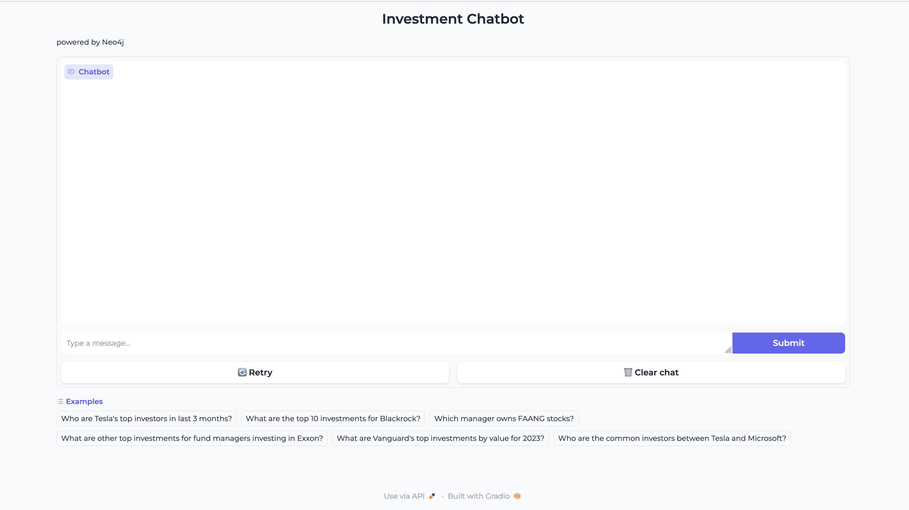

# Lab 6 - Generative AI Chatbot

Exercise here: [chatbot.ipynb](chatbot.ipynb)

This is a sample notebook and web application which shows how Google Vertex AI Generative AI can be used with Neo4j. We will explore how to leverage Google VertexAI LLMs to automatically generate Cypher for consuming data from a financial knowledge graph.

This notebook instructs how to connect to a graph running in Neo4j Aura which contains companies, investors, and investments. We then use the `code-bison` model and prompt it to convert requests in natural language to Cypher - Neo4j's query language for data retrieval.

## Setup

If you're following along with the labs, you'll have already set up your graph in Aura in Lab 4. We're going to be running our code in a managed notebook in VertexAI Workbench, similarly to how we did in Lab 3.

## Notebook

The [notebook](chatbot.ipynb) contains the steps to walk through the LangChain integration, prompt the chatbot for Cypher result set-enriched responses, and deploy the interface for using the chatbot. Our UI is deployed using the `gradio` library, which allows us to build an interface running locally but also gives us a shareable link that is good for 3 days.
