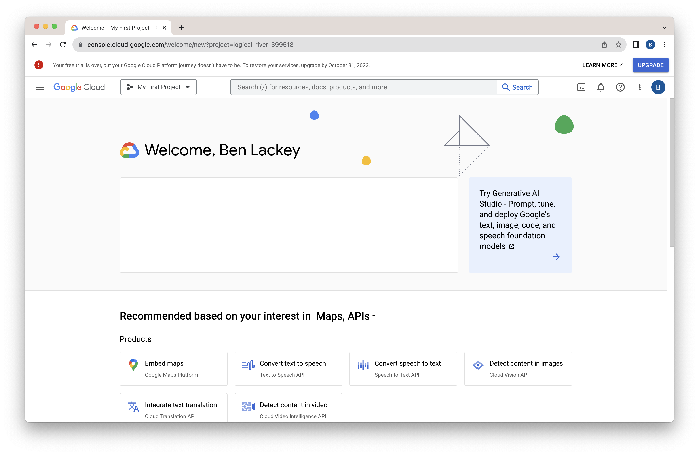
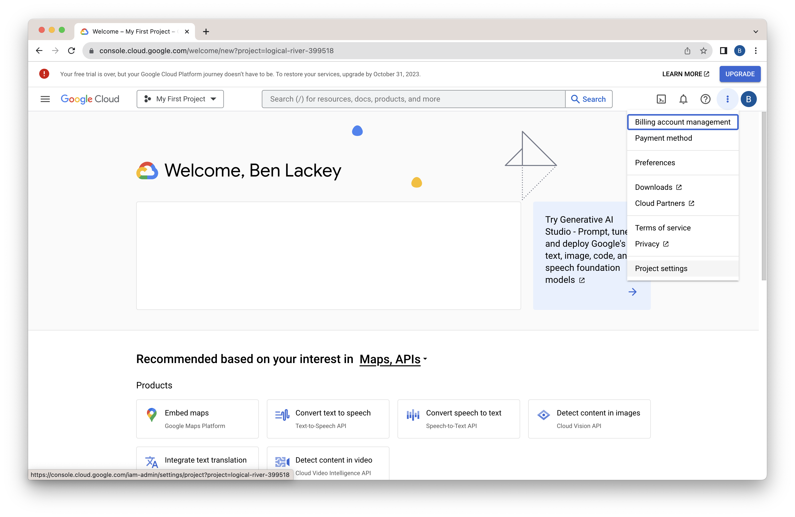
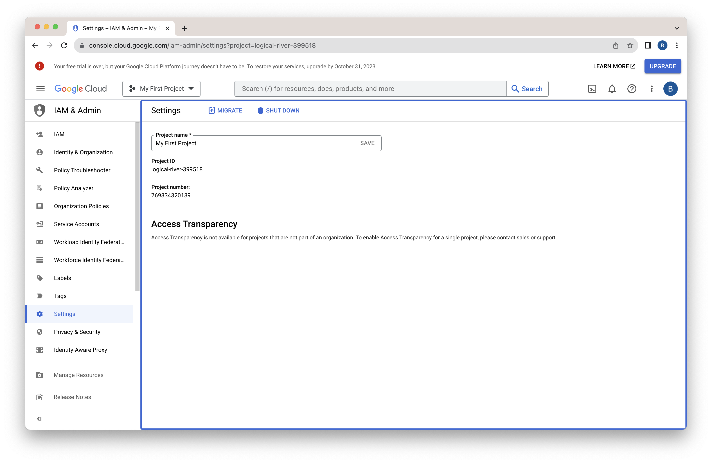
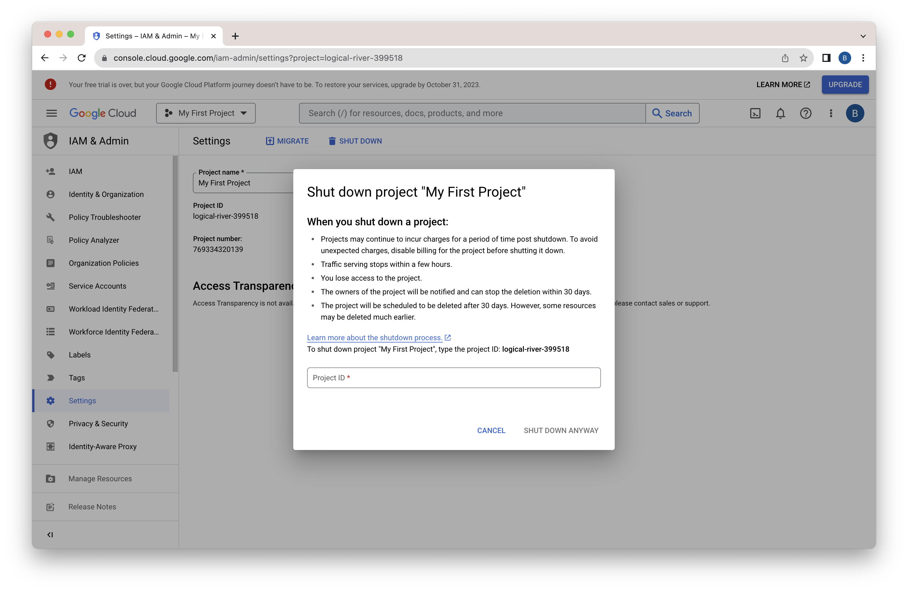
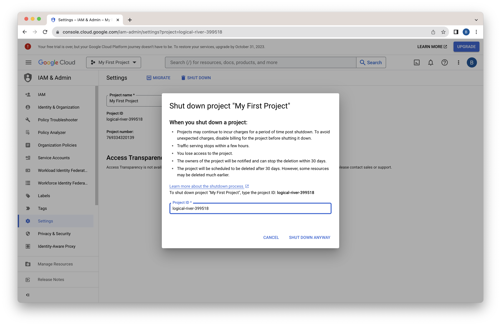
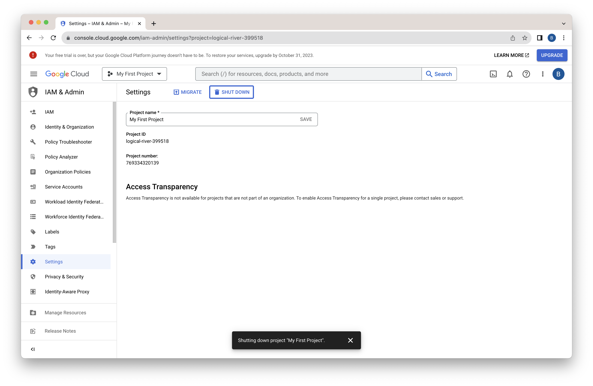
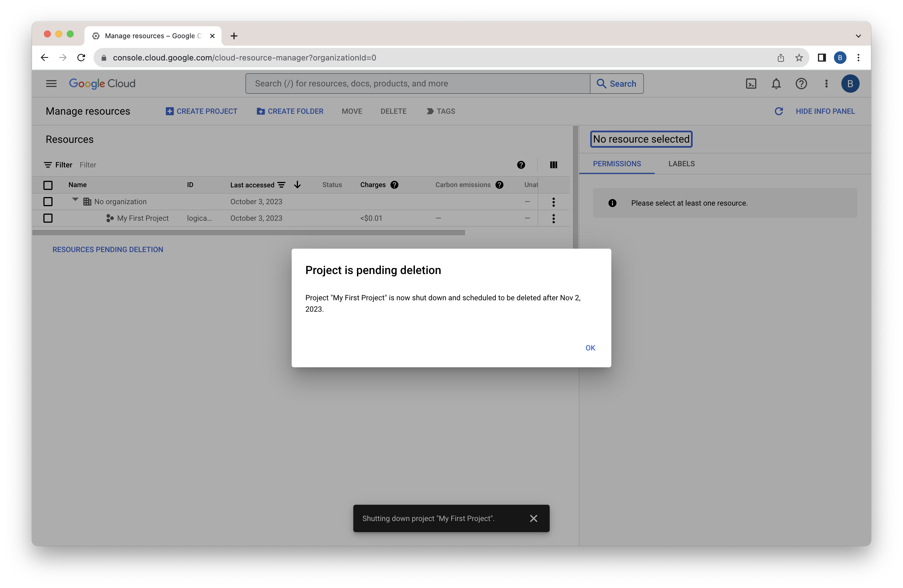
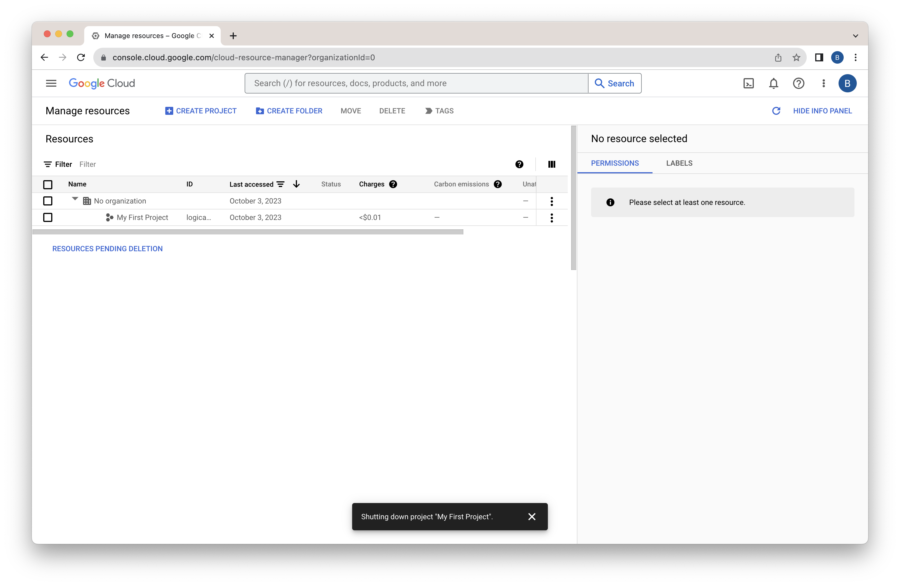

# Lab 8 - Cleanup
You can keep the resources you've deployed in these labs running as long as you like.  If you used a free trial, eventually the credits in your account will be exhausted and they'll be automatically shutdown.  Alternatively, you can delete resources individually.  Another option is to delete you project.  That will delete all resources in it.

## Delete your Project
To delete your project, follow these instructions.  First, navigate to [https://cloud.google.com/](https://cloud.google.com/)  Click on the three dots in the upper right to open a menu.

Select "Project settings."

Click "SHUT DOWN."

Enter your project id.  In this case, it was "logical-river-399518."

Click "SHUT DOWN ANYWAY."

Wait a moment for the project to shut down.

Click "OK."

Your project is now deleted.  That will end all billing, even against your free trial credits.  If you deployed in a project that didn't have a free trial, that will end those costs too.

Congratulations on completing the lab!
